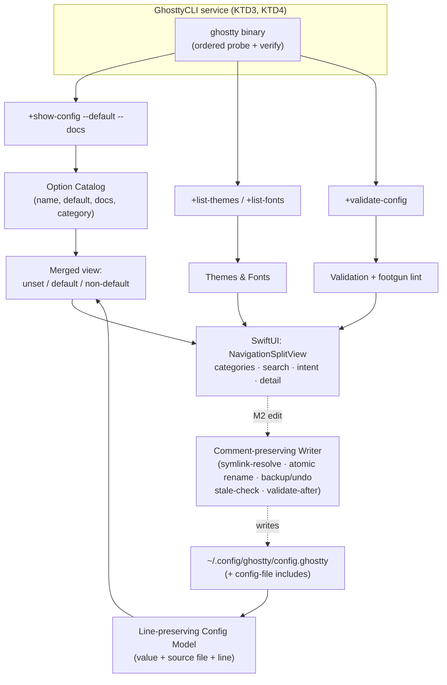

# feat: Ghostty Config Editor (native macOS SwiftUI)

## Summary

Build a native macOS (SwiftUI) configuration tool for Ghostty that makes the config **discoverable** and lets the user tune and save changes to their plain-text config. The catalog is **self-describing** — generated from the user's installed `ghostty` binary — so it stays current without manual updates. Delivered in two phased milestones in this one plan: **M1**, a read-only Explorer (discover, understand, validate), and **M2**, in-app Editing and appearance with a comment-preserving write path.

---

## Problem Frame

Editing Ghostty's text config is tedious, and the sharpest pain is **discovery** — "a behavior annoys me, but I don't know the option exists to change it" (see origin: `docs/brainstorms/2026-06-16-ghostty-config-manager-requirements.md`). No native macOS GUI exists; prior art is a web tool (no filesystem access, no live preview) and a barely-maintained Python app. An official first-party prefs pane is ~9–18 months out and, by design, stores settings in NSUserDefaults and overrides the text file — leaving the **text-native, dotfiles power user** deliberately unserved. This tool occupies that niche. It is built personal-first; community use is upside, not the success bar.

---

## Key Technical Decisions

- KTD1. **Ship non-sandboxed (Developer-ID signed, notarized, Hardened Runtime, direct-download DMG) — not the Mac App Store.** A sandboxed app cannot exec a binary in another app bundle (`/Applications/Ghostty.app/...`) or Homebrew, nor read `~/.config` freely. Since the core feature execs the user's `ghostty` and reads the dotfile, MAS is incompatible. Non-sandboxed then makes file I/O direct (no security-scoped bookmarks). (see origin Dependencies; macOS research dossier.)
- KTD2. **Self-describing catalog from `ghostty +show-config --default --docs`**, cached per binary version — not a hardcoded option list. Always current across Ghostty releases; kills the maintenance treadmill (R1, R2; origin Key Decision).
- KTD3. **Locate the binary by an ordered absolute-path probe, never bare PATH.** GUI apps don't inherit the shell PATH. Order: user override → `/Applications/Ghostty.app/Contents/MacOS/ghostty` → `/opt/homebrew/bin/ghostty` → `/usr/local/bin/ghostty` → login-shell fallback (`zsh -lic 'command -v ghostty'`); verify with `+version` (R19).
- KTD4. **Run subprocesses with `swift-subprocess`** (async/await, avoids pipe-buffer deadlock on verbose output like `--docs`); plain `Process` + concurrent pipe reads is the dependency-free fallback.
- KTD5. **One lossless, line-preserving config model is the single source for both read and write.** It tracks each setting's source file and line so M2 can edit only targeted options and re-serialize every untouched line verbatim (R7, R8, R9, R11).
- KTD6. **Writes target the plain-text config (`config.ghostty`), never NSUserDefaults.** This is the orthogonal positioning against the official pane and keeps configs git-friendly (origin Key Decision, R8).
- KTD7. **Intent search = a small curated synonym/keyword map layered over name + doc full-text search** (not heuristic/ML). Cheap, high-value, and the highest-leverage M1 differentiator (R4).
- KTD8. **Safety-first writes treat the config as a symlinked, git-managed dotfile, not a private regular file.** Write via a same-directory temp file → `fsync` → atomic rename onto the **symlink-resolved real path** (never in-place truncate, never a cross-volume copy that would change the inode), then `fsync` the directory. Guard every write with an out-of-repo backup, last-write undo, a stale-overwrite check, and `+validate-config` after writing; preserve the symlink, inode, permissions/xattrs, line endings, trailing-newline state, and UTF-8/BOM encoding; abort with the live file untouched on any backup or staging failure; never rewrite unparseable content (R10, R11, R15, R20–R24).
- KTD9. **Deployment floor macOS 14+.** Enables `@Observable`, `NavigationSplitView`, and the chosen subprocess line. (Dev machine is macOS 26 / Xcode 26 / Swift 6.3; floor is a distribution choice, easily adjusted.)
- KTD10. **Phased delivery: M1 (read-only Explorer) ships before M2 (writes).** M1 delivers the discovery value and is useful standalone before any write-path code exists, capping the risk of the hard round-trip problem.

---

## High-Level Technical Design

The app is a thin SwiftUI shell over three logic layers: a **CLI service** (drives `ghostty` subcommands), a **catalog** (what options exist), and a **config model** (what the user has set). M1 reads; M2 adds the writer.



Prose is authoritative; the diagram is an on-ramp. The dashed M2 path (writer) is gated behind M1's read-only layers.

---

## Output Structure

Greenfield. Expected shape (per-unit `Files` are authoritative; the implementer may adjust):

```text
GhosttyConfigEditor.xcodeproj
App/
  GhosttyConfigEditorApp.swift      # @main, entitlements wiring
  AppModel.swift                     # @Observable root state
CLI/
  GhosttyCLI.swift                   # subcommand runner (async)
  BinaryLocator.swift                # ordered probe + verify
Catalog/
  OptionCatalog.swift                # catalog model
  CatalogParser.swift                # parse +show-config --default --docs
Config/
  ConfigModel.swift                  # line-preserving model (read + write source)
  ConfigReader.swift                 # search-path precedence + includes
  ConfigWriter.swift                 # comment-preserving write (M2)
Search/
  IntentSearch.swift                 # curated map + full-text
  intent-map.json                    # phrase -> option(s)
Lint/
  ConfigLinter.swift                 # footgun rules
Themes/                              # M2 (U8)
  ThemeParser.swift                  # parse +list-themes / +list-fonts
Views/
  SidebarView.swift  OptionListView.swift  OptionDetailView.swift   # M1
  ThemeBrowserView.swift             # M2 (U8)
Tests/
  CatalogParserTests.swift  ConfigReaderTests.swift  BinaryLocatorTests.swift   # M1
  IntentSearchTests.swift  ConfigLinterTests.swift                              # M1
  ConfigWriterTests.swift            # M2 (U6)
  ThemeParserTests.swift             # M2 (U8)
```

---

## Requirements

Carried from origin and traced to units below. R1–R19 match the requirements doc; R20–R24 are plan-derived filesystem-safety refinements of R8/R10/R11/R15 surfaced during planning.

**Discovery & catalog (M1):** R1 always-current catalog from the binary · R2 docs/default/type per option · R3 browse by category + name search · R4 intent/behavior search.

**Config awareness (M1):** R5 read active config with precedence + show set/default/non-default · R6 surface unused options · R7 resolve `config-file` includes on read.

**Editing & persistence (M2, serves F3):** R8 write back preserving comments/ordering/untouched lines · R9 handle additive keys (`keybind`, `palette`, `font-feature`, `env`) · R10 recoverable backup before write · R11 never destroy unparseable content.

**Write-path filesystem safety (M2):** R20 resolve symlinks and edit the canonical file in place — never replace a symlink with a regular file, preserve the inode · R21 crash-atomic durability (same-dir temp + fsync + atomic rename + dir fsync) and abort-untouched on any backup/stage/disk failure · R22 stale-overwrite guard — detect on-disk change since read (mtime/size/hash) and block rather than clobber · R23 preserve permissions/ownership/xattrs, line endings, trailing-newline state, and UTF-8/BOM encoding so the only byte diff is the intended hunk · R24 store backups and undo history out of the config directory (Application Support), bounded retention.

**Appearance & preview (M2):** R12 theme browser with faithful color preview · R13 type-appropriate controls · R14 honest preview-fidelity labeling.

**Validation & safety (M1 read / M2 write):** R15 `+validate-config` reporting · R16 footgun warnings (bare `keybind =`, conflicts) · R17 explicit apply feedback + new-surface notice.

**Platform & resilience (cross-cutting):** R18 native macOS SwiftUI app · R19 graceful degradation when the binary is absent/unexpected.

---

## Implementation Units

Phased: **M1 = U1–U5** (shippable read-only Explorer), **M2 = U6–U8** (editing + appearance).

### U1. App scaffold, entitlements, and Ghostty CLI service

- **Goal:** SwiftUI app skeleton (`NavigationSplitView` shell, `@Observable` `AppModel`), non-sandboxed + Hardened Runtime project config, and a `GhosttyCLI` service that locates the binary and runs subcommands capturing stdout/stderr asynchronously.
- **Requirements:** R18, R19 (foundation for all CLI-driven units).
- **Dependencies:** none.
- **Files:** `App/GhosttyConfigEditorApp.swift`, `App/AppModel.swift`, `CLI/GhosttyCLI.swift`, `CLI/BinaryLocator.swift`, `Tests/BinaryLocatorTests.swift`.
- **Approach:** Binary discovery per KTD3 (ordered probe + `+version` verify). Subprocess per KTD4. Surface a clear "Ghostty not found / unsupported" state rather than crashing (R19). Configure the target as non-sandboxed, Developer-ID, Hardened Runtime (KTD1) — no special exec entitlement is needed to spawn an independently signed binary.
- **Test scenarios:** probe picks the app-bundle path when present; user override outranks all; all candidates missing → explicit not-found state (R19); `+version` output parses to a version; a verbose subprocess (simulated large stdout) is captured without deadlock.
- **Verification:** launching the app on this machine discovers Ghostty 1.3.1 and reports its version; removing/renaming the binary yields the not-found state.

### U2. Option catalog from `+show-config --default --docs`

- **Goal:** Parse the binary's default+docs output into a structured `OptionCatalog` (name, default value, doc text, category, best-effort type/enum hint); cache keyed by binary version.
- **Requirements:** R1, R2.
- **Dependencies:** U1.
- **Files:** `Catalog/OptionCatalog.swift`, `Catalog/CatalogParser.swift`, `Tests/CatalogParserTests.swift`.
- **Approach:** Line parser over doc-comment blocks + `key = value` defaults. Group options into categories that drive the sidebar. Type/enum metadata is best-effort from doc text; unknowns are left untyped (gap flagged in Follow-Up). Regenerate when the detected version changes.
- **Test scenarios:** a representative captured output sample parses to the expected option count; doc text associates with the correct option; array/repeatable keys are represented as such; malformed/garbled lines are tolerated (skipped, not fatal); cache invalidates on version change.
- **Verification:** the catalog populated from the local Ghostty 1.3.1 lists known options (e.g., `font-family`, `theme`, `keybind`) with their docs and defaults.

### U3. Read and merge the user's config (current-vs-default)

- **Goal:** Read the active config — resolving Ghostty's search-path precedence (`config.ghostty` first) and `config-file` includes — into the line-preserving `ConfigModel`, and compute per-option state: unset(default) / set-to-default / set-non-default, with the user's value.
- **Requirements:** R5, R6, R7.
- **Dependencies:** U1 (paths), U2 (catalog to merge against).
- **Files:** `Config/ConfigModel.swift`, `Config/ConfigReader.swift`, `Tests/ConfigReaderTests.swift`.
- **Approach:** Line-oriented parse that retains every original line and records, per setting, its source file and line (KTD5 — this model is reused by U6's writer). Collect additive keys as ordered lists. Merge with the catalog to derive state.
- **Test scenarios:** `Covers AE1.` an option set to a non-default shows "set (non-default)" and an unmentioned option shows "not set — default" and appears in the unused surface; `config-file` includes are resolved; four `keybind` lines collect into a four-element list; same scalar key across files resolves by precedence; the user's real `config.ghostty` parses without loss.
- **Verification:** pointed at the user's actual config, the app shows `font-size = 16` as non-default and split keybinds as set, with most options unset.

### U4. Catalog browser UI: categories, search, intent search, detail

- **Goal:** `NavigationSplitView` sidebar (categories), `.searchable` option list, and a detail pane showing docs/default/your-value and a "you're not using this" indicator; intent search maps behavior phrases to options.
- **Requirements:** R3, R4, R6 (serves F1).
- **Dependencies:** U2, U3.
- **Files:** `Search/IntentSearch.swift`, `Search/intent-map.json`, `Views/SidebarView.swift`, `Views/OptionListView.swift`, `Views/OptionDetailView.swift`, `Tests/IntentSearchTests.swift`.
- **Approach:** `@Observable` view models drive the views. Intent search = curated `intent-map.json` (phrase → option(s)) layered over name + doc full-text (KTD7). M1 is read-only: detail actions are copy-snippet and reveal-in-editor — no writes.
- **Test scenarios:** name search filters to the matching option; `Covers R4.` intent query "hide title bar" maps to the expected option(s); intent query with no mapping falls back to full-text; the unused surface lists only unset options; copy-snippet yields a syntactically valid `key = value` line. (View layer is thin; assert on the search mapper and view-model logic.)
- **Verification:** typing "transparent background" surfaces `background-opacity`; selecting an option shows its docs, default, and current value.

### U5. Validation surface and footgun lint (read-only)

- **Goal:** Run `+validate-config` against the user's config and surface errors clearly; statically flag known footguns as warnings.
- **Requirements:** R15 (read side), R16.
- **Dependencies:** U1, U3.
- **Files:** `Lint/ConfigLinter.swift`, `Tests/ConfigLinterTests.swift`.
- **Approach:** Wrap `+validate-config` via `GhosttyCLI`; a small rule set over U3's parsed model flags footguns (bare `keybind =` clearing all binds; likely-conflicting or malformed keybind triggers).
- **Test scenarios:** `Covers AE4.` a bare `keybind =` produces a "clears all keybinds" warning; an injected invalid value surfaces the validator's error; a duplicate/conflicting keybind is flagged; a clean config yields no warnings.
- **Verification:** the user's current config validates clean; introducing `keybind =` raises the footgun warning.

### U6. Comment-preserving config writer (round-trip core)

- **Goal:** Extend the `ConfigModel` into a lossless writer with two layers — a content round-trip and a filesystem write contract that treats the target as a symlinked, git-managed dotfile edited by multiple actors.
- **Requirements:** R8, R9, R10, R11, R20, R21, R22, R23, R24; write side of R15.
- **Dependencies:** U3.
- **Files:** `Config/ConfigWriter.swift`, `Tests/ConfigWriterTests.swift`.
- **Approach (content):** Mutate only the model nodes that changed and re-emit all other source lines exactly. Write target = the file where the option is set; if unset, the primary config file (`config.ghostty`). Unparseable content is preserved untouched (R11). Scope each apply to a single file — no cross-file atomicity in v1.
- **Approach (filesystem):** At read time, capture an identity stamp (resolved real path, inode, mtime, size, content hash). On apply: re-stat and re-hash; if changed since read, block and offer reload-and-reapply (R22). Resolve symlinks fully (relative links and chains) to the canonical real path and edit *that* inode in place (R20). Stage to a same-directory temp file with the source's mode/owner/xattrs and exact newline/trailing-newline/encoding preserved (R23), `fsync`, then atomically rename onto the resolved real path and `fsync` the directory (R21). Backups and last-write undo live in Application Support keyed by the resolved path with bounded retention (R24); the only file placed in the config dir is the transient rename temp, swept on success and on next-launch crash-recovery. Abort with the live file untouched on any backup/temp/disk failure. A per-resolved-path in-process write lock prevents re-entrant races between windows or double-applies.
- **Execution note:** characterization-first — write the byte-preservation and crash-safety round-trip tests before implementing the mutation path.
- **Test scenarios:** `Covers AE2.` editing one of four `keybind` lines leaves the other three byte-identical; `Covers AE3.` a `# comment` and an unrecognized line survive an unrelated edit verbatim; adding/removing a `palette` entry updates only that key's lines; write-target selection picks an include file when the option lives there, else the primary file; validate-after-write catches a bad result; an unparseable file is preserved rather than rewritten. Filesystem: a simulated crash between temp-write and rename leaves the original byte-intact; disk-full aborts with the original untouched; the rename keeps a symlink pointing at the same real path (inode unchanged); a file modified on disk between read and apply is refused with a reload prompt; a `0600` config stays `0600`; a file with no trailing newline still has none; a non-ASCII `font-family` round-trips byte-identical except the edited line; a full-file diff after an edit shows exactly the intended hunk; backups land in Application Support, not the config dir.
- **Verification:** an edit-then-reread round-trips a value while a byte-level diff of the real file shows only the intended hunk, with the symlink and inode intact.

### U7. In-app editing and apply feedback

- **Goal:** Editing controls in the detail pane that mutate the model and persist via U6, with explicit apply feedback and a new-surface notice.
- **Requirements:** R13, R15 (validate on apply), R17.
- **Dependencies:** U6, U4.
- **Files:** `Views/OptionDetailView.swift` (extend), `App/AppModel.swift` (extend), `Tests/ConfigWriterTests.swift` (extend for apply flow).
- **Approach:** Type-appropriate controls (toggles, steppers, value fields) bound to the model; apply → validate → write (U6) → success/error feedback. Options known to apply only to new terminals/surfaces carry a notice on apply. When the resolved write target sits inside a git working tree, the apply feedback notes the change landed in a git-tracked file, so the dotfiles user knows to commit (turns U6's symlink/git reality into a surfaced fact).
- **Test scenarios:** `Covers AE5.` changing a new-surface-only option shows the "affects new terminals" notice; apply success and failure render distinct states; an invalid value is blocked with the validator message before any write; a control change round-trips through write + reread; a target inside a git working tree surfaces the "committed in your dotfiles repo" hint.
- **Verification:** changing `font-size` in-app writes the file (preserving the rest) and shows apply success.

### U8. Theme browser and appearance preview

- **Goal:** A theme browser over `+list-themes` with faithful palette/color preview, color/palette and font pickers (via `+list-fonts`), and honest fidelity labeling.
- **Requirements:** R12, R13, R14 (serves F2).
- **Dependencies:** U6, U2.
- **Files:** `Themes/ThemeParser.swift`, `Views/ThemeBrowserView.swift`, `Tests/ThemeParserTests.swift`.
- **Approach:** Enumerate themes via `+list-themes`, resolve each theme's on-disk path with `+list-themes --path`, then parse the theme file's `palette`/`background`/`foreground`/`cursor-color`/`selection-*` lines into the swatch model — the `--plain` name list alone carries no colors. Applying a theme writes `theme = …` via U6 with apply feedback. The preview renders colors faithfully and carries a labeled disclaimer that font rendering, ligatures, blur, and cursor effects are best-effort (R14). Support the `dark:X,light:Y` form.
- **Test scenarios:** a real theme file (e.g. `Aardvark Blue`) parses into 16 palette entries plus background/foreground; themes enumerate and render swatches from the parsed files; applying a theme writes the correct `theme` line and shows feedback; the font list populates from `+list-fonts`; the fidelity disclaimer is present on non-color options; a `dark:…,light:…` value is representable and round-trips. (Assert on theme parsing + apply logic; view layer thin.)
- **Verification:** browsing themes shows live palette previews; applying one updates the config and the preview.

---

## Acceptance Examples

Carried from origin; each is enforced by the test scenario noted.

- AE1. Set-vs-unset display — U3.
- AE2. Repeated `keybind` lines round-trip intact — U6.
- AE3. Comment + unknown line preserved — U6.
- AE4. Bare `keybind =` footgun warning — U5.
- AE5. New-surface-only change notice — U7.

---

## Scope Boundaries

**Deferred for later (post-v1, from origin):** recipe library / outcome snippets; config annotation; profiles and config switching; config diffing/sharing; a full visual keybinding builder with a conflict graph (beyond U5's warnings).

**Outside this product's identity (from origin):** NSUserDefaults-backed settings that override the text file; a comprehensive "form for all 185 options" as the reason to exist; cross-platform (Linux/Windows) builds; competing with the first-party pane on basic option coverage; embedding a real Ghostty terminal for pixel-perfect preview.

**Deferred to Follow-Up Work (plan-local):** richer per-option type/enum metadata beyond what doc text yields (revisit if/when Ghostty exposes a machine-readable schema); making the intent map user-extensible; auto-reload/apply-to-running-Ghostty beyond surfacing the new-surface notice.

---

## Risks & Dependencies

- **CLI output-format drift.** The catalog, themes, and validation all parse `ghostty +…` text; a format change across versions can break parsing. Mitigation: tolerant parsers (U2 skips unknown lines), version-keyed cache, and a fallback "couldn't parse" state. (Origin assumption; no machine-readable schema exists.)
- **Config-corruption risk on write (M2).** The single highest-severity risk, and it lives at the *filesystem* level for this user, not just the content level. The target is typically a symlink into a git-managed dotfiles repo edited concurrently by git, chezmoi, the user's editor, and Ghostty. Failure modes: replacing the symlink with a regular file (silently disconnects the repo), a crash mid-write truncating the file, a stale-snapshot overwrite clobbering an external change, dropped permissions/encoding, and backups polluting the git repo. Mitigation: the R20–R24 filesystem contract — symlink/inode-preserving in-place edit via atomic same-dir-temp+rename, stale-read guard, attribute/encoding fidelity, out-of-repo backups, abort-on-failure, crash recovery on next launch — plus characterization-first tests (KTD8, U6).
- **Distribution prerequisites.** Developer-ID signing + notarization require an Apple Developer account; without it the app can be built/run locally but not distributed (KTD1).
- **`swift-subprocess` maturity.** Newer dependency; `Process` + concurrent pipe reads is the fallback if it proves unstable (KTD4).
- **Binary discovery gaps.** Non-standard install locations may evade the probe; the user-override path is the escape hatch (KTD3, U1).

---

## Open Questions (deferred to implementation)

- How much reliable type/enum metadata can be extracted from `--docs` prose per option (determines how rich U4's controls can be before the Follow-Up schema work)?
- When an option is set inside a `config-file` include, what is the clearest UX for showing/choosing the write target (U6 picks the file functionally; the surfacing detail is a UI call at implementation time)?
- Is the intent map bundled static for v1 (assumed yes) — revisit only if coverage feels thin in use?

---

## Sources / Research

- Origin requirements: `docs/brainstorms/2026-06-16-ghostty-config-manager-requirements.md`.
- Ghostty config/keybind/theme docs and CLI reference: https://ghostty.org/docs/config , https://ghostty.org/docs/config/keybind , https://ghostty.org/docs/features/theme , https://man.archlinux.org/man/ghostty.1
- Official prefs-pane status (durability context): https://github.com/ghostty-org/ghostty/discussions/2354 , https://github.com/ghostty-org/ghostty/discussions/10807
- macOS implementation research (sandboxing/distribution, subprocess, binary discovery, SwiftUI): Apple "Enabling App Sandbox"; Apple Dev Forums 661272 / 735321 / 709333; `swiftlang/swift-subprocess`; swift-foundation Subprocess proposal SF-0007.
- Local environment confirmed: Ghostty 1.3.1 at `/Applications/Ghostty.app/Contents/MacOS/ghostty`; dev machine macOS 26 / Xcode 26 / Swift 6.3.
