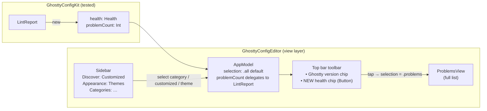

# feat: Declutter sidebar and surface config health in the top bar

## Summary

Two coupled UI changes to the GhosttyConfigEditor explorer:

1. **Remove the "All Options" and "Not Using Yet" rows** from the sidebar's *Discover* section — they are redundant with category browsing + search, and "Not Using Yet" duplicates the per-option "not using yet" state badge.
2. **Move config health (the *Problems* surface) out of the sidebar and into the window top bar** — a health chip sits next to the existing "Ghostty {version}" status chip, reflects clean / warning / error / unknown state, and clicking it opens the full Problems list.

The health-state derivation is pushed down into the (unit-tested) `GhosttyConfigKit` so the new toolbar logic is testable, keeping the app target a thin view layer per the project's existing architecture.

---

## Problem Frame

The sidebar's *Discover* section currently lists four entry points — **All Options**, **Customized**, **Not Using Yet**, **Problems** — alongside *Appearance* and per-category sections. Two of these add little:

- **All Options** is a flat dump that overlaps with the structured *Categories* list and the toolbar search.
- **Not Using Yet** is a discovery filter that overlaps with search and re-states information already shown per-option via the "not using yet" state badge in the detail pane.

Separately, **config health is buried** as a sidebar list item. Health is a persistent, at-a-glance signal ("is my config valid / footgun-free?") that belongs in the window chrome next to the Ghostty version, not as one row among many in a navigation list. The screenshot (Image #1) shows the target home for it: the top bar, beside the green "Ghostty 1.3.1" badge.

This is a presentation reorganization. It does not change validation, footgun detection, the option catalog, or editing behavior.

---

## Scope Boundaries

**In scope**
- Removing the *All Options* and *Not Using Yet* sidebar rows.
- Removing the *Problems* sidebar row and adding a config-health chip to the window toolbar that navigates to the existing Problems surface.
- Pushing the health/severity derivation into `GhosttyConfigKit` (`LintReport`) with unit tests.
- Keeping the full Problems list reachable (now via the toolbar chip rather than a sidebar row).

**Out of scope (non-goals)**
- No change to validation (`+validate-config`), footgun lint rules, or the option catalog.
- No change to editing/apply/undo, themes, or search behavior.
- No removal of `CatalogBrowser.unusedOptions` from the kit — it remains public, tested kit API (used by `IntentSearch` and covered by `IntentSearchTests`/`ConfigReaderTests`); only the *sidebar selection* for it is removed.

### Deferred to Follow-Up Work
- Re-thinking the now single-item *Discover* section (only *Customized* remains). Folding/renaming it is a separate design call; this plan leaves the *Discover* header in place to keep the change minimal.
- Adding a dedicated app-target test harness. Logic worth testing is moved into the kit instead (see U1); the remaining view changes are presentational.

---

## Key Technical Decisions

**KTD1 — Health derivation lives in the kit, not the view.**
The toolbar chip needs a clean/warning/error/unknown signal and a problem count. Rather than computing this in SwiftUI, add `LintReport.health` and `LintReport.problemCount` to `GhosttyConfigKit` and have `AppModel.problemCount` delegate to it. This matches the project's "logic in the tested kit, views stay dumb" pattern and makes the new behavior unit-testable (the app target has no test harness). *(see origin: R15, R16)*

**KTD2 — Keep `.all` as the default content state; only remove its sidebar row.**
Removing the *All Options* nav row does not require removing the `.all` selection case. `selection` stays defaulted to `.all`, so on launch the middle column still shows the full option list (good content for first-run users with an empty config) — there is simply no highlighted sidebar row for it. Trade-off: returning to the flat all-options list after picking a category is no longer one click; users rely on *Categories* + search. This is accepted as the intent of the declutter. Chosen over "default to first category" (needs async post-load selection logic + a new test) and over "default to Customized" (empty/weak first-run state when no config exists yet).

**KTD3 — Remove the `.unused` selection case entirely.**
Unlike `.all`, the `.unused` case has no remaining entry point once its row is gone and is not a sensible default. It is dead after the sidebar change, so remove it from `SidebarSelection`, `AppModel.visibleOptions`, and `OptionListView.title`. The per-option "not using yet" **state badge** in `OptionDetailView` is unrelated and stays.

**KTD4 — The health chip is a button that selects `.problems`.**
The existing `.problems` selection state, `ProblemsView`, and its detail placeholder are kept and reused. The toolbar chip just sets `model.selection = .problems`, preserving access to the full validation-errors + footguns list. Even in the clean state the chip stays clickable (it opens the reassuring "No problems" view), keeping one consistent interaction.

**KTD5 — Chip severity mirrors existing Problems iconography.**
Color/icon follow `ProblemsView`: red `xmark.octagon.fill` when live validation reports hard errors, orange `exclamationmark.triangle.fill` for footgun warnings, green `checkmark.seal.fill` when clean, orange `questionmark.diamond.fill` when validation couldn't run ("Health unknown"). This reuses the user's existing mental model rather than inventing a new one.

---

## High-Level Technical Design

Selection-state and health-signal flow after the change:



`Health` is a small enum derived from the already-computed validation outcome + findings:

```text
Health =
  .unknown   when validation == .unavailable        // couldn't run +validate-config
  .error     when validation completed && !isValid   // hard validation errors
  .warning   when no errors but ≥1 non-info footgun
  .clean     otherwise                               // valid/notRun and no actionable footguns

problemCount = (completed && !isValid ? messages.count : 0)
             + findings.filter { severity != .info }.count
```

*Directional guidance, not implementation specification.*

---

## Implementation Units

### U1. Kit: testable config-health summary on `LintReport`

**Goal:** Provide a presentation-agnostic health signal the toolbar can render, with unit coverage.
**Requirements:** R15 (validation), R16 (footguns). Backs KTD1, KTD5.
**Dependencies:** none.
**Files:**
- `Sources/GhosttyConfigKit/Lint/ConfigLinter.swift` (extend `LintReport`)
- `Tests/GhosttyConfigKitTests/ConfigLinterTests.swift` (add cases)

**Approach:**
- Add a nested `public enum Health: Equatable { case clean, warning, error, unknown }` to `LintReport` (or a sibling type in the same file).
- Add `public var problemCount: Int` computing validation errors (`messages.count` only when `.completed` && `!isValid`) + non-`.info` findings. This is the same arithmetic currently in `AppModel.problemCount`, relocated so it is testable.
- Add `public var health: Health` per the HTD truth table: `.unavailable → .unknown`; completed-invalid `→ .error`; else any non-info finding `→ .warning`; else `.clean`.
- Keep the existing `hasProblems` (or express it as `health != .clean && health != .unknown`-equivalent — preserve current truthiness; do not change its meaning).

**Patterns to follow:** existing computed vars on `LintReport` (`hasProblems`); `ValidationOutcome` switch style already used in `analyze`/`AppModel`.

**Test scenarios** (add to `ConfigLinterTests`):
- `.notRun` + no findings → `health == .clean`, `problemCount == 0`.
- `.completed(isValid: true)` + no findings → `.clean`, count 0.
- `.completed(isValid: true)` + one `.warning` footgun → `.warning`, count 1.
- `.completed(isValid: true)` + only `.info` finding → `.clean`, count 0 (info never counts).
- `.completed(isValid: false, messages: 2)` + one `.warning` footgun → `.error`, `problemCount == 3` (errors take severity precedence; count sums both).
- `.unavailable("boom")` + one `.warning` footgun → `.unknown` (unavailable dominates), `problemCount == 1`.
- Covers R16 footgun-vs-info severity distinction already exercised by `ConfigLinterTests` (build the `LintReport` directly with `LintFinding` fixtures; no CLI needed).

**Verification:** `swift test` green, new cases included; `LintReport.problemCount` returns the same values `AppModel.problemCount` produced for equivalent inputs.

---

### U2. App: surface the health chip in the top bar

**Goal:** Add the config-health chip to the window toolbar beside the version chip, navigating to Problems on tap.
**Requirements:** R15, R16. Backs KTD4, KTD5. Implements user request #2.
**Dependencies:** U1.
**Files:**
- `Sources/GhosttyConfigEditor/App/GhosttyConfigEditorApp.swift` (toolbar + `healthChip`)
- `Sources/GhosttyConfigEditor/App/AppModel.swift` (delegate `problemCount` to `lintReport?.problemCount ?? 0`)

**Approach:**
- In `RootView.browser(_:)`, add a second `ToolbarItem(placement: .status)` (after the existing version `statusChip`) rendering a new `healthChip()`.
- `healthChip()`: when `model.lintReport == nil`, show a non-interactive "Checking…" label (`stethoscope`, secondary). Otherwise a `Button { model.selection = .problems }` whose label switches on `report.health` per KTD5, showing `model.problemCount` for `.warning`/`.error` (pluralize: `"\(n) problem" + (n == 1 ? "" : "s")`). Keep `.font(.caption)` to match the version chip; add `.help("Show config health")`.
- Change `AppModel.problemCount` to delegate to the kit (`lintReport?.problemCount ?? 0`) so the sidebar (still present at this step) and the chip share one source of truth.
- At this step the Problems entry exists in **both** sidebar and toolbar — intentional transient; the sidebar row is removed in U3 so each commit builds and runs.

**Patterns to follow:** the existing `statusChip` (HStack + SF Symbol + `.font(.caption)`); `ProblemsView` icon/color choices for severity.

**Test scenarios:** `Test expectation: none` — view-layer change in the `GhosttyConfigEditor` target, which has no unit-test harness. The branching logic it renders is `LintReport.health`/`problemCount`, covered by U1. Verified via `swift build` + visual check (clean, warnings, errors, unknown, checking states; tap opens Problems).

**Verification:** App builds and runs; chip appears beside the version badge; tapping it shows `ProblemsView`; chip color/text matches config state.

---

### U3. App: remove the decluttered sidebar rows

**Goal:** Drop *All Options*, *Not Using Yet*, and *Problems* from the sidebar.
**Requirements:** R3, R6 (discovery surfaces). Implements user request #1 and the sidebar half of #2.
**Dependencies:** U2 (health chip must exist before Problems leaves the sidebar, so the surface is never absent).
**Files:**
- `Sources/GhosttyConfigEditor/Views/SidebarView.swift`

**Approach:**
- In the *Discover* section, delete the `All Options` (`.all` tag) and `Not Using Yet` (`.unused` tag) labels and the entire `Problems` label/badge block (`.problems` tag).
- *Discover* now contains only `Customized`. Leave the section header as-is (re-design deferred — see Scope Boundaries).
- Keep *Appearance* (Themes) and *Categories* untouched. The `problemCount` badge logic moves with the Problems row (its count now lives in the toolbar chip).

**Test scenarios:** `Test expectation: none` — pure view removal in the untested app target. Verified via `swift build` + visual check that the three rows are gone and *Customized*/*Themes*/*Categories* still work.

**Verification:** App builds; sidebar shows only *Customized*, *Themes*, and category rows; selecting them still drives the middle column.

---

### U4. App + kit cleanup: drop the dead `.unused` case and stale references

**Goal:** Remove the now-dead `.unused` selection path and reconcile drifted code/comments, consolidating health truthiness on the kit.
**Requirements:** R3, R6, R15, R16. Backs KTD3.
**Dependencies:** U1 (health), U3 (sidebar no longer references `.unused`).
**Files:**
- `Sources/GhosttyConfigEditor/App/AppModel.swift` (remove `.unused` from `SidebarSelection` + `visibleOptions`)
- `Sources/GhosttyConfigEditor/Views/OptionListView.swift` (remove `.unused` from `title`)
- `Sources/GhosttyConfigEditor/Views/ProblemsView.swift` (refactor `isClean` to use `report.health == .clean`)
- `Sources/GhosttyConfigKit/Catalog/OptionCatalog.swift` (fix stale doc comment referencing removed surfaces)

**Approach:**
- Delete `case unused` from `SidebarSelection`; remove the `.unused` arm from `AppModel.visibleOptions` and from `OptionListView.title`. Keep `.all`/`.none` ("All Options") and `.problems`/`.themes`/`.category`.
- Refactor `ProblemsView.isClean(_:)` to delegate to `report.health == .clean` (behavior-preserving: `.unavailable → .unknown ≠ .clean` keeps the banner; completed-valid-no-findings and notRun-no-findings stay clean). Removes the duplicated switch.
- Update the `OptionCatalog.swift` doc comment that names "All Options, or the 'Not Using Yet' discovery surface" to a generic phrasing (e.g. "the sidebar, search, or discovery surfaces") so it no longer references removed UI.

**Test scenarios:** `Test expectation: none` for the app-target edits (no harness; mechanical case removal verified by `swift build`). The `ProblemsView.isClean → health` refactor is behavior-covered by U1's `health` cases. The `OptionCatalog` change is a comment-only edit — `swift test` confirms no regression.

**Verification:** `swift build` succeeds with no `.unused` references; `swift test` green; Problems "No problems" vs list states render exactly as before.

---

## Risks & Dependencies

- **Build-green per commit.** Ordering (U1 → U2 → U3 → U4) keeps every commit compiling and runnable: Problems lives in both sidebar and toolbar transiently (U2→U3), and the `.unused` enum case is removed only after its last reference is gone (U3→U4). Don't reorder U3 before U2 (Problems would briefly vanish from both) or U4 before U3 (build break on the dangling `.tag(.unused)`).
- **`unusedOptions` is shared kit API.** It stays — removing it would break `IntentSearchTests`/`ConfigReaderTests`. Only the app's `.unused` *selection* is removed.
- **No app-target tests.** The `GhosttyConfigEditor` target is view-only with no test harness; this is why health logic moves to the kit. View changes are verified by build + manual inspection, consistent with the existing project.
- **Toolbar placement.** The health chip reuses the existing `.status` placement that already renders the version chip where the screenshot shows it; no placement experimentation needed.

---

## Sources & Research

- Origin requirements: `docs/brainstorms/2026-06-16-ghostty-config-manager-requirements.md` (R3, R6 discovery; R15 validation; R16 footguns) — referenced via the existing plan `docs/plans/2026-06-16-001-feat-ghostty-config-manager-plan.md`.
- Local code recon (this session): `SidebarView.swift`, `GhosttyConfigEditorApp.swift`, `AppModel.swift`, `ProblemsView.swift`, `OptionListView.swift`, `OptionDetailView.swift`, `ConfigLinter.swift`; reference scan confirming `unusedOptions` is tested kit API and `OptionCatalog.swift:211` carries a now-stale UI reference.
- No external research required: this is a self-contained SwiftUI/SwiftPM reorganization with strong local patterns.
