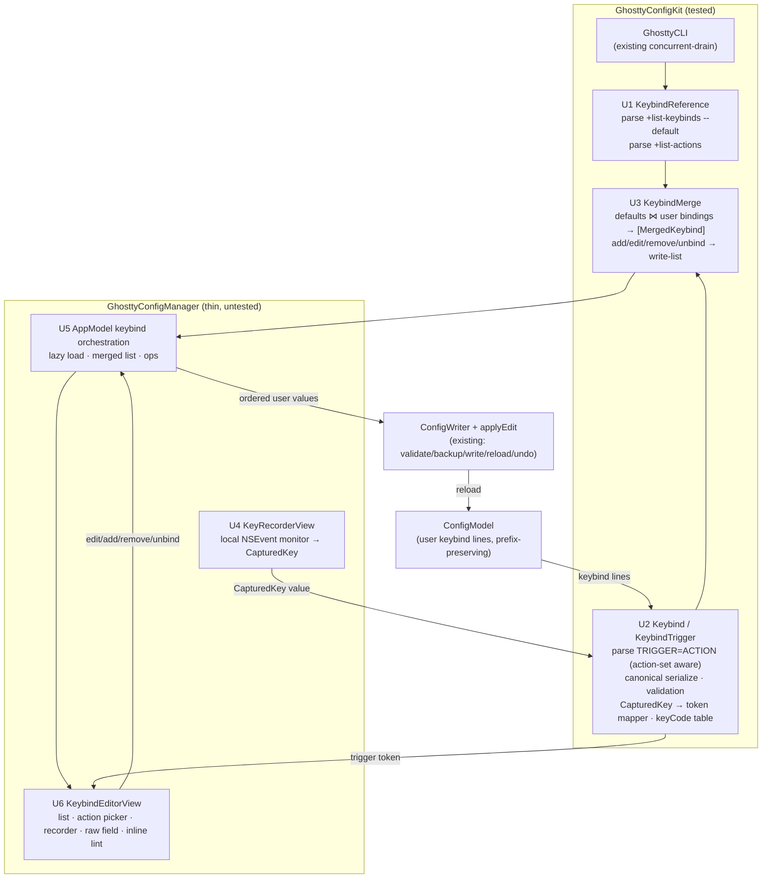

# feat: Keybindings Editor — Merged List, Action Picker, Key-Capture Recorder

## Summary

Add a dedicated **Keybindings** editor surface to GhosttyConfigManager. It shows Ghostty's
default keybinds merged with the user's overrides, lets the user assign an action from
Ghostty's action list, and provides a **key-capture recorder** — press the real hotkey to set
the trigger, exactly like a system shortcut field. Edits are written back as `keybind` lines
through the app's existing safe write path (validate → backup → atomic write → reload → undo),
and the existing keybind footgun lint is surfaced inline.

This deliberately and narrowly **un-defers** the "visual keybinding builder" the brainstorm
placed post-v1 (see origin: *Scope Boundaries → Deferred for later*): it builds keybind-specific
list editing **without** a conflict graph. The other repeatable keys (`palette`, `env`,
`font-feature`) keep their current "in-app list editing is coming" placeholder.

---

## Problem Frame

`keybind` is a repeatable option, and the app has **no in-app editor for repeatable keys** —
`OptionDetailView` renders a literal placeholder ("This option can repeat… In-app list editing
is coming; for now use Copy snippet or Reveal in editor."). For keybinds specifically that gap
is acute: the syntax has footguns, the user can't see which defaults exist to override, and
typing `trigger=action` by hand is exactly the tedium this tool exists to remove. Ghostty's own
docs say the full key set "is currently only available for reference by viewing the source code"
— so a discoverable, press-the-keys editor is high-value.

The write machinery already exists and is robust (`ConfigWriter` reconciles repeatable keys
position-wise; `AppModel.applyEdit` runs validate/backup/write/reload/undo). The missing pieces
are all **read + model + UI**: pull Ghostty's defaults and actions, parse/merge them with the
user's config, capture a keystroke into a canonical trigger token, and present a list editor.

---

## Scope Boundaries

### In scope
- A dedicated Keybindings editor surface reached from the existing **Keybindings** sidebar category.
- Merged display: Ghostty defaults (`+list-keybinds --default`) + user bindings (from the config model), marking which user bindings override a default.
- Action assignment via a searchable picker over `+list-actions`.
- A key-capture recorder for **single modifier+key chords**, emitting logical lowercase tokens in canonical order.
- A **raw-text fallback** field for advanced grammar the recorder does not generate (sequences `ctrl+a>n`, W3C physical key names, `global:`/`unconsumed:`/`all:`/`performable:` prefixes).
- Add / edit / remove a user binding, plus **unbind a default** (writes `trigger=unbind`).
- Inline reuse of the existing footgun lint (`ConfigLinter`) findings for `keybind`.
- Writes via the existing repeatable-key path; reuse of apply feedback + undo.

### Deferred to follow-up work (this product, later PRs)
- Generalizing the repeatable-key editor to `palette` / `env` / `font-feature` (each needs a different control; out of this feature's value path).
- Recorder support for multi-key **sequences** and **W3C physical** key names (raw-text fallback covers them for v1).
- Per-action **parameter pickers** (e.g. `goto_split:left/right/up/down`) — research confirmed the param enums are **not** derivable from `+list-actions[--docs]`; v1 takes the action name and a free-text/param string.
- Re-reading `+list-keybinds` after a write to **confirm a binding registered** (mitigation for Ghostty's silent-drop; v1 relies on kit-side validation instead).
- Correcting the existing `keybind-clears-all` linter copy (see Risks R-A) — separate concern, tracked as a follow-up.
- Platform-scoping the action list to exclude GTK/Linux-only actions (see Open Questions).

### Outside this product's identity (carried from origin)
- A full visual keybinding builder **with a conflict graph** — origin keeps this post-v1; this plan honors that by reusing the existing footgun lint rather than building a conflict engine.
- NSUserDefaults-backed settings; cross-platform builds; surfacing Linux/GTK-only options.

---

## Requirements Traceability

Carried from origin (`2026-06-16-ghostty-config-manager-requirements.md`) plus feature-local requirements (RK*):

| ID | Requirement | Units |
|----|-------------|-------|
| R9 | Editing repeatable keys (`keybind`) must not collapse them to a single value | U2, U3, U5 |
| R16 | Warn on known keybind footguns; surface conflicts | U6 |
| R17 | Applying a change gives explicit success/failure feedback | U5 (reuses existing) |
| R8/R11 | Preserve comments, ordering, untouched/unrecognized lines on write | U3, U5 (multi-file guard) |
| AE2 | Editing one keybind leaves the other `keybind` lines intact | U3 (test) |
| AE4 | Warn before a binding that clears all keybinds | U6 (+ Risk R-A) |
| RK1 | Show Ghostty defaults merged with user bindings, marking overrides | U1, U3, U6 |
| RK2 | Assign an action chosen from Ghostty's action list | U1, U6 |
| RK3 | Capture a trigger by pressing the keys; emit a canonical lowercase logical token | U2, U4, U6 |
| RK4 | Preserve advanced trigger grammar (prefixes/sequences/physical) on bindings not edited via the recorder | U2, U3, U6 |
| RK5 | Validate trigger/action in the kit before writing (Ghostty silently drops bad keybinds) | U2, U5 |

---

## Key Technical Decisions

- **KTD1 — Logic in the kit, thin AppKit views.** Per the project's testing architecture (kit is the only tested target; the app target has no harness), all parsing, merging, serialization, validation, and the NSEvent→token mapping live in `GhosttyConfigKit` as pure, fixture-tested code. The recorder NSView and SwiftUI editor stay thin and untested.
- **KTD2 — Reuse `GhosttyCLI`, never spawn a fresh `Process`.** `+list-keybinds`/`+list-actions` go through the existing concurrent-drain path, inheriting the watchdog, the no-unbounded-`waitUntilExit` guarantee, and the `Process`-is-not-Sendable discipline (per `docs/solutions/logic-errors/directory-walk-infinite-loop-at-filesystem-root.md`).
- **KTD3 — Defaults baseline = `+list-keybinds --default`; user bindings = parsed from the config model.** `+list-keybinds` (no flag, effective) is **lossy** — it strips `global:`/`unconsumed:`/`all:`/`performable:` prefixes and canonicalizes key aliases. We therefore never treat the CLI listing as the source of truth for user bindings; we parse the user's raw `keybind` lines from `ConfigModel` (prefix-preserving) and use `--default` only as the discover-and-override reference set.
- **KTD4 — Recorder emits logical lowercase tokens only; physical/sequence grammar via raw text.** Research could not get any `physical:` form to register in 1.3.1, and the recorder's job is the common case. It emits `super+ctrl+alt+shift+<key>` in canonical order, modifiers lowercase, letter keys lowercased. Anything else is hand-editable in the raw-text fallback.
- **KTD5 — `keyCode` for stability + named keys; resolve *character* keys via the live layout on the AppKit side.** A purely kit-side `keyCode → keyName` static table would emit **US-ANSI-position** letters/digits on every layout, silently mis-binding on AZERTY/Dvorak/QWERTZ (the recorder's happy path). So the split is: the **AppKit recorder (U4)** has live-layout access and resolves letter/digit/punctuation keys to their unshifted character (via `UCKeyTranslate` against the current input source, like `MASShortcut`'s `keyCodeString`), passing a resolved character into `CapturedKey`; the **kit** assembles the canonical token (modifier ordering + lowercasing) and owns a static `keyCode → keyName` table for **position-stable non-character keys only** (arrows, F-keys, `enter`/`tab`/`space`/`escape`/`delete`/`home`/`end`/`page_up`/`page_down`). Punctuation — including brackets `[` `]`, `backslash`, and `backquote` — is **layout-variable** (the US `[` keyCode produces `ü` on QWERTZ and sits elsewhere on AZERTY), so it is resolved via the live layout like letters/digits, **never** from the static table. `keyCode` remains the source for the named keys and for dead-key safety. *Correction:* `KeyboardShortcuts`/`MASShortcut` translate `keyCode` through the **live** keyboard layout (Carbon `UCKeyTranslate` / `TISCopyCurrentKeyboardLayoutInputSource`) — *not* a static table — which a deliberately NSEvent-free kit cannot replicate; that is precisely why the character resolution lives on the AppKit side.
- **KTD6 — Local `NSEvent` monitor (`.keyDown` only), not a `keyDown` override.** AppKit dispatches menu key-equivalents (Cmd+Q/W/T) *before* the responder chain, so an override never sees them. A local monitor sees them earlier and returning `nil` swallows the event (no menu fire, no beep). `.keyDown`-only also makes modifier-only presses a non-issue (a bare ⌘ never produces a key-down).
- **KTD7 — Kit-side trigger/action validation; do not rely on `+validate-config` for keybinds.** Ghostty silently drops malformed keybinds (exit 0, no stderr), so `validateAndApply`'s `+validate-config` step cannot catch them. The kit validates lowercase modifiers, a known key token, and a known action name before producing a write value.
- **KTD8 — Write only user bindings, via the existing repeatable-key writer.** The edited ordered list of user `keybind` values is handed to `AppModel.applyEdit(option: keybindOption, values:)`. Defaults are never written. "Override-to-nothing" writes `trigger=unbind`. This reuses `ConfigWriter.editedFile(…isRepeatable:true)` position-wise reconciliation (AE2/R9) untouched.

---

## High-Level Technical Design

The feature is a read/model/UI layer over an unchanged write path. Data flows from two sources
(the CLI defaults/actions and the user's config) into a merged display model, and edits flow
back out through the existing `applyEdit` pipeline.



**Routing.** `RootView.browser(_:)` currently switches `model.selection` → `ProblemsView` /
`ThemeBrowserView` / `OptionListView`. Add a branch so that selecting the **Keybindings**
category renders `KeybindEditorView` instead of the generic option list (mirrors how `.themes`
renders `ThemeBrowserView`). The sidebar already emits this row with a `keyboard` icon — no
sidebar change required beyond routing.

**Trigger/action split (the subtle part).** `keybind` values cannot be split naively: `=` and
`+` are valid keys (`super+==increase_font_size:1`). The parser strips any leading
prefix tokens, consumes `+`-separated **known modifier tokens** left-to-right, then resolves the
`TRIGGER=ACTION` boundary by finding the `=` whose right-hand side is a **known action name**
(from U1's action set), with a heuristic fallback (action names are `[a-z_]`-initial) when the
set is unavailable. Directional sketch (not implementation spec):

```
parseKeybindValue("super+==increase_font_size:1", knownActions):
  prefixes ← consume {global:,all:,unconsumed:,performable:}*      // none here
  for each candidate '=' index i (left→right):
     left  = "super+="    right = "increase_font_size:1"
     if actionName(right) ∈ knownActions  → trigger=left, action=right ✓
  trigger → tokens: mods={super}, key="="  (canonical: "super+=")
```

---

## Output Structure

New kit module plus two app views (per-unit `**Files:**` remain authoritative):

```
Sources/GhosttyConfigKit/Keybind/
  KeybindReference.swift     # U1: CLI wiring + parse defaults/actions
  Keybind.swift              # U2: model, parse/serialize, capture→token, validation
  KeybindMerge.swift         # U3: merge + write-list + edit operations
Sources/GhosttyConfigManager/Views/
  KeyRecorderView.swift      # U4: NSViewRepresentable capture control
  KeybindEditorView.swift    # U6: editor surface (+ action picker subview)
Tests/GhosttyConfigKitTests/
  KeybindReferenceTests.swift
  KeybindTests.swift
  KeybindMergeTests.swift
  Fixtures/list-keybinds-default.txt
  Fixtures/list-actions.txt
```

Modified: `Sources/GhosttyConfigManager/App/AppModel.swift` (U5),
`Sources/GhosttyConfigManager/App/GhosttyConfigManagerApp.swift` (U6 routing).

---

## Implementation Units

### U1. Wire and parse `+list-keybinds --default` and `+list-actions`

**Goal:** Expose Ghostty's default keybinds and its action list to the kit, parsed into typed models, via the existing CLI path.

**Requirements:** RK1, RK2.

**Dependencies:** none.

**Files:**
- `Sources/GhosttyConfigKit/Keybind/KeybindReference.swift` (new)
- `Tests/GhosttyConfigKitTests/KeybindReferenceTests.swift` (new)
- `Tests/GhosttyConfigKitTests/Fixtures/list-keybinds-default.txt` (new)
- `Tests/GhosttyConfigKitTests/Fixtures/list-actions.txt` (new)

**Approach:**
- Define `DefaultKeybind { trigger: String, action: String }` and `KeybindAction { name: String }` (docs optional, deferred).
- Add a provider mirroring `ThemeProvider`/`CatalogProvider`: `KeybindReferenceProvider` (or static `KeybindReference.live(_:)`) that runs `cli.run(["+list-keybinds", "--default", "--plain"])` and `cli.run(["+list-actions"])` through `GhosttyCLI` (KTD2) and parses stdout.
- Parser for `+list-keybinds` lines: strip the literal `keybind = ` prefix, then reuse U2's value parser to split `TRIGGER=ACTION`. Skip blank/`--docs` filler lines.
- Parser for `+list-actions`: one snake_case name per line; trim, drop blanks.
- Do **not** assume `--default` is a subset of effective output, and do not depend on a fixed line count — parse whatever lines are present (see Risk R-B).

**Patterns to follow:** `CatalogProvider.live` / `ThemeProvider.live` (actor/provider shape, `cli.run`, `result.succeeded` guard); `CatalogParser` fixture-driven tests; `BinaryLocator.locateForTests()` to keep unit tests off the live binary.

**Test scenarios:**
- Parses a representative `list-keybinds-default.txt` fixture into the expected count of `DefaultKeybind`, with `super+shift+,=reload_config` → trigger `super+shift+,`, action `reload_config`.
- Parses the `=`-key and `+`-key defaults: `super+==increase_font_size:1` → trigger `super+=`, action `increase_font_size:1`; `super++=increase_font_size:1` → trigger `super++`.
- Parses a parameterized action line `super+ctrl+shift+j=write_screen_file:copy,plain` → action `write_screen_file:copy,plain`.
- `+list-actions` fixture → list including `ignore`, `unbind`, `new_tab`, `goto_split`; blank lines ignored; count matches fixture.
- Malformed/blank lines in either fixture are skipped without crashing.
- `Covers RK1.` A default line with a sequence `ctrl+a>n=new_tab` round-trips trigger `ctrl+a>n`.

**Verification:** `swift test` green for `KeybindReferenceTests`; against a live 1.3.1 binary the provider returns a non-empty defaults list and ~85 actions (live-integration tier, not unit).

---

### U2. Keybind domain model: parse, serialize, capture→token, validate

**Goal:** A pure, fully-tested model for keybind values and trigger tokens, including the NSEvent→token mapping (as a value-typed function) and validation.

**Requirements:** RK3, RK4, RK5, R9.

**Dependencies:** none (the value parser accepts an optional injected known-action `Set<String>` so it does not depend on U1 at compile time).

**Files:**
- `Sources/GhosttyConfigKit/Keybind/Keybind.swift` (new)
- `Tests/GhosttyConfigKitTests/KeybindTests.swift` (new)

**Approach:**
- `Keybind { trigger: String, action: String, raw: String }`, parsed from a `keybind` value via `Keybind.parse(value:knownActions:)` using the action-set-aware boundary resolution (see HTD). Handle special whole-values `clear`, bare/empty, and action `unbind`/`ignore`.
- `KeybindTrigger` decomposition: leading prefixes (`global:`/`all:`/`unconsumed:`/`performable:`, preserved verbatim, RK4), `+`-separated modifier tokens normalized to canonical lowercase set, key token, and `>`-joined sequence steps preserved as raw (RK4). `canonical()` re-emits modifiers in `super→ctrl→alt→shift` order, lowercased; preserves prefixes/sequence/key case-normalized (letters lowercased).
- `CapturedKey` — a `Sendable` value struct `{ keyCode: UInt16, modifierFlags: UInt, resolvedCharacter: String? }` (no AppKit types, KTD1/KTD5). `resolvedCharacter` is the **unshifted, layout-correct** character the AppKit recorder computed for character keys (nil for named keys like arrows/F-keys). `KeybindTrigger.token(from: CapturedKey) -> String?`:
  - Mask modifiers (`deviceIndependentFlagsMask` semantics simulated on the raw `UInt`), drop capsLock/numericPad, map `.command→super / .control→ctrl / .option→alt / .shift→shift`.
  - Resolve the key: if `resolvedCharacter` is present, use it lowercased (the layout-correct path, KTD5); otherwise look up the static `keyCode → keyName` table for **position-stable non-character keys** (`enter`/`tab`/`space`/`escape`/`delete`/`home`/`end`/`page_up`/`page_down`/`arrow_left`…/`f1…f12`). Punctuation, brackets, `backslash`, and `backquote` are character keys and arrive via `resolvedCharacter`, not the table.
  - Return `nil` for unmappable keys (caller keeps recording). The kit never derives a *letter* from `keyCode` alone — that is the AppKit recorder's job (KTD5), so the token mapper stays layout-correct.
- `KeybindValidation.validate(trigger:action:knownActions:) -> [String]` (warnings/errors): modifiers must be lowercase + recognized (KTD7); key token non-empty; action ∈ knownActions or a recognized special (`unbind`/`ignore`/`text:`/`csi:`/`esc:`); warn when no modifier is present (a bare `t` fires on every literal `t`).

**Technical design (directional, not spec):** the kit's static `keyCode → keyName` table holds
**position-stable named keys only** (arrows, F-keys, enter/tab/space/escape/delete/home/end/page_up/page_down);
letters, digits, and punctuation (including brackets, backslash, backquote) come from the
AppKit-resolved `resolvedCharacter` (KTD5), never from the table. Everything downstream of
`token(from:)` is strings.

**Patterns to follow:** `ConfigLine.splitSetting` / `ConfigLinter.action(of:)` (existing first-`=` handling — extend, do not reuse, because keybinds need action-set-aware splitting); `CatalogParser` test style.

**Test scenarios:**
- `Covers R9.` Round-trip: `parse("super+shift+t=new_tab")` → trigger `super+shift+t`, action `new_tab`; `canonical()` is byte-stable.
- Mixed input order `shift+alt+f` canonicalizes to `alt+shift+f`.
- `=`-key / `+`-key: `parse("super+==increase_font_size:1")` → trigger `super+=`; `parse("super++=…")` → trigger `super++`.
- Prefixes preserved: `parse("global:unconsumed:ctrl+a=reload_config")` keeps both prefixes; `canonical()` re-emits them at the front (RK4).
- Sequence preserved: `parse("ctrl+a>n=new_tab")` → trigger `ctrl+a>n` retained verbatim (RK4).
- Specials: `parse("super+shift+t=unbind")` action `unbind`; whole-value `clear` and empty recognized as special.
- `token(from:)` character key: `CapturedKey(resolvedCharacter:"t", command+shift)` → `super+shift+t` (uses the resolved character, not the keyCode); `resolvedCharacter:"é"` (AZERTY) → `super+shift+é` proving the kit never substitutes a US-position letter.
- `token(from:)` punctuation is a character key: `CapturedKey(resolvedCharacter:"[", control)` → `ctrl+[` (resolved via the layout, **not** the static table — so a QWERTZ user gets their actual bracket character).
- `token(from:)` named key: `CapturedKey(resolvedCharacter:nil, keyCode:Enter, control)` → `ctrl+enter`; bare F5 → `f5`; left arrow → `arrow_left`.
- `token(from:)` lowercases the resolved character; returns `nil` when `resolvedCharacter` is nil and the keyCode is not a known named key.
- `Covers RK5.` `validate` flags an uppercase modifier, an unknown action, and a no-modifier letter binding; passes `super+t=new_tab` clean.

**Verification:** `KeybindTests` green; parse/serialize is a stable round-trip for every fixture trigger from U1.

---

### U3. Merge defaults with user bindings; produce the write-list and edit operations

**Goal:** Combine Ghostty defaults (U1) with the user's parsed bindings (U2) into the editor's display model, and provide the pure transforms that turn an edit into the ordered list of user `keybind` values for the existing writer.

**Requirements:** RK1, RK4, R9, AE2, R8/R11.

**Dependencies:** U1, U2.

**Files:**
- `Sources/GhosttyConfigKit/Keybind/KeybindMerge.swift` (new)
- `Tests/GhosttyConfigKitTests/KeybindMergeTests.swift` (new)

**Approach:**
- `MergedKeybind { trigger, action, origin }` where `origin ∈ { .default, .userAdded, .userOverridesDefault, .userDisablesDefault }`. Built from `defaults: [DefaultKeybind]` + `userBindings: [Keybind]` (the latter parsed from the keybind `MergedOption.userValues`).
- Merge by canonical trigger: user binding with a trigger matching a default → `.userOverridesDefault` (carry the default's action for "overrides X"); user `trigger=unbind` matching a default → `.userDisablesDefault`; user trigger not in defaults → `.userAdded`; default with no user binding → `.default`.
- **Write-list is scoped to the writer's target file (Risk R-F).** The transforms take the user bindings **with their `sources`** and build the ordered `[String]` from only the bindings whose `source.file` canonicalizes to `ConfigWriter.targetFile(forOption:"keybind").resolvedPath`. Bindings defined in *other* files are excluded from the write-list (they round-trip untouched on disk) and surfaced read-only by U5 — without this scoping, feeding the full cross-file `userValues` to the single-file writer duplicates include-bindings into the primary. New bindings are added to the target file.
- Write-list transforms operate on the **target-file user binding list only** (never defaults) and preserve untouched entries verbatim (raw value) so the writer's position-wise reconcile keeps them byte-identical (AE2):
  - `addOrUpdate(trigger:action:)` — replace the target-file user binding with the same canonical trigger, else append.
  - `remove(trigger:)` — drop the user binding (the default, if any, reactivates).
  - `unbindDefault(trigger:)` — append `trigger=unbind`.
- Editing the trigger of a binding that carries a prefix/sequence the recorder can't produce must preserve the original raw value unless the user explicitly replaces it via the raw field (RK4, R11).

**Patterns to follow:** `ConfigReader.merge` (catalog ⋈ config join, normalize-for-compare); `ConfigWriter.mutate` semantics (the write-list feeds exactly this).

**Test scenarios:**
- `Covers RK1.` Defaults `[super+t=new_tab]` + user `[super+shift+t=new_tab]` → one `.default`, one `.userAdded`; user `[super+t=new_window]` → `.userOverridesDefault` carrying default action `new_tab`.
- `Covers AE2.` Given user values `[A,B,C,D]`, `addOrUpdate` on B's trigger returns a 4-element list with A/C/D unchanged (raw preserved) and only B replaced.
- `remove` on a non-existent user trigger is a no-op; `remove` on an existing one drops exactly it.
- `unbindDefault(super+shift+t)` appends `super+shift+t=unbind`; merge then marks that default `.userDisablesDefault`.
- Prefix preservation: a user `global:ctrl+a=reload_config` left untouched by an unrelated edit keeps its exact raw value in the write-list (RK4/R11).
- Two user bindings with the same canonical trigger → last wins in the merged display (matches Ghostty), and `addOrUpdate` collapses them to one.
- `Covers R-F.` Given user bindings sourced 2-from-primary + 3-from-an-include, the write-list for a target file == primary contains **only the 2 primary bindings** (the 3 include-bindings are excluded), so a subsequent `ConfigWriter.mutate(…isRepeatable:true)` against the primary's 2 occurrences neither appends nor duplicates the include-bindings.

**Verification:** `KeybindMergeTests` green; feeding a write-list into `ConfigWriter.mutate(…isRepeatable:true)` changes only the intended line and never duplicates a cross-file binding (cross-checked against existing `ConfigWriterTests` patterns).

---

### U4. Key-capture recorder control

**Goal:** A SwiftUI-wrappable control that captures a single chord via a local `NSEvent` monitor and hands a `CapturedKey` value to the kit mapper.

**Requirements:** RK3.

**Dependencies:** U2.

**Files:**
- `Sources/GhosttyConfigManager/Views/KeyRecorderView.swift` (new)

**Approach:**
- `NSViewRepresentable` wrapping an `NSView`/`NSControl` subclass that owns a local monitor started in `becomeFirstResponder()` and torn down in `resignFirstResponder` / `viewWillMove(toWindow:)` (KTD6). Monitor `[.keyDown]` only.
- In the handler (main actor): mask modifiers, then — with no modifiers — Escape cancels, Delete/Backspace clears, Tab moves focus (return the event); otherwise compute the **layout-correct unshifted character** for character keys (`UCKeyTranslate` against `TISCopyCurrentKeyboardLayoutInputSource`, or `charactersIgnoringModifiers` with explicit Shift handling), build a `CapturedKey` (`keyCode`, `modifierFlags.rawValue`, `resolvedCharacter`), call `KeybindTrigger.token(from:)`, publish the token, and return `nil` to swallow the event. Only position-stable non-character keys (arrows/F-keys/enter/tab/space/escape/delete/home/end/page) pass `resolvedCharacter: nil` and are named by the kit's static table; punctuation, brackets, backslash, and backquote are **character keys** and must be resolved via the live layout into `resolvedCharacter` (KTD5).
- Reject Shift-only / Option-only (outside allowed cases) with a visible warning; surface system-taken combos via `CopySymbolicHotKeys` (advisory only).
- Swift 6 / lifetime: never capture the `NSEvent` — extract value types immediately; keep the binding model `@MainActor`. **Store the monitor token *strongly* (`private var monitor: Any?`)** and tear it down in `resignFirstResponder` / `viewWillMove(toWindow:)` via `if let monitor { NSEvent.removeMonitor(monitor) }; monitor = nil`. A *weak* token can deallocate immediately after install, orphaning the app-wide `.keyDown` handler (which returns `nil`) so it swallows every keystroke for the rest of the session — exactly what `KeyboardShortcuts`' `LocalEventMonitor` and `MASShortcut` avoid by holding it strongly.

**Patterns to follow:** `sindresorhus/KeyboardShortcuts` `RecorderCocoa` + `LocalEventMonitor` (closest match — mirror its focus/teardown, `.keyDown`-only, swallow-on-capture); `MASShortcutValidator` policy for accept/reject.

**Test scenarios:** `Test expectation: none — AppKit view with no test harness (per the project testing architecture). The capture→token logic it depends on is covered by U2's `token(from:)` and validation tests.`

**Verification:** Manual — focusing the field and pressing Cmd+Shift+T shows `super+shift+t`; Escape cancels; Delete clears; Cmd+Q does not quit while recording.

---

### U5. AppModel keybind orchestration

**Goal:** Wire the kit model into app state: lazily load the keybind reference, expose the merged list, and route add/edit/remove/unbind through the existing `applyEdit` write path.

**Requirements:** R17, R9, RK5, R8/R11.

**Dependencies:** U1, U2, U3.

**Files:**
- `Sources/GhosttyConfigManager/App/AppModel.swift` (modify)

**Approach:**
- Add lazy `loadKeybindReferenceIfNeeded()` mirroring `loadThemesIfNeeded()` — runs `KeybindReference.live(environment)`, caches `defaults` + `actions`; cancel/clear on `bootstrap()` re-entry like the theme caches.
- Expose `mergedKeybinds: [MergedKeybind]` computed from `defaults` + the `keybind` `MergedOption.userValues` (via U3), and `keybindActions: [KeybindAction]`.
- `applyKeybindEdit(...)`: compute the new ordered user values via U3, then call the existing `applyEdit(option: <keybind MergedOption>, values:)` — reusing validate/backup/write/reload/undo and `applyState` feedback (R17) unchanged. Pre-validate via U2 (KTD7/RK5) and short-circuit to `applyState = .failed(...)` on a hard validation error before touching disk.
- Guard the keybind `MergedOption` lookup (`browser?.merged.option(named: "keybind")`); handle the `configMissing` first-write case (the existing empty-model path already targets the real primary path).
- **Multi-file guard (Risk R-F):** pass the keybind `MergedOption.sources` to U3 so the write-list is scoped to the writer's target file. When the user's keybinds span more than one resolved file, mark the out-of-target bindings **read-only** in the surface (a "defined in `<file>` — edit there" affordance) so an edit can never duplicate them into the primary. Editing/adding always targets the writer's single target file.

**Patterns to follow:** `loadThemesIfNeeded` / `applyTheme` (lazy load + delegate to `applyEdit`); existing `applyState` lifecycle.

**Test scenarios:** `Test expectation: none — AppModel lives in the untested app target; its pure transforms are covered in U3 and its validation in U2. Orchestration is verified manually and via the live-integration tier.`

**Verification:** Adding a binding in the running app writes a `keybind` line, shows the "Saved" feedback + new-surface notice where applicable, and Undo reverts it.

---

### U6. Keybindings editor surface + routing + inline lint

**Goal:** The user-facing surface — merged list, action picker, recorder, raw-text fallback, inline footgun warnings — routed from the Keybindings category.

**Requirements:** RK1, RK2, RK3, RK4, R16, AE4.

**Dependencies:** U4, U5.

**Files:**
- `Sources/GhosttyConfigManager/Views/KeybindEditorView.swift` (new; action-picker subview inline or as a sibling)
- `Sources/GhosttyConfigManager/App/GhosttyConfigManagerApp.swift` (modify — route the Keybindings category)

**Approach:**
- In `RootView.browser(_:)`, branch `model.selection`: when it is `.category("Keybindings")`, render `KeybindEditorView` (content) instead of `OptionListView`; the detail column shows the selected binding's editor (recorder + action picker + raw field) or a hint, mirroring the `.themes` branch. (Implementer may collapse the edit form into a sheet if the split feels cramped — see origin design sensibility; the list-as-content / edit-as-detail split is the recommended default.)
- List rows: trigger (rendered as key glyphs), action, and an origin badge (`default` / `★ yours` / `⚠ overrides default` / `disabled` / `defined in <file>` for read-only out-of-target bindings, Risk R-F), matching the approved mockup. Read-only rows disable the edit form.
- Add/Edit form: a searchable action picker over `model.keybindActions`, the `KeyRecorderView` for the trigger, and a raw-text field pre-filled with the canonical value for advanced grammar. Apply calls `model.applyKeybindEdit(...)`.
- Inline lint: filter `model.lintReport?.findings` to keybind rules (`keybind-*`) and render them in-surface (reusing severity language from `ProblemsView`), satisfying R16/AE4 without a new conflict engine.
- `.onAppear { Task { await model.loadKeybindReferenceIfNeeded() } }`.

**Patterns to follow:** `ThemeBrowserView` (content-surface for a category-like selection, lazy load on appear); `OptionEditorView` (apply button + `applyState` feedback rendering); `ProblemsView` severity styling; the top-bar/chip design idiom from recent commits.

**Test scenarios:** `Test expectation: none — SwiftUI views in the untested app target. All underlying logic (merge, write-list, token mapping, validation, lint) is covered in U1–U3 and the existing `ConfigLinterTests`.`

**Verification:** Selecting Keybindings shows the merged list; recording a chord + picking an action + Apply writes the line and refreshes the list; an injected duplicate-trigger conflict shows the existing warning inline.

---

## Alternatives Considered

- **Recorder: local `NSEvent` monitor vs. `keyDown`/`performKeyEquivalent` override.** Chose the monitor (KTD6) — the override misses Command combos consumed by the menu and needs more moving parts. Both reference libraries use the monitor.
- **Trigger token: logical letter vs. W3C physical.** Chose logical lowercase (`super+shift+t`) for the recorder — it matches Ghostty's own default-config look, and `physical:`/W3C forms wouldn't register in 1.3.1 testing. Physical forms remain available via the raw-text field. Non-US layouts are handled correctly by resolving the character **on the AppKit side against the live layout** (KTD5), not by a static keyCode table — the failure mode that design avoids is *wrong-at-capture* on AZERTY/Dvorak, not time-based drift. The accepted trade-off is that the NSEvent-free kit cannot resolve characters alone, which is why character resolution is pushed into U4.
- **Defaults source: `+list-keybinds` (effective) vs. `--default`.** Chose `--default` as the discover/override reference, with user bindings parsed from our own config model — because the effective listing is lossy (strips prefixes, canonicalizes aliases) and already merges user config, which we represent more richly ourselves.
- **Editor placement: dedicated surface vs. inline in option detail.** Chose the dedicated surface (user-confirmed) — a list + recorder + action picker needs more room than the detail pane and matches the "list of all bindings" framing.
- **Conflict handling: reuse footgun lint vs. build a conflict graph.** Reuse — the brainstorm explicitly defers the conflict graph; the existing duplicate-trigger/clears-all/malformed rules cover R16.

---

## Risk Analysis & Mitigation

- **R-A — Existing `keybind-clears-all` linter copy is likely wrong for 1.3.1.** Research (verified) found bare `keybind =` **resets to defaults** and `keybind = clear` does **not** fully clear (8 split-nav binds persist), contradicting the linter's "removes every keybinding" message and origin AE4. *Mitigation:* out of scope to fix here; flagged as a follow-up. The editor never generates bare `keybind =`. Verify against the target binary before correcting the copy.
- **R-B — `--default` vs. effective semantics are version-specific.** In 1.3.1 they were non-subset (99 vs 93, the 8 split binds only in effective). *Mitigation:* U1 parses whatever lines exist (no count assumptions); the merge tolerates a default appearing or not. Listed in Open Questions for live verification.
- **R-C — Ghostty silently drops bad keybinds.** `+validate-config` won't reject them. *Mitigation:* KTD7 kit-side validation (lowercase modifiers, known key/action); optional post-write `+list-keybinds` confirmation deferred.
- **R-D — Trigger/action split ambiguity.** `=`/`+` keys break naive parsing. *Mitigation:* action-set-aware boundary resolution (U2) with explicit fixtures for `super+=` / `super++`.
- **R-E — Prefix/sequence loss on edit.** Editing a prefixed/sequenced binding via the recorder could drop its prefix. *Mitigation:* recorder edits replace only simple bindings; prefixed/sequenced bindings preserve their raw value unless explicitly replaced via the raw field (RK4/R11).
- **R-F — Multi-file keybinds cause silent cross-file *duplication*, not benign single-file writes** *(confirmed in adversarial review; was previously mis-stated as benign).* `ConfigReader.merge` accumulates a repeatable option's `userValues` across the primary **and every include** (`effectiveSettings` walks the whole include graph), but `ConfigWriter.targetFile(forOption:"keybind")` returns only the *first* file holding a `keybind` line and `ConfigWriter.mutate` reconciles position-wise against just that file — so feeding the full accumulated list **appends** the include-originating bindings into the primary (mutate lines 91–94) while the include keeps its own copies. With 2 keybinds in the primary + 3 in an include, the first edit silently duplicates 3 lines into the primary. This is first-exercised here (other repeatable keys are placeholder-only and never write), and `ConfigLinter` only flags a conflict when actions *differ*, so same-action duplicates are silent — a direct breach of R8/R11. *Mitigation:* U3 scopes the write-list to the writer's target file and U5 renders out-of-file bindings read-only (see U3/U5). Full cross-file editing (write each binding back to its own file) is deferred with the broader multi-file precedence work.

---

## Open Questions (verify against the target binary; do not block planning)

- Exact `physical:` / W3C key-token spelling and casing — all attempts silently failed in 1.3.1. Keep physical forms in the raw field only until confirmed.
- The accepted-key → canonical-spelling alias map (e.g. `grave_accent`→`backquote`, `digit_1`≈`1`) — docs say it's source-only; enumerate from the target binary as the keyCode table is finalized (U2).
- Per-action parameter enums for a future param picker — not derivable from `+list-actions[--docs]`; deferred.
- Whether to platform-scope the action list (GTK/Linux-only actions). Conscious v1 decision: **do not filter** (low cost of a stray action; no reliable scoping signal in plain `+list-actions`). Revisit per the `MacOSCatalogScope` learning if it becomes noisy.
- Full cross-file keybind *editing* (writing each binding back to its own include) is deferred — v1 scopes edits to the writer's single target file and shows out-of-file bindings read-only (Risk R-F); revisit with the broader multi-file precedence work.

---

## Dependencies / Assumptions

- Requires a discovered Ghostty binary supporting `+list-keybinds` (`--default`, `--plain`) and `+list-actions`; degrade gracefully (empty defaults/actions → editor still edits user bindings) when unavailable, consistent with R19.
- Assumes the existing `ConfigWriter` repeatable-key reconcile and `AppModel.applyEdit` are unchanged and correct (covered by existing tests).
- Assumes `keybind` is present in the catalog as a repeatable option in the **Keybindings** category (verified in `CatalogParser`/`OptionCategorizer`).
- The app is intentionally un-sandboxed so it can exec `ghostty` (per the packaging learning); no change introduces a sandbox assumption.

---

## Sources & Research

External grounding gathered during planning (load-bearing — shaped KTD3–KTD8, the parser, and the recorder):

- **Ghostty keybind grammar + CLI, verified against installed 1.3.1**: trigger/modifier tokens and lowercase requirement; canonical order `super→ctrl→alt→shift`; `=`/`+` as valid keys; sequences `>`; prefixes `global:`/`all:`/`unconsumed:`/`performable:` and `+list-keybinds` stripping them; `+list-keybinds --default` vs effective non-subset; `+list-actions` plain = bare snake_case names (≈85), `--docs` = name + description; silent-drop of malformed keybinds; bare `keybind =` resets to defaults / `keybind = clear` non-empty. Docs: https://ghostty.org/docs/config/keybind , https://ghostty.org/docs/config/keybind/reference , https://man.archlinux.org/man/ghostty.1
- **macOS key-capture patterns**: local `NSEvent` monitor over `keyDown` override; capture `keyCode` (physical) + keep `charactersIgnoringModifiers` (logical); `deviceIndependentFlagsMask` masking; recorder UX (Escape/Delete/Tab, Shift-only/Option-only rejection, `CopySymbolicHotKeys`); Swift 6 NSEvent-not-Sendable handling. Refs: https://github.com/sindresorhus/KeyboardShortcuts (RecorderCocoa, LocalEventMonitor, Shortcut, HotKey), https://github.com/shpakovski/MASShortcut (MASShortcutView, MASShortcutValidator, MASKeyCodes); Apple AppKit `NSEvent`/`NSMenuItem.keyEquivalent`.
- **Institutional learnings** (`docs/solutions/`): reuse `GhosttyCLI` concurrent-drain (don't spawn `Process`), platform-scope CLI-derived lists deliberately + whitespace-normalize doc text, keep NSEvent capture on the main actor passing only Sendable values, mirror the kit fixture-test vs live-integration split. Files: `docs/solutions/logic-errors/directory-walk-infinite-loop-at-filesystem-root.md`, `docs/solutions/design-patterns/platform-scoping-cli-derived-option-catalog.md`, `docs/solutions/tooling-decisions/packaging-swiftpm-executable-as-macos-app.md`.

*This feature is a strong `/ce-compound` candidate once it lands — the recorder control, the defaults/actions merge, and the action-set-aware parser are exactly the non-obvious learnings the knowledge base is currently missing.*
