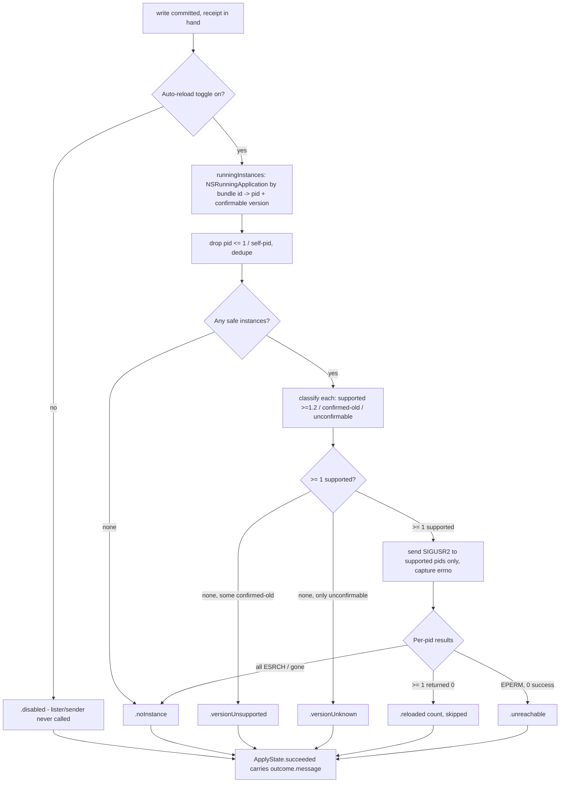

# feat: Auto-reload Running Ghostty After Each Config Change

## Summary

After every successful in-app config write — an option apply, a theme apply, or an undo —
the app automatically signals the running Ghostty to reload its configuration, so live
terminals reflect the change immediately instead of waiting for a manual reload. The signal
is `SIGUSR2` (Ghostty's documented config-reload signal on macOS), sent only to running
Ghostty GUI processes the app can confirm are safe to signal. Auto-reload is on by default
with a toggle to disable it.

---

## Problem Frame

The write path already exists and is robust: `AppModel.applyEdit` runs
`ConfigWriter.validateAndApply` (validate → backup → atomic write) and then `refreshConfig`.
But that "reload" is **app-side only** — `refreshConfig` re-reads the file from disk to refresh
the app's own browser and lint view. Nothing tells the running Ghostty terminal to re-read its
config, so after a save the user's live terminals stay stale until they manually reload
(`cmd+shift+,`) or restart. This is the "silent-reload gap" the brainstorm calls out (the
problem frame notes "config reload gives no visual confirmation"; see origin: *Requirements →
R17*). This plan closes the loop: make the in-app change actually appear in the terminal,
and report honestly what happened.

This is a new capability beyond the brainstorm's M2 editing scope — the brainstorm assumed
manual reload — and it directly advances R17 (explicit apply feedback / silent-reload gap).

---

## High-Level Technical Design

The reload step slots in after a successful commit. The kit owns the entire decision —
the enabled gate, version classification, signal dispatch, and all user-facing copy — so it is
fully unit-tested. The app shell supplies only the AppKit process enumeration: for each running
Ghostty it reports the PID and a **confirmable** version (the bundle's own version, reported
only when the process is known to be running that bundle's code; otherwise reported as unknown
so the kit fails closed).

Component split:

- **Kit (testable):** `GhosttyReloader` takes two injected closures — a *running-instance* lister
  (`() -> [GhosttyInstance]`, each carrying a PID and a confirmable version string) and a signal
  sender (`(pid_t, Int32) -> Int32`). Its `reload(enabled:)` short-circuits when disabled, applies
  the PID safety filter, classifies each instance by version, signals only confirmed-supported
  instances, classifies per-PID errno, and returns a `ReloadOutcome` whose every user-facing
  message is derived in the kit. `signalReloadSupported(version:)` is a pure, tested numeric
  comparator.
- **App (thin glue):** `AppModel` owns the toggle (`autoReloadEnabled`), wires `GhosttyReloader`
  with the real `NSRunningApplication` lister and `kill` sender, calls `reload(enabled:)` after a
  successful write/undo, and routes the returned `ReloadOutcome` into `ApplyState`. The lister
  decides each instance's *confirmable* version (KTD4). A `Settings` scene hosts the toggle.

---

## Requirements

**Reload trigger & mechanism**

- R1. After a successful in-app write — option apply, theme apply, and undo — the app signals
  the running Ghostty to reload its configuration (advances origin R17). Undo is included
  explicitly: it currently re-reads the file app-side but never reloads the terminal.
- R2. Reload uses `SIGUSR2` sent to running Ghostty GUI processes discovered by bundle id
  `com.mitchellh.ghostty` via `NSRunningApplication`. The short-lived `ghostty +…` CLI
  subprocesses the app itself spawns are never signaled.
- R3. The signaler refuses to signal any unsafe PID (`<= 1`, or the app's own PID) and
  de-duplicates the PID list before dispatch.
- R4. An instance is signaled only when the app can **confirm** it is running code that supports
  `SIGUSR2` reload (its own bundle version is `>= 1.2.0` **and** the process is running that
  bundle's code). An instance that is confirmed older, or whose running version cannot be
  confirmed, is never signaled — `SIGUSR2` would terminate a process without the reload handler
  (default signal disposition). Such instances are surfaced to the user with a "reload manually"
  message.

**Feedback & safety**

- R5. Reload is best-effort: a missing, unreachable, unsupported, unconfirmable, or disabled
  reload never turns a successful save into a failure. The committed on-disk file is the source of
  truth.
- R6. The app surfaces a distinct, honest reload outcome (reloaded / Ghostty not running /
  couldn't reach Ghostty / version too old / version unconfirmable / disabled), without claiming a
  confirmation the one-way signal cannot provide (advances origin R17). All messages are
  kit-derived and scope-neutral; the existing new-surface/restart notice (origin AE5) is rendered
  as a separate line so the two read complementarily, never contradictorily.

**User control**

- R7. Auto-reload is **on by default** and can be disabled by a user toggle that persists across
  launches. When disabled, no instance is enumerated or signaled.

---

## Key Technical Decisions

- KTD1: **`SIGUSR2` is the primary reload mechanism, chosen with eyes open to its failure mode.**
  Confirmed implemented for the macOS GUI app in Ghostty 1.2.0+ (PR #7759: `AppDelegate.setupSignals()`
  installs a `DispatchSourceSignal` that calls `ghostty.reloadConfig()` app-wide). It needs **zero**
  TCC permissions, steals no focus, and reloads all surfaces. The tradeoff that matters is the
  *failure mode*: `SIGUSR2` is **fail-deadly** — sent to a process without the handler, the default
  disposition terminates it. The rejected alternatives fail *safe* but cost more: AppleScript
  `perform action reload_config` (1.3.0+ only) errors harmlessly on an unsupported target but needs
  Automation consent; System-Events menu-click needs Accessibility; keystroke synthesis needs focus.
  We accept `SIGUSR2`'s fail-deadly mode because the confirm-before-signal gate (KTD4) reduces the
  kill risk to a fail-safe residual, and a one-time consent prompt on every install is a worse
  default. A fail-safe AppleScript fallback for the unconfirmable case is deferred (see Scope
  Boundaries). There is no `ghostty +reload` CLI for a running instance. (see Sources)
- KTD2: **Discover Ghostty by bundle id; the app lister reports a confirmable version per instance.**
  The lister is `NSRunningApplication.runningApplications(withBundleIdentifier: "com.mitchellh.ghostty")`
  (bundle id verified locally via `/Applications/Ghostty.app/Contents/Info.plist`). For each result it
  returns `processIdentifier` and a version string — the `bundleURL` Info.plist `CFBundleShortVersionString`,
  **but only when `launchDate >= bundleURL` modification time** (the process started no earlier than the
  installed bundle, so it is running that bundle's code). When the process predates the bundle's mtime,
  or the version can't be read, the lister reports an **empty** version so the kit gate fails closed.
  A name probe (`pgrep ghostty`) would match the transient `ghostty +show-config` / `+validate-config`
  subprocesses this app spawns. Multiple GUI instances are possible; each is classified and signaled
  independently.
- KTD3: **Kit/app split via injected seams — `.live` is a partial factory by design.** The testable
  `GhosttyReloader` lives in `GhosttyConfigKit` with injected `runningInstances: () -> [GhosttyInstance]`
  and `send: (pid_t, Int32) -> Int32` closures. The `send` closure and the version predicate self-wire
  inside the kit (matching `BinaryLocator.locate` / `CatalogProvider.live`); the **instance lister is
  intentionally app-supplied** because `NSRunningApplication` (and the `launchDate`/mtime check) is
  AppKit/Foundation system state and the kit stays AppKit-free. So `.live(runningInstances:)` is
  deliberately a partial factory — do not "fix" it by dragging `NSWorkspace` into the kit. The lister
  closure is invoked from `AppModel`'s `@MainActor` context, so it must compile cleanly under Swift 6
  isolation.
- KTD4: **Confirm-before-signal safety gate, fail-safe by construction.** An instance is signaled only
  when the app can confirm it is running ≥1.2 code. Two facts must both hold: (a) the instance's own
  bundle reports `>= 1.2.0` (per-instance, not the located CLI's version — the signal goes to the GUI),
  and (b) the process launched no earlier than that bundle was installed (`launchDate >= bundle mtime`),
  so it is actually running the new code rather than stale pre-upgrade code. (a) closes the
  different-install / CLI-vs-GUI holes; (b) closes the upgrade-in-place-without-restart hole — the one
  case where a process reports a new bundle version while still running the old, handler-less binary and
  would be terminated by `SIGUSR2`. Every failure mode of the gate is **fail-safe**: when unsure (bundle
  touched without a code change, clock skew, unreadable version), the gate skips the signal and tells the
  user to reload manually — it never signals a process it cannot confirm. The version comparison itself
  lives in the kit (`signalReloadSupported`, tested); the `launchDate`/mtime check lives in the app lister.
- KTD5: **Best-effort, non-throwing; outcome rides on `ApplyState`.** The reload call never throws out
  of the apply flow and never produces `ApplyState.failed` — the only throwing call in `applyEdit`
  stays `validateAndApply`. The reload result is carried on `ApplyState.succeeded` (the added
  associated value must stay `Equatable`/`Sendable`). Because `SIGUSR2` is fire-and-forget with no
  acknowledgement channel, success copy says "asked Ghostty to reload," not "reloaded." Ghostty's own
  `app-notifications = config-reload` toast (on by default in 1.2.0+, but user-disableable) is the
  user's real confirmation; the copy must not promise it.
- KTD6: **`send` returns errno, not a bool.** The injected sender returns `0` on success or the
  captured `errno` on failure, so the signaler distinguishes `ESRCH` (instance vanished → benign,
  treat as not-running) from `EPERM` (blocked → surfaced as `.unreachable`). This makes the
  failure-path classification unit-testable with injected constants. The errno-after-syscall idiom
  already exists in the repo (`ConfigWriter.stageAndRename` reads `strerror(errno)` after `rename`).
- KTD7: **Auto-reload default ON; toggle is a stored, persisted property — the app's first persisted
  setting.** `AppModel.autoReloadEnabled` is a **stored** `var` with a `didSet` that writes to
  `UserDefaults`, initialized in `init()` with **explicit default-true** handling:
  `UserDefaults.standard.register(defaults: ["autoReloadEnabled": true])` then read, or
  `defaults.object(forKey:) == nil ? true : defaults.bool(forKey:)`. The naive `bool(forKey:)` returns
  `false` for a missing key, which would ship auto-reload OFF on a fresh install and silently violate
  R7/AE6 — so the default must be registered, not assumed. This is the **first persisted setting** in
  the app; `binaryOverride`/`selection` are in-memory only and are not a persistence precedent. The
  `Settings` scene **must** inject the shared model explicitly (`Settings { SettingsView().environment(model) }`)
  — SwiftUI does not propagate `.environment` across scenes.
- KTD8: **All reload policy and copy live in the kit; messages are scope-neutral.** The enabled gate,
  version classification, outcome classification, and every user-facing message are computed in
  `GhosttyReloader` / `ReloadOutcome`, mirroring `LintReport.badgeText`/`health`. `AppModel` calls one
  tested function (`reload(enabled:)`) and the views render `outcome.message` verbatim. The kit does
  **not** receive the option's `changeScope` — its message stays scope-neutral ("Asked Ghostty to
  reload its config") and the view stacks it as a separate line beneath the existing per-option
  `applyNotice`, so the two never compose and never contradict (see U2).

---

## Output / API Shape (directional)

Directional guidance for review, not an implementation spec.

- `GhosttyInstance` (kit, `Sendable`): `{ pid: pid_t, version: String }`. An empty version means
  "unconfirmable" and fails the gate closed (the app lister emits empty when `launchDate < bundle mtime`
  or the version can't be read; KTD4).
- `ReloadOutcome` (kit, `Equatable`/`Sendable`): `.disabled`, `.noInstance`, `.versionUnsupported`,
  `.versionUnknown`, `.reloaded(count: Int, skipped: Int)`, `.unreachable`. Each exposes a computed
  `message: String?` (kit-derived, scope-neutral; `.disabled` → `nil`). `.reloaded` appends a
  manual-reload hint when `skipped > 0`. Classification precedence when no signal is sent: `.noInstance`
  (none running) → `.versionUnsupported` (some confirmed-old, none unknown) → `.versionUnknown` (only
  unconfirmable). Mirrors `LintReport.badgeText`.
- `GhosttyReloader` (kit, `Sendable`): `init(runningInstances:send:)`, `static func live(runningInstances:)`
  (defaults `send` to the real `kill`), `func reload(enabled: Bool) -> ReloadOutcome`, and a pure
  `static func signalReloadSupported(version: String) -> Bool`. `reload(enabled:)` does not invoke the
  lister or sender when `enabled` is false.
- `ApplyState.succeeded(notice: String?, gitTracked: Bool, reload: ReloadOutcome)` — extend the
  existing case with the kit outcome so `OptionEditorView.feedback` and `ThemeBrowserView` render the
  reload caption as a line stacked beneath the existing `notice`.

---

## Implementation Units

### U1. Kit: `GhosttyReloader`, `ReloadOutcome`, version comparator, and the decision policy

**Goal:** A pure, fully-tested kit component that decides whether to reload, classifies each instance
by version, signals only confirmed-supported Ghostty PIDs with `SIGUSR2`, classifies the result, and
owns every (scope-neutral) user-facing message.

**Requirements:** R2, R3, R4, R5, R6 (the whole decision + safety + classification + copy).

**Dependencies:** none.

**Files:**
- `Sources/GhosttyConfigKit/CLI/GhosttyReloader.swift` (new — beside the existing `kill` precedent in
  `CLI/`; a dedicated `Reload/` group is an acceptable alternative)
- `Tests/GhosttyConfigKitTests/GhosttyReloaderTests.swift` (new)

**Approach:** `public struct GhosttyReloader: Sendable` holding `runningInstances: @Sendable () -> [GhosttyInstance]`
and `send: @Sendable (pid_t, Int32) -> Int32` (returns `0` or `errno`, per KTD6). `reload(enabled:)`:
if `!enabled` → `.disabled` (lister and sender untouched); else list instances → filter PIDs `<= 1`
and `getpid()` → dedupe → if none `.noInstance` → classify each by `signalReloadSupported(version)`
(empty version = unconfirmable, never supported) → signal supported PIDs via `send(pid, SIGUSR2)`,
classify return (`0` success, `ESRCH` gone, else blocked) → fold to the precedence in the API shape
above (`.reloaded(count:skipped:)` if any success, where `skipped` counts confirmed-old + unconfirmable
instances not signaled; `.noInstance` if all gone; `.unreachable` if blocked with zero success;
`.versionUnsupported` / `.versionUnknown` when nothing was signalable). `signalReloadSupported` is a
**numeric, component-wise** comparator: strip any `-prerelease`/`+build` suffix, parse leading integer
components, compare as a tuple `>= (1,2,0)`; **fail closed** (`false`) on any parse ambiguity. Keep the
signal number a named `SIGUSR2` constant and the bundle id a kit constant. Derive each
`ReloadOutcome.message` in the kit, scope-neutral.

**Patterns to follow:** mirror `BinaryLocatorTests`' injected-closure style (pure fakes — **not**
`GhosttyCLITests`/`IntegrationTests`' real-process style; the reloader must never signal a live
process). Use a mutable array captured by the `send` fake to record call args. Mirror
`LintReport.badgeText`/`health` for kit-derived copy; match the heavy `///` doc-comment density and
cite R17/KTD4.

**Execution note:** Write the PID-safety and version-comparator tests first — they are the
hazard-adjacent logic where a false positive terminates a user's terminal; bias the comparator toward
`false`.

**Test scenarios** (`GhosttyReloaderTests`, XCTest, injected fakes — no real process):
- Covers R5. `reload(enabled: false)` → `.disabled`; both the lister and `send` are asserted never
  called.
- Covers R5. Lister returns no instances → `.noInstance`; `send` never called.
- Covers R2/R6. One instance, version `"1.3.1"`, `send` returns `0` → `.reloaded(count: 1, skipped: 0)`;
  assert `send` called exactly once with that PID **and** signal `== SIGUSR2` (guards an accidental
  `SIGUSR1`/`SIGTERM`/`SIGKILL`).
- Covers R2. Three supported instances all returning `0` → `send` once per PID with `SIGUSR2`;
  `.reloaded(count: 3, skipped: 0)`.
- Covers R3. Lister returns PIDs `0`, `-1`, `1`, and `getpid()` (all "supported") → `send` asserted
  **not** called for any (guards `kill(0)` process-group and `kill(-1)` broadcast disasters and
  self-signal).
- Covers R3. Lister returns the same PID twice → `send` called once (dedupe).
- Covers R4. One instance version `"1.1.9"` → `.versionUnsupported`; `send` never called (never kill an
  old Ghostty).
- Covers R4. One instance with empty (unconfirmable) version → `.versionUnknown`; `send` never called.
- Covers R4/R6. Two instances, `"1.3.0"` and `"1.1.0"` → `send` only for the `1.3.0` PID;
  `.reloaded(count: 1, skipped: 1)`, and the message asserts it includes the manual-reload hint for the
  skipped instance.
- Covers R4. Version comparator matrix: `"1.2.0"`, `"1.2"`, `"1.10.0"`, `"2.0.0"` → true (`"1.10.0"`
  guards against a lexicographic compare); `"1.1.9"`, `"1.0.0"`, `""`, `"garbage"` → false; suffixed
  `"1.2.0-tip+abc"`/`"1.4.0-pre"` → true and `"1.1.9-rc1"` → false (leading numeric parsed, suffix
  ignored).
- Covers R5. Sole supported PID returns `ESRCH` → benign no-op, classified `.noInstance`.
- Covers R6. Sole supported PID returns `EPERM` → `.unreachable` (distinct from `ESRCH` and
  `.noInstance`).
- Covers R6. Mixed errno across supported PIDs (`0`, `ESRCH`, `EPERM`) → `.reloaded` with the success
  count; aggregate never becomes a failure.
- Covers R6. Each `ReloadOutcome.message` asserted distinctly (`.reloaded` with and without `skipped`,
  `.noInstance`, `.versionUnsupported`, `.versionUnknown`, `.unreachable`, and `.disabled` → `nil`) so
  the honest strings stay tested in the kit.

**Verification:** `swift test` passes the new suite; the safety filter, version comparator, and the
full decision→message map are covered; no real signal is sent in the suite.

### U2. App: own the toggle, wire reload into apply / undo / theme, surface the outcome

**Goal:** `AppModel` owns the persisted toggle, calls `reload(enabled:)` after a successful write/undo
with a confirmable-version live lister, and routes the kit outcome into the success feedback on both
the option and theme surfaces; `applyTheme` inherits the trigger via `applyEdit`.

**Requirements:** R1, R4, R5, R6, R7.

**Dependencies:** U1.

**Files:**
- `Sources/GhosttyConfigManager/App/AppModel.swift` (modify: add the stored `autoReloadEnabled`
  (`UserDefaults`-backed via `init` + `didSet`, default-true registered explicitly per KTD7); own a
  `GhosttyReloader` defaulting to `.live` whose lister maps `NSRunningApplication.runningApplications(withBundleIdentifier:)`
  to `(pid, confirmable version)` applying the `launchDate >= bundle mtime` check (KTD4); call
  `reload(enabled: autoReloadEnabled)` in `applyEdit` after `validateAndApply` succeeds and in
  `undoLastApply` after `restore` succeeds; extend `ApplyState.succeeded` with the `ReloadOutcome`)
- `Sources/GhosttyConfigManager/Views/OptionDetailView.swift` (modify: render `outcome.message` in
  `OptionEditorView.feedback` as a line stacked beneath the existing new-surface/restart notice)
- `Sources/GhosttyConfigManager/Views/ThemeBrowserView.swift` (modify: render the `.succeeded` reload
  caption too — today it renders only `.failed`, so a theme-apply reload outcome would otherwise be
  invisible on the Themes surface)
- `Sources/GhosttyConfigKit/Catalog/OptionCatalog.swift` (modify: companion wording change — make the
  `.newSurface`/`.restart` `applyNotice` strings *additive* rather than corrective so they read
  complementarily beneath the scope-neutral reload caption; e.g. `.restart` → "Config saved — this takes
  effect after a full Ghostty restart." instead of "This takes effect after you fully restart Ghostty.")

**Approach:** Insert the reload **only** on the success path, after the receipt is in hand and the
atomic rename has returned (never before): in `applyEdit` right after `lastReceipt = receipt` /
`gitTracked`, and identically in `undoLastApply` after the successful `restore`. The call is the single
line `let reload = reloader.reload(enabled: autoReloadEnabled)` — the toggle gate, version gate, and
copy all live in U1, so this glue is exercised by the U1 kit suite. `applyTheme` already delegates to
`applyEdit`, so it needs no separate call (assert no double-signal). Validation/rejection paths
(`validationFailed`, `staleOnDisk`, `invalidValue`) reach `ApplyState.failed` with **zero** reload
attempts (no receipt → no call). Render the kit's scope-neutral `outcome.message` as its own caption
line beneath the existing `notice`; do **not** compose the two into one sentence (KTD8) — the additive
`applyNotice` wording above keeps the stacked lines complementary for `.newSurface`/`.restart` options.
The success caption's lifecycle mirrors the existing `.failed` banner: it persists until the next apply
sets `applyState` to `.applying` (no extra clear mechanism needed).

**Patterns to follow:** the existing `applyEdit` structure (only throwing call stays
`validateAndApply`); `GitContext.isInsideWorkingTree` for the post-receipt side-effect placement; the
existing `feedback` `@ViewBuilder` switch in `OptionEditorView`; the `.failed` branch in
`ThemeBrowserView` as the insertion point for the success caption; the existing `applyNotice`
test(s) in the kit for the additive-wording change. Keep all wording kit-derived (KTD8).

**Test expectation: none** for the app-target glue (SwiftUI/orchestration; no harness by design — see
`testing-architecture`). The toggle gate, version gate, classification, and all reload copy are covered
by the U1 kit suite. **One kit test is in scope here**: assert the revised `.restart`/`.newSurface`
`applyNotice` strings no longer begin with "This takes effect" (so they read additively beside the
reload caption), in `OptionCatalogTests`/`CatalogParserTests` as appropriate.

**Verification:** `swift build` succeeds. Manual, with a real Ghostty 1.2+ running: apply a live option
(e.g. `cursor-style`) and confirm the running terminal updates without manual reload and the caption
shows the reload outcome; apply then **undo** and confirm the terminal reverts; apply a theme and
confirm one reload (recolor) **and** that the reload caption is visible on the Themes surface; apply a
`.restart`-scope option and confirm the stacked captions read complementarily, not contradictorily.
With Ghostty quit: apply succeeds, caption says it isn't running, no error. Confirm the live lister
returns only safe PIDs and applies the `launchDate >= bundle mtime` check (this is the home of the
real-lister verification, not the kit suite).

### U3. App: auto-reload toggle UI (Settings scene)

**Goal:** A Preferences UI for the toggle introduced in U2.

**Requirements:** R7.

**Dependencies:** U2 (the `autoReloadEnabled` property and persistence already exist).

**Files:**
- `Sources/GhosttyConfigManager/Views/SettingsView.swift` (new: the toggle)
- `Sources/GhosttyConfigManager/App/GhosttyConfigManagerApp.swift` (modify: add a `Settings` scene
  that injects the shared model)

**Approach:** Add a SwiftUI `Settings { SettingsView().environment(model) }` scene (gives the standard
`cmd+,` Preferences window) — the explicit `.environment(model)` is required because SwiftUI does not
propagate environment across scenes, and there is no Settings precedent in the repo. `SettingsView`
reads the model via `@Environment(AppModel.self)` + `@Bindable` and binds a single toggle to
`autoReloadEnabled` (default on, defined in U2). Copy: "Automatically reload Ghostty after changes,"
with a one-line caption noting it uses Ghostty's reload signal and needs Ghostty 1.2+. Bind to the
`AppModel` property — **not** a bare `@AppStorage` in the view, which would write `UserDefaults` without
updating `AppModel`'s in-memory stored property and leave a mid-session toggle stale until relaunch.

**Patterns to follow:** existing `@Observable AppModel` property style; the app's toolbar-chip copy
tone for the caption.

**Test expectation: none** — app-target settings/UI glue with no harness (see `testing-architecture`).
Verified by build + manual launch.

**Verification:** `swift build` succeeds. Toggle defaults to on for a fresh `UserDefaults`; turning it
off suppresses the signal on the next apply (terminal unchanged, save still succeeds); turning it back
on takes effect immediately (no relaunch) and resumes; the setting survives relaunch.

---

## Acceptance Examples

- AE1. Covers R1, R6. Given a Ghostty 1.3 instance is running (started after its install) and
  auto-reload is on, when the user applies a live option and the write succeeds, then the app sends
  `SIGUSR2` to that instance and the feedback shows the change was saved and Ghostty was asked to
  reload — on both the option and theme surfaces.
- AE2. Covers R5, R6. Given Ghostty is not running, when the user applies a change, then the write
  still succeeds, the feedback says Ghostty isn't running (applies next launch), and no signal is
  attempted and no error is shown.
- AE3. Covers R4. Given a running Ghostty whose own bundle reports 1.1.x, when the user applies a
  change, then that instance is **not** signaled and the feedback tells the user to reload it manually
  (auto-reload needs Ghostty 1.2+).
- AE4. Covers R4. Given Ghostty was upgraded on disk to 1.2+ but its running process started before the
  upgrade, when the user applies a change, then the app does **not** signal it (`launchDate < bundle
  mtime` → unconfirmable) and tells the user to reload manually — the terminal is never terminated.
- AE5. Covers R1. Given a prior apply is undone, when the undo write succeeds, then the app signals a
  reload too, so the live terminal reverts (closing the current undo gap).
- AE6. Covers R3. Given the instance lister yields PIDs `0`, `-1`, `1`, or the app's own PID, when
  reload runs, then no `kill` is sent for those PIDs.
- AE7. Covers R6. Given two instances — one confirmed 1.3 and one confirmed 1.1 — when the user applies
  a change, then only the 1.3 instance is signaled and the feedback both confirms the reload and tells
  the user the older instance needs a manual reload.
- AE8. Covers R7. Given the user turns auto-reload off, when they apply a change, then no instance is
  enumerated or signaled; turning it back on resumes; the setting (default on) survives relaunch.

---

## Risks & Dependencies

- **One-way signal, no acknowledgement.** `SIGUSR2` is fire-and-forget — the app cannot confirm Ghostty
  accepted or validated the reload (R6). Ghostty's `app-notifications = config-reload` toast is on by
  default in 1.2.0+ but is user-disableable, so the copy must not promise the user will see external
  confirmation; consider suggesting the user keep that notification enabled.
- **Running instance loaded a different config.** If the live Ghostty was launched with `--config-file`
  or a different `XDG_CONFIG_HOME`, it may not read the file the app edited, so the reload is a silent
  no-op. The app cannot easily know the instance's effective config path. The v1 caption should hedge
  that reload only affects instances reading the edited file, so the no-op is not mystifying for the
  power-user segment most likely to hit it.
- **Confirm-before-signal residual is fail-safe.** The KTD4 gate (per-instance bundle version +
  `launchDate >= bundle mtime`) closes the deadly upgrade-in-place hole. The remaining residual is
  benign: a bundle file touched without a code change, or clock skew, can make a genuinely-supported
  instance look unconfirmable, so the app skips the signal and tells the user to reload manually — a
  missed convenience, never a terminated terminal. Put a code comment at the signal site naming this.
- **changeScope coherence.** Options carry a `changeScope` (live/newSurface/restart) and an
  `applyNotice`. The signal is still sent for all scopes (it keeps Ghostty's in-memory config current
  for new surfaces and is harmless for restart). The scope-neutral reload caption (KTD8) is rendered as
  a separate line beneath the additive-worded `applyNotice` (U2), so a restart-scope option never shows
  a "reloaded" + "requires restart" contradiction.
- **PID reuse race (low).** A Ghostty instance can exit and macOS recycle its PID between enumeration
  and `send`; the window is within one `reload()` call. Optionally re-check `NSRunningApplication.isTerminated`
  immediately before signaling; note the residual in a comment.
- **Non-sandbox invariant.** `kill` to a same-uid process and `NSRunningApplication` enumeration both
  rely on the app staying non-sandboxed (it already is). Enabling App Sandbox later would break this.
  Pin the invariant in the packaging doc/README; no entitlement is otherwise required.
- **Dev-build caveat.** Ghostty launched from Xcode ignores `SIGUSR2` (signal handlers need a real app
  bundle). Affects developers testing against a debug Ghostty, not end users.
- **Dependency:** Ghostty `>= 1.2.0` for the macOS `SIGUSR2` reload handler and the
  `app-notifications = config-reload` toast.

---

## Scope Boundaries

**Deferred to follow-up work:**
- A fail-safe AppleScript fallback (`perform action reload_config`, 1.3.0+) for the unconfirmable case,
  so an instance the gate declines to signal still reloads without risk of a kill.
- Watching the config file for **external** edits (changes made in the user's own editor) and
  auto-reloading on those — a filesystem watcher with debouncing. This plan reloads only after the
  app's own writes (confirmed scope).
- Debounce / coalesce policy for rapid applies, to limit Ghostty's reload-toast frequency.
- Detecting the running instance's effective config path to warn precisely on divergence (the v1
  caption only hedges).

**Outside this product's identity:**
- Synthetic keystrokes to drive reload — they cost Accessibility consent or focus.
- Driving Ghostty's in-process `reload_config` keybind action externally — it is not externally
  invocable.

---

## Sources / Research

- Ghostty `SIGUSR2` macOS reload — PR #7759 (`AppDelegate.setupSignals()` →
  `ghostty.reloadConfig()`, app-wide), merged 2025-07-01, milestone 1.2.0:
  https://github.com/ghostty-org/ghostty/pull/7759
- Ghostty 1.2.0 release notes (`SIGUSR2`, `app-notifications = config-reload`):
  https://ghostty.org/docs/install/release-notes/1-2-0
- Ghostty AppleScript dictionary (`perform action`, Automation TCC) — the deferred fail-safe
  alternative, 1.3.0+: https://ghostty.org/docs/features/applescript
- No `ghostty +reload` CLI for a running instance; multiple macOS instances possible:
  https://github.com/ghostty-org/ghostty/discussions/5093 ,
  https://github.com/ghostty-org/ghostty/discussions/3563
- Bundle id `com.mitchellh.ghostty` — verified locally at
  `/Applications/Ghostty.app/Contents/Info.plist`.
- Codebase anchors: `Sources/GhosttyConfigManager/App/AppModel.swift` (`applyEdit`,
  `undoLastApply`, `ApplyState`); `Sources/GhosttyConfigKit/Config/ConfigWriter.swift`
  (`validateAndApply`, `WriteReceipt`, `rename`/`strerror(errno)` idiom); `Sources/GhosttyConfigKit/CLI/GhosttyCLI.swift`
  and `BinaryLocator.swift` (`kill` precedent, injected-probe pattern, `parseVersion` returning a raw
  token such as `1.4.0-pre`); `Sources/GhosttyConfigKit/Catalog/OptionCatalog.swift`
  (`changeScope`/`applyNotice`); `Sources/GhosttyConfigManager/Views/OptionDetailView.swift`
  (`OptionEditorView.feedback`); `Sources/GhosttyConfigManager/Views/ThemeBrowserView.swift`
  (`.failed`-only feedback today).
- Related learning: `docs/solutions/tooling-decisions/packaging-swiftpm-executable-as-macos-app.md`
  (non-sandboxed, ad-hoc-signed — no entitlement wall for `kill`/`NSWorkspace`).
