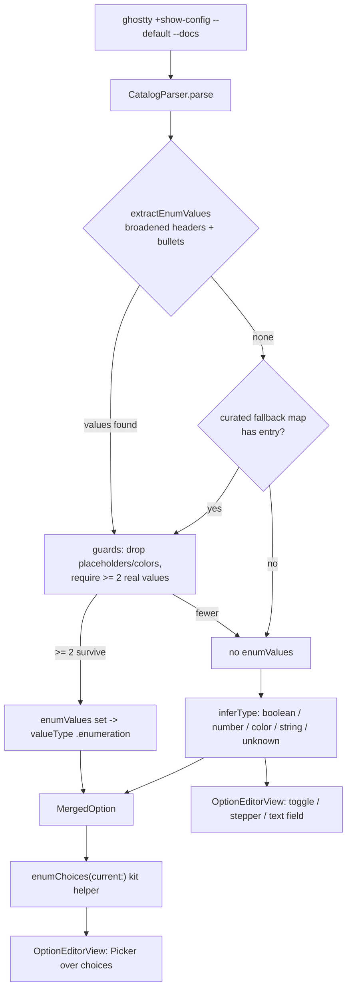

# feat: Dropdown controls for non-binary options with known valid values

## Summary

Make every non-binary config option that has a known, finite set of valid values render as a single-select dropdown in the option editor instead of a free-text field, so the user picks a valid value rather than typing one that fails validation. The editor already renders a `Picker` for `.enumeration` options; the work is closing the detection gap so more options reach that path, fixing options that accept boolean-plus-extra states, and making the dropdown safe when the user's current value isn't in the enumerated set.

---

## Problem Frame

The editor's control is chosen from the catalog's inferred `valueType`: `.boolean` gets a toggle, `.enumeration` gets a `Picker`, `.number` gets a stepper, everything else gets a free-text field. The catalog already maps any option with non-empty `enumValues` to `.enumeration`, and `OptionEditorView` already renders a dropdown for it — so the user-visible problem is upstream, in how few options get `enumValues` populated.

Two concrete failure classes exist against the real Ghostty 1.3.1 `--docs` output:

- **Missed enums.** The parser only triggers enum extraction on the literal phrase "valid values are" / "available values are" / "possible values are". Ghostty also documents closed value sets as "Valid values:" (no "are") and "Allowable values are:", followed by bulleted choices. Those options — `window-theme`, `alpha-blending`, `right-click-action`, `shell-integration`, `window-decoration`, `scrollbar`, `window-colorspace`, and ~9 more — fall through to a free-text field today.
- **Boolean impostors.** Options whose default is `true`/`false` but which also accept extra states (`confirm-close-surface` → `always`; `macos-option-as-alt` → `left`/`right`) are inferred as `.boolean` and rendered as a two-state toggle that cannot represent — and silently cannot preserve — the extra states. These express their value set only in prose, so the parser cannot extract them.

This advances the origin requirements doc's R13 (type-appropriate controls rather than raw text entry) and R2 (surface accepted/enumerated values), and resolves the origin's deferred Outstanding Question on value-type metadata strategy: the answer is *parse where the docs allow, plus a thin curated fallback where they don't*.

---

## Requirements

**Editor control behavior**

- R1. A non-binary option with a known finite value set renders as a single-select dropdown in the editor instead of a free-text field.
- R2. An option that accepts boolean-plus-extra states (e.g. `always`, `left`, `right`) is not rendered as a two-state toggle; its full value set is selectable.
- R3. The editor never silently changes or discards a current value that is not in the enumerated set; that value stays visible and selected, and applying without an edit leaves it byte-for-byte unchanged.
- R4. Open-valued options (colors, numbers, paths, free strings) and composite comma-separated flag options keep their existing controls — no degenerate one-item dropdown, no lossy single-select over a multi-flag value.

**Detection & catalog**

- R5. Dropdown values are sourced from the option's documented valid values via the self-describing parser wherever the docs express them parseably.
- R6. Options whose finite value set appears only in prose (not parseable) are covered by a small curated, version-pinned fallback so they too render as dropdowns and are typed as enumerations rather than booleans.
- R7. Value-set detection happens once in the catalog parser; the view derives its control from the catalog and performs no inference of its own.

---

## Key Technical Decisions

- KTD1. **Detect at the parser choke point, not the view.** Enum extraction and the curated fallback both run in `CatalogParser.parse`, the single place every UI surface reads from (the same choke point where `MacOSCatalogScope.excludes` is already applied). The view renders a dropdown when `enumValues` is populated and falls back to its existing control otherwise. Mirrors the recorded platform-scoping learning: derive from doc prose at one choke point, never re-infer per surface (`docs/solutions/design-patterns/platform-scoping-cli-derived-option-catalog.md`).
- KTD2. **Two-layer detection: broaden the parser first, curate only the residue.** Layer one broadens the doc-header match to cover "valid values" (with or without "are") and "allowable values", keeping the catalog self-describing and zero-maintenance for ~16 newly covered options. Layer two is a small static map for the genuinely prose-only impostors the parser cannot reach. The curated map is the deliberate, documented exception to the self-describing-catalog identity, scoped as narrowly as possible.
- KTD3. **False-positive guards on extraction.** Broadening the trigger risks turning format-placeholder bullets into bogus enums — `search-foreground` documents "Valid values:" then `#RRGGBB`. After collecting the full co-listed token set (KTD2's multi-token bullet reader), reject placeholder/format tokens (`#RRGGBB`, `RRGGBB`, `N=COLOR`, `cell-foreground`, `cell-background`, any token containing `=` or whitespace) and require at least two real values. The "never override a color-typed option" guard needs the option name and default, which `extractEnumValues` does not see, so it is applied at the `parse` call site rather than inside the extractor. A degenerate or color-like list yields no enum, preserving the existing control.
- KTD4. **Out-of-enum safety lives in a testable kit helper.** The logic that builds the dropdown's selectable list — enum values plus the user's current value when it falls outside the set, plus a distinct unset/default entry when the default isn't itself a listed value — is a pure function in `GhosttyConfigKit` (the app target has no test harness). The view binds to it. This avoids the SwiftUI `Picker` footgun where a selection with no matching tag renders blank and lets the user silently overwrite their value.
- KTD5. **Boolean-impostor reclassification falls out of detection.** `inferType` already prefers enums over the `true`/`false` default heuristic, so once an impostor gains `enumValues` (via the curated map), it is typed `.enumeration` and stops rendering as a toggle. No change to `inferType`'s ordering is needed.
- KTD6. **Composite flag options stay free text.** Comma-separated multi-flag values (`shell-integration-features`, `scroll-to-bottom`, `font-synthetic-style`) are not single-choice; a single-select dropdown would be wrong. They keep free-text entry; a multi-select control is deferred (see Scope Boundaries).
- KTD7. **Version-pin and re-audit.** The curated map and any extraction heuristics are annotated with the Ghostty release they were validated against (1.3.x) and added to the existing on-upgrade re-audit checklist, mirroring the exclusion-list discipline in the platform-scoping learning.

---

## High-Level Technical Design

How an option's editor control is resolved, end to end:

The view never branches on doc text — it branches on `valueType` and consumes `enumChoices`.

---

## Implementation Units

### U1. Broaden parser enum detection with false-positive guards

- **Goal:** Recognize the "Valid values:" / "Allowable values are:" doc headers and their bulleted choices — including bullets that co-list several values and wrapped continuation lines — so the ~16 currently-missed enumerated options gain their full `enumValues`, while guarding against format-placeholder and color false positives.
- **Requirements:** R1, R4, R5, R7; advances origin R2, R13.
- **Dependencies:** none.
- **Files:**
  - `Sources/GhosttyConfigKit/Catalog/CatalogParser.swift` (broaden header match, extend bullet tokenization, add list guard; apply the color guard at the `parse` call site)
  - `Tests/GhosttyConfigKitTests/CatalogParserTests.swift` (extend)
- **Approach:** Three changes to enum extraction, plus a guard.
  1. **Broaden the header match.** Add "valid values" (with or without a trailing "are"/colon) and "allowable values are" to the bulleted-mode triggers; keep the existing "available values are" / "possible values are" inline triggers. Per the platform-scoping learning, whitespace-normalize each doc block before scanning so line-wrapped headers aren't missed.
  2. **Extract every co-listed value per bullet, not just the first.** Ghostty packs multiple values onto one bullet — `shell-integration` lists five shells on a single line, and `macos-icon` wraps `paper`/`retro`/`xray` onto a following non-bulleted continuation line. `firstBacktickToken` returns only the first token per bullet and the bulleted mode skips non-bullet lines, so as-is the parser would render a *closed dropdown omitting legal values* — the inverse of the bug this plan fixes. Replace `firstBacktickToken` with extraction of the comma-separated run of backtick tokens at the start of the bullet, stopping at the ` - ` description separator (so values inside a bullet's prose are not pulled in), and keep consuming a following non-bulleted continuation line while it begins with backtick tokens.
  3. **Guard the extracted set.** Drop tokens that are format placeholders (`#RRGGBB`, `RRGGBB`, `N=COLOR`, `cell-foreground`, `cell-background`), contain `=` or whitespace, or are empty; if fewer than two real values survive, return no enum. The "never override a color-typed option" guard needs the option name/default, which `extractEnumValues` does not receive — apply it at the `parse` call site (skip enum assignment when the option color-types), not inside the extractor. Leave `inferType` untouched — it already prefers a non-empty enum.
- **Patterns to follow:** the existing two-mode `extractEnumValues` structure and `quotedTokens`; `firstBacktickToken` is extended into a multi-token bullet reader (note in code that "all backticks on the line" works on 1.3.1 but is fragile to a future bullet that backticks a token inside its description — stop at ` - `). Fixture-driven `realCatalog()` test pattern in `CatalogParserTests`.
- **Test scenarios** (fixture: `Tests/GhosttyConfigKitTests/Fixtures/show-config-default-docs.txt`):
  - Covers AE1. `window-theme` is typed `.enumeration` with `enumValues` containing `auto`, `system`, `light`, `dark`, `ghostty`.
  - Multi-value bullet: `shell-integration` enumerates all of `none`, `detect`, `bash`, `elvish`, `fish`, `nushell`, `zsh` (co-listed shells not dropped); `macos-icon` includes the continuation-line values `paper`, `retro`, `xray`.
  - `alpha-blending` enum contains `native`, `linear`, and `linear-corrected` (assert by containment, not order); `right-click-action` enumerates `context-menu`, `paste`, `copy`, `copy-or-paste`, `ignore`.
  - `fullscreen` and `macos-non-native-fullscreen` (default `false`, bulleted "Valid values") are typed `.enumeration`, not `.boolean`, and their enum includes the non-`false` states.
  - Covers AE4. `search-foreground` and `search-selected-foreground` are NOT `.enumeration` (color placeholders rejected); they retain their prior type.
  - No regression: options already detected today (e.g. `cursor-style`, `macos-titlebar-style`, `mouse-shift-capture`) keep their existing `enumValues`. Assert against the actual pre-change count the Swift parser produces after `MacOSCatalogScope` — confirm that number against the live parser rather than hardcoding an estimate.
  - A doc block with a "Valid values:" header but a single real bullet yields no enum (degenerate-list guard).
- **Verification:** `swift test` passes; the parsed catalog reports `.enumeration` with the *complete* value set for the broadened options and leaves colors/placeholders alone.

### U2. Curated enum fallback for prose-only boolean impostors

- **Goal:** Give a dropdown (and correct `.enumeration` typing) to options whose finite value set appears only in prose, eliminating the two-state-toggle data-loss bug.
- **Requirements:** R2, R6; resolves origin Outstanding Question (value-type metadata strategy).
- **Dependencies:** U1.
- **Files:**
  - `Sources/GhosttyConfigKit/Catalog/CatalogParser.swift` (add curated map; apply in `parse` after extraction)
  - `Tests/GhosttyConfigKitTests/CatalogParserTests.swift` (extend)
- **Approach:** Add a small static `[String: [String]]` of option name → ordered valid values, each entry annotated with the `--docs` sentence that establishes its values and the Ghostty version verified against (1.3.x). In `parse`, when parser extraction returns no enum for an option, consult the map; a hit supplies `enumValues` (and therefore `.enumeration`). Seed set, confirmed prose-only impostors from the 1.3.1 fixture: `confirm-close-surface` (`true`, `false`, `always`), `custom-shader-animation` (`true`, `false`, `always`), `macos-option-as-alt` (`true`, `false`, `left`, `right`), `notify-on-command-finish` (`never`, `unfocused`, `always`), `split-preserve-zoom` (`navigation`, `no-navigation`), `link-previews` (`true`, `false`, `osc8`). To keep membership reproducible across Ghostty upgrades rather than a one-off scan, define an explicit inclusion criterion: an option qualifies when its docs describe a closed value set only in prose (no parseable "valid values"/bulleted form) — typically a `true`/`false` default plus prose of the shape *"can also be set to X"* / *"when set to \"X\""* / *"anything other than false"*. Apply that criterion against the fixture/live `--docs` (an execution-time discovery) to confirm final membership, explicitly excluding genuinely-boolean options (`mouse-reporting`, `window-padding-balance`, `selection-clear-on-copy`) and composite/flag options (KTD6).
- **Patterns to follow:** `MacOSCatalogScope.nonPrefixedLinuxOnly` — a curated, per-entry-annotated, version-pinned `Set`/map applied at the parser choke point.
- **Test scenarios:**
  - Covers AE2. `confirm-close-surface` is `.enumeration` with values including `always` (not `.boolean`).
  - Covers AE6. `macos-option-as-alt` is `.enumeration` with `true`, `false`, `left`, `right`.
  - `link-previews` is `.enumeration` with `true`, `false`, `osc8` (not `.boolean` — the impostor that silently loses `osc8` today).
  - A genuinely-boolean option in the impostor neighborhood (`mouse-reporting`) stays `.boolean`.
  - An option the parser already covers is not overridden by the map (parser result wins; map only fills gaps).
  - Composite flag option `shell-integration-features` is absent from the map and stays non-enumeration.
- **Verification:** `swift test` passes; impostor options type as `.enumeration`; boolean and composite neighbors are untouched.

### U3. Testable dropdown-choice resolution helper in the kit

- **Goal:** Provide a pure, unit-tested function that produces the ordered selectable values for an enum option given the user's current value, handling out-of-enum and unset cases so the view can render a safe `Picker`.
- **Requirements:** R3; supports R1, R2.
- **Dependencies:** U1, U2.
- **Files:**
  - `Sources/GhosttyConfigKit/Config/ConfigReader.swift` (add helper on `MergedOption`, e.g. `enumChoices(current:)`)
  - `Tests/GhosttyConfigKitTests/EnumChoicesTests.swift` (new)
- **Approach:** Add a computed helper (or small value type) that returns the choice list to render: the catalog `enumValues` in documented order; if the resolved current value (`userValues.first` when set, else the catalog default) is non-empty and not already in `enumValues`, include it so it is never dropped or silently rewritten; when the option is unset and its default is not itself a listed value, surface a distinct "not set" entry. That entry must carry an explicit tag equal to the value the editor seeds `draft` with for an unset option (the empty string for empty-default options like `macos-option-as-alt`), so the SwiftUI selection always has a matching tag and the blank-selection footgun (KTD4) never triggers; its label reads "Not set — uses default" (with the default shown when non-empty). The helper marks which entry is the current selection. It performs no I/O and is `Sendable`-clean.
- **Patterns to follow:** existing computed properties on `MergedOption` (`effectiveValues`, `isSet`); kit test conventions using fixtures and `BinaryLocator.locateForTests()` where a binary is needed (no live `ghostty` exec).
- **Test scenarios:**
  - Current value in the enum set → choices equal `enumValues`, current value marked selected.
  - Covers AE3. Current value `beam` not in `enumValues` → `beam` is present in choices and marked selected; `enumValues` order otherwise preserved.
  - Unset option whose default is a listed value → default marked as the selection, no spurious extra entry.
  - Unset option whose default is empty/unlisted (`macos-option-as-alt`) → a distinct unset/default entry exists and is the selection.
  - No duplicate entries when the current value equals the default and both are listed.
- **Verification:** `swift test` passes; the helper covers in-set, out-of-set, and unset cases without ever omitting the current value.

### U4. Render the dropdown in the option editor

- **Goal:** Use the kit helper to render a `Picker` for enumerated options, including out-of-enum current values, while keeping existing controls for non-enumerated and composite options.
- **Requirements:** R1, R2, R3, R4.
- **Dependencies:** U3.
- **Files:**
  - `Sources/GhosttyConfigManager/Views/OptionDetailView.swift` (`OptionEditorView.control`, `.enumeration` case)
- **Approach:** In the `.enumeration` branch, build the `Picker`'s rows from `option.enumChoices(current:)` rather than raw `enumValues`. Pass `currentValue` (the saved config value), not `draft` (the in-progress selection), as the `current:` argument — passing `draft` would make the out-of-enum row vanish the moment the user moves the selection away from it, re-trapping them (the failure R3 exists to prevent). An out-of-enum current value renders as a selectable, pre-selected row with a trailing "— current value" suffix in secondary style; the unset entry renders as "Not set — uses default (`<default>`)". Do not mutate `draft` on appear to force it into the enum set — preserve the existing `onAppear`/`onChange` seeding from `currentValue` so an unchanged apply round-trips the original value (R3). Leave the `.boolean`, `.number`, and `default` (free-text) branches unchanged; composite flag options remain `.string`/`.unknown` and so keep free text by construction (KTD6). Keep the read-only "Valid values" badge in `enumSection`: it serves a distinct scan-before-interact role (the full set is visible without opening the menu) and now reflects the richer `enumValues` with no code change.
- **Patterns to follow:** the current `.enumeration` `Picker` block (`pickerStyle(.menu)`, `labelsHidden()`, `tag` per value); the surrounding Apply/Reset/feedback scaffold already in `OptionEditorView`.
- **Test scenarios:** `Test expectation: none — the app target has no test harness (see project testing-architecture memory); the selection logic is unit-tested in U3, and this unit is verified manually.`
- **Verification:** Build the app; open `window-theme` and `confirm-close-surface` → both show dropdowns with the full value set; open an option whose config value is outside the documented set → the dropdown shows that value selected and applying without change leaves the config line untouched; open `search-foreground` and `shell-integration-features` → both still show their prior (non-dropdown) controls.

---

## Acceptance Examples

- AE1. Covers R1, R5. Given `window-theme` (documented with a "Valid values:" bulleted list), when the user opens it in the editor, then the value control is a dropdown offering `auto`, `system`, `light`, `dark`, `ghostty`, and choosing `dark` then applying writes `window-theme = dark`.
- AE2. Covers R2. Given `confirm-close-surface` (default `true`, prose-only `always`), when the user opens it, then the control is a dropdown offering `true`, `false`, `always` — not a two-state toggle — and `always` is selectable.
- AE3. Covers R3. Given the user's config sets `cursor-style = beam` (a value not in the documented enum), when they open `cursor-style`, then the dropdown shows `beam` selected; applying without changing it leaves the `cursor-style` line byte-for-byte unchanged.
- AE4. Covers R4. Given `search-foreground` (documents "Valid values:" followed by an `#RRGGBB` placeholder), when the user opens it, then the control is the existing color/free-text field, not a one-item `#RRGGBB` dropdown.
- AE5. Covers R4. Given `shell-integration-features` (a comma-separated flag set), when the user opens it, then the control is a free-text field, not a single-select dropdown.
- AE6. Covers R6. Given `macos-option-as-alt` (prose-only `true`/`false`/`left`/`right`, default empty), when the user opens it, then the control is a dropdown with those values and a distinct unset/default entry.

---

## Scope Boundaries

**Deferred to follow-up work:**

- A multi-select / token control for composite comma-separated flag options (`shell-integration-features`, `scroll-to-bottom`, `font-synthetic-style`, `notify-on-command-finish-action`). These stay free-text for now (KTD6).
- Dropdowns for repeatable keys (`keybind`, `palette`, `font-feature`) — they already route to the separate repeatable-option path, not `OptionEditorView`.
- A searchable/typeahead picker for very large value sets (`macos-icon` has ~8 values today; not yet large enough to need it).

**Outside this product's identity:**

- Treating the curated fallback as a general "form for all options" type catalog. It stays a narrow, version-pinned residue for prose-only value sets the parser cannot reach — the catalog remains self-describing by default (origin Key Decision: *self-describing catalog*).
- A dropdown for `theme` — the 300+ themes are served by the dedicated theme browser, not the option editor.

---

## Open Questions

- OQ1. **Escape hatch for options that are open beyond their enum.** `window-decoration` (a named target) documents a bulleted value set *and* accepts literal `true`/`false` (`false` ≡ `none`). A closed dropdown lets the user re-select only a value they already have (U3), not enter a new legal-but-unlisted one. Resolve before U4: accept current-value-preservation as the ceiling (simplest), per-option mark a few known-open options to keep free text, or add a "Custom…" affordance that reveals a text field (largest scope). The escape-hatch control, if chosen, is the kind of follow-up deferred in Scope Boundaries.
- OQ2. **Platform-only enum values surfacing on macOS.** `MacOSCatalogScope` filters whole options, not individual enum values, so a macOS dropdown would offer inert choices — `window-theme`'s `ghostty` ("only supported on Linux builds") and `window-decoration`'s `client`/`server` (GTK concepts). This sits in tension with the origin's macOS-scoped-catalog identity (don't present choices that do nothing on macOS). Decide whether to add a per-value platform filter (and where the membership data comes from, since the CLI carries no platform tag) or to accept inert values as documented and harmless.

---

## Risks & Dependencies

- **Over-extraction from broadened headers.** Loosening the trigger could capture example-bearing prose as enum values. Mitigated by the KTD3 guards (placeholder/format rejection, ≥2-real-values floor, color-type precedence) and by the out-of-enum-safe helper (U3) that preserves any value the dropdown doesn't list. Risk surface is bounded by the fixture-driven tests asserting both the newly-covered set and the explicitly-excluded set.
- **Under-extraction dropping co-listed values.** A bullet that packs several values (or wraps onto a continuation line) could yield a *closed* dropdown missing legal choices — the inverse data-loss failure. Mitigated by U1's multi-token bullet reader and the U3 current-value preservation; the `shell-integration` / `macos-icon` test scenarios assert the full set.
- **Closed dropdown over an actually-open option.** Some options accept free-form input beyond their listed values (`window-decoration`; see OQ1). U3's inclusion of the current value prevents data loss for existing values, but entering a new unlisted value depends on OQ1's resolution.
- **Curated-map drift across Ghostty versions.** A future release may add/rename values for a prose-only option. Mitigated by KTD7 version-pinning and the existing on-upgrade re-audit checklist; the self-describing layer (U1) already absorbs newly-bulleted options automatically.
- **Dependency on `--docs` text stability.** Same load-bearing assumption the catalog already rests on (origin Dependencies/Assumptions); this plan widens reliance on doc-header wording, which the guards and fallback are designed to fail safe against.

---

## Sources / Research

- Real Ghostty 1.3.1 catalog ground truth: `Tests/GhosttyConfigKitTests/Fixtures/show-config-default-docs.txt` — the authoritative source for which options enumerate values and in which doc form. Roughly two dozen options use the current trigger phrases, ~16 more use "Valid values:" / "Allowable values are:" headers, and a small residue expresses its value set only in prose. Confirm exact per-option detection against the Swift parser (post-`MacOSCatalogScope`) rather than the raw fixture phrase counts.
- Existing detection and rendering: `Sources/GhosttyConfigKit/Catalog/CatalogParser.swift` (`extractEnumValues`, `inferType`), `Sources/GhosttyConfigManager/Views/OptionDetailView.swift` (`OptionEditorView.control` `.enumeration` case), `Sources/GhosttyConfigKit/Config/ConfigReader.swift` (`MergedOption`).
- Institutional learning: `docs/solutions/design-patterns/platform-scoping-cli-derived-option-catalog.md` — derive from doc prose not names, whitespace-normalize wrapped doc blocks before scanning, apply at the single parser choke point, version-pin and re-audit curated lists. Directly shapes KTD1, KTD3, KTD7.
- Origin requirements: `docs/brainstorms/2026-06-16-ghostty-config-manager-requirements.md` — R2, R13, and the deferred value-type-metadata Outstanding Question this plan resolves.
