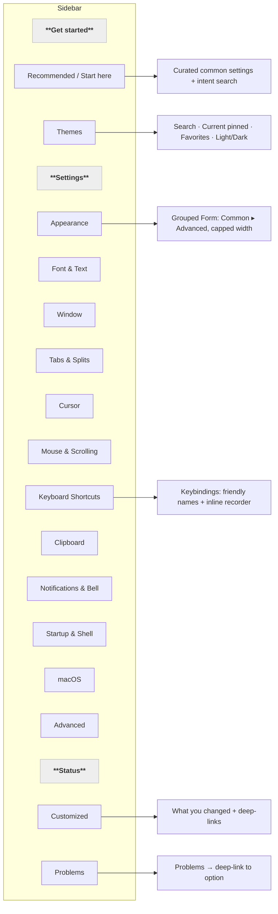
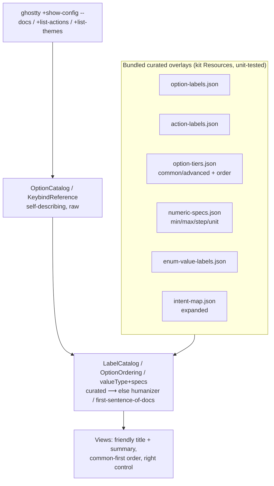
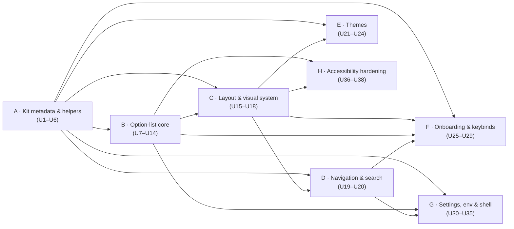

# feat: Newcomer-first UI/UX overhaul of Ghostty Config Manager

## Summary

The app is a capable, safe Ghostty config editor with real strengths — validate-before-write with Undo, live theme previews, a strong font picker, type-appropriate inline controls, config health/Problems, and a genuine accessibility foundation. But it presents Ghostty's internal dialect to the user: raw kebab-case keys as labels, alphabetical ordering that surfaces the most obscure options first, a "General" catch-all dump, a layout that gets *worse* when the window grows, and several dead-ends (no theme search across 300+ themes, no way to set the binary path the "not found" screen tells you to set, no reload-from-disk, and an undo whose *button* vanishes on navigation even though the last change stays undoable).

This plan restructures the app around a **newcomer-first** posture: plain-language labels and descriptions, a curated common-vs-advanced split, a grouped System-Settings-style layout, unified navigation, and the missing table-stakes capabilities — while preserving the safe-write engine and every power-user escape hatch. It is grounded in a firsthand walkthrough of every surface plus a 115-finding audit (7 UX lenses + a completeness critic), and is organized into 8 dependency-ordered phases (38 implementation units). Every finding is traceable to exactly one unit (see the [Traceability appendix](#traceability-appendix)).

**Direction confirmed with the product owner:** optimize for **newcomers first** · **include high-value new features** (not polish-only) · **open to a refreshed layout**.

---

## Problem Frame

A newcomer who installs Ghostty and opens this app to "make my terminal look nicer" hits friction at every step:

- **It speaks jargon.** Every option's primary label is its raw config key (`adjust-cell-height`, `osc-color-report-format`); every keybinding is a raw action id with params (`copy_to_clipboard:mixed`, `increase_font_size:1`). There is no plain-language name or one-line description anywhere.
- **It leads with the wrong things.** Options are sorted alphabetically within a category, so opening **Font** shows 13 obscure `adjust-*` metric fields before `font-family`/`font-size`. "General" is a 30+ item grab-bag. There is no notion of common vs advanced.
- **The layout fights the user.** With no content max-width, maximizing the window strands each control ~1000px from its label; the app ships a deliberately cramped 760px window as a workaround.
- **Discovery is missing where it's needed.** The launch surface (Themes, 300+ entries) has no search; the app's best guidance tool — intent search ("describe a behavior") — is only mounted on a surface newcomers rarely reach.
- **Dead-ends and jank.** The "Ghostty not found" screen says "set the binary path" but no UI sets it; the stale-on-disk error says "reload" but nothing reloads; Undo appears only briefly on one row and never on Themes/Keybindings; theme/font load failures spin forever; two windows share one model and interfere.

The engine underneath is sound. The work is presentation, information architecture, control correctness, and closing capability gaps — all in service of a user who does not know Ghostty's internals.

---

## Goals & Requirements

**R1 — Speak the user's language.** Every option and keybinding shows a plain-language name and a one-line description by default; raw keys/ids are demoted to a secondary/advanced position, never removed.

**R2 — Lead with what matters.** Each category surfaces a curated "Common" set first; the long tail lives under an "Advanced" disclosure. Retire "General." Launch to a curated starting point, not a raw list.

**R3 — A layout that scales.** Adopt a capped-width, grouped, section-headed form layout (System Settings idiom) applied uniformly across surfaces; the window is usable at any size.

**R4 — Right control for each value.** One accessible, correct control per semantic: real toggles for all boolean-ish options (incl. impostors), sliders/units for bounded numbers, a native color picker, dedicated editors for repeatables (font, palette, env). Continuous edits debounce; discrete edits apply immediately.

**R5 — Close the dead-ends.** In-app binary-path and config-file location; reload-from-disk + external-edit recovery; global/reachable Undo; per-option and bulk reset; theme search; retry on failure states; import/export.

**R6 — Unified, orienting navigation.** All destinations live in the sidebar with a consistent "you are here"; a Commands menu (Undo/Reload/Find/Help) and state restoration make it a first-class Mac app.

**R7 — Accessible by construction.** Every inline control carries a VoiceOver label/value; state is conveyed by text/shape, not color/hover alone; Dynamic Type and contrast are respected.

**R8 — Preserve the safety model and power-user paths.** All writes continue to route through validate-before-write + backup + auto-reload. Nothing a power user can do today is removed — only relabeled or relocated. **Tested invariant: search always matches the raw option/action key**, so a power user who knows a key by name can always find it even after the row shows a friendly label (this property is load-bearing for parity — see A1).

**Success criteria:** a newcomer can (a) land on a curated start surface, (b) find and change their font, colors, transparency, and theme without knowing a single config key, (c) understand what each setting does and undo any change, and (d) never hit an unrecoverable dead-end — all verified by launching the packaged app and by the kit test suite for the logic layers.

---

## Design Direction (decided)

| Fork | Decision | Consequence for this plan |
|---|---|---|
| Target user | **Newcomers first** | Friendly labels/descriptions are the primary content; raw keys demoted. Curated common set leads; jargon relabeled. |
| New capabilities | **Include high-value new features** | Theme search, binary-path/config-file settings, common/advanced grouping, palette editor, import/export, reset-all are in scope as real features. |
| Visual/layout | **Open to a refreshed layout** | Adopt a capped-width grouped-form System-Settings layout; refresh the top bar and sidebar; retire the cramped-window workaround. |

---

## Key Technical Decisions

**KTD1 — Curated metadata as bundled kit resources, with deterministic fallback.** The catalog is self-describing (generated from the installed Ghostty binary) and carries no human-facing metadata. Add a layer of small, hand-authored JSON resources in `Sources/GhosttyConfigKit/Resources/` — `option-labels.json`, `action-labels.json`, `option-tiers.json` (common/advanced + order), `numeric-specs.json`, `enum-value-labels.json` — loaded exactly like the existing `intent-map.json` (`IntentMap.bundled`, `IntentSearch.swift:25`). Where the curated map is silent, fall back deterministically: a kebab/snake → Title-Case **humanizer** (with an acronym allowlist: macOS, GTK, OSC, TTY, DPI) and the **first sentence of the already-parsed docs** as the description. *Rationale:* quality where it matters, coverage everywhere, no fork of the catalog; the pattern (curated table + re-audit on version bump) mirrors `CatalogParser.curatedEnumValues` and `MacOSCatalogScope.nonPrefixedLinuxOnly`. All of it is pure and unit-tested in the kit (the app target has no harness by design). **Every curated resource carries an orphan-key guard test** — a kit test asserting each key resolves against a reference catalog / `+list-actions` dump — so a Ghostty rename/removal fails a test instead of silently dropping a common option's label/tier/spec (the deterministic fallback only covers *added* options, not renamed/removed curated keys).

**KTD2 — Newcomer-first via progressive disclosure, not removal.** Each category renders a **Common** section (curated order) by default and an **Advanced** section behind a collapsed disclosure, driven by `option-tiers.json`. Raw keys, advanced options, and jargon are demoted and one step away — never deleted. An option the user has already customized is auto-promoted into the visible set so a setting is never "lost." Search always spans everything.

**KTD3 — Capped-width grouped-form layout as the shared vessel.** Replace the flat full-bleed `List` in the detail pane with a `Form { Section … }` (`.formStyle(.grouped)`) inside a centered `CappedContentColumn` (max width ~680pt), applied uniformly to every surface via `RootView.mainColumn`. This natively fixes the label↔control gap, gives section rhythm for the common/advanced split, and lets the default window grow (retire the 760px workaround). A shared `SurfaceHeader` (title/count + one search field + info affordance) and `SurfaceFeedbackBar` end the three-different-chromes divergence. **Migrating the Phase-B inline controls into Form/`LabeledContent` trailing slots is real layout work, not a drop-in:** the current controls use List-oriented sizing (`.fixedSize()` pickers, fixed 80/160pt fields) that can overflow the constrained trailing column or re-introduce the label↔control gap — C2 must audit each control's sizing (drop `.fixedSize` where it fights the Form, adopt flexible frames, decide truncate-vs-wrap for long enum lead rows).

**KTD4 — One correct, accessible control per semantic.** Control choice is driven by `valueType` **plus** a per-option spec: real `Toggle` for every boolean-ish option (including impostors like `background-blur`, via a toggle-first hybrid that exposes extra states in a trailing affordance); `Slider` + numeric field + unit for bounded/fractional numbers (clamped to `[min,max]`, debounced on drag); native `ColorPicker` (eyedropper/HSB) alongside the hex/preset field; dedicated popover editors for repeatables (font — exists; palette, env — new). Discrete controls apply immediately; continuous controls commit on release/blur so the live terminal isn't reloaded per tick.

**KTD5 — The safe-write engine's *safety model* is preserved; it gains one additive batched path.** Every single-option write, reset, and repeatable-editor commit reuses the existing `AppModel.applyEdit(option:values:)` → `ConfigWriter.validateAndApply` path unchanged (validate-before-write, timestamped backup, auto-reload; empty `values: []` already means "unset"). **However**, bulk reset-all/reset-category and whole-file import (U33) are *not* expressible as the per-option primitive — looping it yields N backups / N validations / N live reloads and a depth-1 undo that reverts only the last option. Those two features require a new, unit-tested **batched primitive** in the kit: a multi-op `editedFile` that applies several mutations to the primary file's line array and commits **once** (one backup, one `validatePreview`, one reload, one receipt so a single ⌘Z reverts the whole operation), plus an import path composed of `ConfigLinter.validate(wholeText)` + `ConfigWriter.commit(newFile)` with a correct `FileIdentity`/stale stamp for the imported bytes. The engine's guarantees are unchanged; its API surface grows by this one additive path.

**KTD6 — Unified sidebar navigation + a real Commands menu.** All destinations become sidebar rows in three sections — **Get started** (Recommended, Themes), **Settings** (the renamed categories), **Status** (Customized, Problems) — so the "you are here" highlight is always coherent (fixes the lost-selection bug). Add a `Commands{}` block: Undo (⌘Z, cross-surface), Reload from disk (⌘R), Find (⌘F), Help/About; persist the last surface via `@SceneStorage`.

**KTD7 — Accessibility is built in per control, hardened at the end.** Each control unit adds its own `.accessibilityLabel/Value` as it's touched (not deferred), and a dedicated Phase H pass fixes the systemic items (`.combine` flattening, Dynamic Type, contrast, reduce-motion). A11y is an acceptance criterion for every UI unit, not an afterthought.

**KTD8 — Window model is an open product decision (see [Open Questions](#open-questions--decisions-for-you)).** The shared-`AppModel`-across-`WindowGroup` bug (GAP-5) is real; the recommended fix is a single-window `Window` scene, but whether multi-window is wanted is the owner's call — held, not decided. **This decision is a prerequisite for U31's `@SceneStorage` state restoration** (not orthogonal to it): `selection` currently lives on the shared model, and `@SceneStorage` is per-window — persisting the last surface per-window *is* the multi-window refactor. If single-window (recommended), `@SceneStorage` on the one window is trivial; if multi-window, selection must move off `AppModel` first. U31's Undo/Reload/Find/Help commands do **not** depend on this — only its restoration piece does.

---

## High-Level Technical Design

### Target navigation & information architecture

### Layered data model (the KTD1 overlay)

### Phase dependency graph

Phase A (curated kit data + helpers) unblocks everything. B and C are the heart; E/F/G build on them; H is the systemic a11y pass that closes what the per-control units start. **The graph shows the primary blocking edges; each unit's `Depends` field is authoritative for full ordering** (e.g. D2 needs C3; F1 needs B controls; F3 needs D1; G4 needs B5; G5 needs D1). Within a phase, units are largely parallelizable except where noted in **Depends**.

---

## Target taxonomy (reference for U3)

Adopt this sidebar order and per-category **Common** set (everything else → **Advanced** disclosure). Membership is drafted from the audit + intent map; **reconcile against the installed Ghostty catalog before coding** (drop keys not present). "General" is dropped entirely.

| # | Section (sidebar label) | Common (shown first) | Advanced (disclosure) |
|---|---|---|---|
| 1 | **Themes** | *(dedicated browser)* | — |
| 2 | **Appearance** | `background-opacity`, `background-blur`, `background`, `foreground` | `palette`, `selection-*`, `minimum-contrast`, `bold-color`, `alpha-blending`, `custom-shader*`, `background-image*` |
| 3 | **Font & Text** | `font-family`, `font-size`, `font-feature` (label "Ligatures") | `font-family-bold/italic*`, `adjust-*`, `grapheme-width-method` |
| 4 | **Window** | `window-padding-x/y`, `window-decoration`, `macos-titlebar-style`, `window-save-state` | rest of `window-*`, `title`, `resize-overlay*` |
| 5 | **Tabs & Splits** | `unfocused-split-opacity`, `unfocused-split-fill` | `split-*`, `tab-bar` |
| 6 | **Cursor** | `cursor-style`, `cursor-style-blink`, `cursor-color` | `cursor-text`, `cursor-opacity`, `cursor-click-to-move` |
| 7 | **Mouse & Scrolling** | `mouse-hide-while-typing`, `mouse-scroll-multiplier`, `scrollback-limit`, `copy-on-select` | `focus-follows-mouse`, `click-repeat-interval` |
| 8 | **Keyboard Shortcuts** | *(dedicated editor)* | — |
| 9 | **Clipboard** | `clipboard-read`, `clipboard-write`, `copy-on-select` | rest |
| 10 | **Notifications & Bell** | `desktop-notifications`, `notify-on-command-finish`, `bell-features` | rest of `bell-*` |
| 11 | **Startup & Shell** | `shell-integration`, `command`, `working-directory` | `initial-command`, `wait-after-command`, `abnormal-command-exit-*`, `env` |
| 12 | **macOS** | `macos-option-as-alt`, `macos-titlebar-style` | rest of `macos-*`, `quick-terminal-*`, `auto-update*` |
| 13 | **Advanced** | *(the true internals)* | `term`, `enquiry-response`, `osc-color-report-format`, `key-remap`, `image-storage-limit`, `config-file` |

---

## Implementation Phases

Each unit lists **Resolves** (audit finding IDs — the authoritative detail lives in `scratchpad/audit-digest.md`), **Depends**, **Files**, **Approach**, **Test scenarios**, and **Verification**. Kit logic is unit-tested in `Tests/GhosttyConfigKitTests/`; the app target (SwiftUI views) has no harness by design, so view-only units specify manual verification against the packaged app (`scripts/package-app.sh` → `open dist/GhosttyConfigManager.app`).

---

### Phase A — Foundational kit metadata & helpers

Pure, testable kit work that every UI phase depends on. Most of it is invisible until Phase B consumes it — **except A3, whose category renames are immediately visible in the sidebar**, so A3 carries its own icon-map and surface-routing updates. These can ship as one reviewed batch, with A3's user-visible piece verified on landing.

#### A1. Friendly label + description layer (`LabelCatalog`)

**Resolves:** CONTENT-1.
**Depends:** none.
**Files:** `Sources/GhosttyConfigKit/Resources/option-labels.json` (new), `Sources/GhosttyConfigKit/Catalog/LabelCatalog.swift` (new), `Sources/GhosttyConfigKit/Catalog/OptionCatalog.swift` (add computed `displayTitle`/`shortSummary` or a `LabelCatalog` accessor), `Tests/GhosttyConfigKitTests/LabelCatalogTests.swift` (new).
**Approach:** `option-labels.json` keyed by option name → `{title, summary}`; hand-author the ~40 common settings (`font-family`→"Font", `background-opacity`→"Window transparency", `macos-titlebar-style`→"Title bar style", …). Provide (a) a `humanize(name)` fallback (split on `-`, Title-Case, acronym allowlist) so the 300+ long tail is never blank, and (b) `firstSentence(documentation)` (up to first `. `, cap ~120 chars) as the `summary` fallback. Expose one read API used by all views. Load via `Bundle.module` mirroring `IntentMap.bundled`. `displayTitle` is **always non-empty** (curated → humanizer), satisfying R1's plain-language name; `shortSummary` is best-effort and **may be empty** when no curated summary exists and the docs yield no clean sentence — R1 is met by the always-present title plus a description where one exists.
**Test scenarios:** `humanize("adjust-cell-height")` == "Adjust cell height"; acronym allowlist keeps "macOS"/"GTK" cased; curated title wins over humanizer for `font-family`; `firstSentence` truncates at the first sentence boundary and caps length; `shortSummary` prefers curated summary then first doc sentence then empty; a name absent from every source still yields a non-empty `displayTitle`; **searching an exact raw option key still returns that option** after relabeling (power-user parity guard, R8); every key in `option-labels.json` resolves against a reference catalog (orphan guard, KTD1). Covers R1, R8.
**Verification:** kit suite green; `displayTitle`/`shortSummary` non-empty for every option in a real catalog dump.

#### A2. Keybind action label layer (`ActionLabelCatalog`)

**Resolves:** CONTENT-3, A11Y-4.
**Depends:** A1 (shares the humanizer + loader pattern).
**Files:** `Sources/GhosttyConfigKit/Resources/action-labels.json` (new), `Sources/GhosttyConfigKit/Keybind/ActionLabelCatalog.swift` (new), `Tests/GhosttyConfigKitTests/ActionLabelCatalogTests.swift` (new).
**Approach:** Map param-less action name → `{title, summary}` (`copy_to_clipboard`→"Copy to clipboard", `increase_font_size`→"Increase font size", `goto_split`→"Focus a split"). Key on the param-less name (`Keybind.actionName` already strips `:params`, `KeybindReference.swift:20`); expose the param separately and humanize it (`:previous`→"(previous)"). Snake_case → Title-Case humanizer fallback for the ~140-action long tail.
**Test scenarios:** curated title for `copy_to_clipboard`; humanizer fallback for an un-curated action; param `:previous`/`:mixed` humanized separately from the base title; unknown action still yields a readable title. Covers R1.
**Verification:** kit suite green; every action from `+list-actions` yields a non-empty title.

#### A3. Taxonomy + common/advanced tiering + one ordering comparator

**Resolves:** IA-1, IA-3, IA-4, IA-7, IA-13, CONTENT-12, ONBOARD-11, FEATURES-5.
**Depends:** none.
**Files:** `Sources/GhosttyConfigKit/Resources/option-tiers.json` (new — per-option `{tier: common|advanced, rank}`), `Sources/GhosttyConfigKit/Catalog/OptionCatalog.swift` (**this file already contains `OptionCategorizer` — there is no separate `OptionCategorizer.swift`**; extend its `nameOverrides`/`prefixMap` to the [target taxonomy](#target-taxonomy-reference-for-u3), **redirect the `category(for:)` catch-all fallback from "General" to "Advanced"** and add "Advanced" to `displayOrder` — otherwise an unmapped option resurfaces "General" via `orderedCategories`' append-unknown step — drop "General", reorder to newcomer-frequency, and add a shared `keybindingsCategory` constant), `Sources/GhosttyConfigKit/Catalog/OptionOrdering.swift` (new — single comparator), `Sources/GhosttyConfigKit/Search/IntentSearch.swift` (route `CatalogBrowser.options(in:)` through the comparator), `Sources/GhosttyConfigManager/Views/SidebarView.swift` (`icon(for:)` cases for the new category names), `Sources/GhosttyConfigManager/App/GhosttyConfigManagerApp.swift` + `Sources/GhosttyConfigManager/Views/KeybindEditorView.swift` (route the keybind editor by the shared constant, not the literal — see Approach), `Tests/GhosttyConfigKitTests/OptionOrderingTests.swift`, `OptionCategorizerTests.swift`.
**Approach:** Centralize ordering in `OptionOrdering.compare` sorting by `(isCommon desc, curatedRank asc, name asc)`; route both `OptionCatalog.options(in:)` (`OptionCatalog.swift:111-113`) and `CatalogBrowser.options(in:)` (`IntentSearch.swift:124-126`) through it so **category lists and search agree** (the flat Customized list keeps name-order — common-first ranking is irrelevant there — so this unit does *not* reorder Customized). Reassign every current "General" member explicitly (bell→Notifications, command/env→Startup & Shell, alpha-blending/custom-shader→Appearance advanced, …) **and** redirect the fallback to "Advanced" so "General" disappears with no orphan resurfacing. **P1 routing coupling:** `GhosttyConfigManagerApp.swift:99` selects the dedicated keybind editor via `case .category("Keybindings")` — renaming that category to "Keyboard Shortcuts" without updating this literal silently drops users into the generic option list (which renders no editor for the repeatable `keybind`). Introduce one shared `keybindingsCategory` constant used by the categorizer, the `mainColumn` switch, `SidebarView.icon(for:)`, and `KeybindEditorView`'s title so a rename can't desync. Add a golden-file test pinning ~25 headline options to expected `(category, tier)`.
**Test scenarios:** `font-family` sorts above `adjust-box-thickness` in Font; every catalog option resolves to a real category and none to "General" (the fallback lands in "Advanced"); the golden pinned set maps to expected `(category, tier, rank)`; comparator is stable and total; **every key in `option-tiers.json` resolves against a reference catalog** (orphan-key guard, KTD1). Covers R2.
**Verification:** kit suite green; sidebar shows the target sections (no "General") with correct icons; **clicking "Keyboard Shortcuts" renders `KeybindEditorView`** (recorder/conflict UI), not the generic list.
**Uncertainty:** exact "General"/tier membership depends on the installed Ghostty version — enumerate against the target binary and reconcile before finalizing the JSON.

#### A4. Numeric specs + boolean-impostor presentation hint + value-type display names

**Resolves:** CONTROLS-1, CONTROLS-2, CONTENT-7, CONTENT-8, A11Y-18.
**Depends:** none.
**Files:** `Sources/GhosttyConfigKit/Resources/numeric-specs.json` + `enum-value-labels.json` (new), `Sources/GhosttyConfigKit/Catalog/CatalogParser.swift` (add a `booleanish` presentation hint for impostor/open-valued options that accept true/false; keep the raw value-type), `Sources/GhosttyConfigKit/Catalog/OptionCatalog.swift` (`OptionValueType.displayName` → "On/off"/"Number"/"Color"/"Choice"/"Text", `nil` for `.unknown`; a `NumericSpec` accessor), `Tests/GhosttyConfigKitTests/NumericSpecTests.swift`, `ValueTypePresentationTests.swift`.
**Approach:** `numeric-specs.json` keyed by option → `{min, max, step, unit, style: slider|field|size}`. Seed: `background-opacity 0…1 step .05`, `background-image-opacity 0…1 step .05`, `unfocused-split-opacity 0.15…1 step .05`, `bell-audio-volume 0…1 step .05`, `minimum-contrast 1…21 step .5`, `font-size 4…72 step .5 (pt)`, `image-storage-limit`/`scrollback-limit` → `style: size (bytes)`. `enum-value-labels.json` annotates cryptic enum values (`osc8`→"Only OSC 8 hyperlinks", `linear-corrected`→"Linear (gamma-corrected)"). Mark boolean-ish impostors/open-valued so U10 can render toggle-first.
**Test scenarios:** spec lookup returns seeded range/step/unit for opacity options and `nil` for options with no spec; `image-storage-limit` classified `size`; `valueType.displayName` maps each case and returns `nil` for `.unknown`; `background-blur`/`confirm-close-surface` flagged `booleanish`; enum-value-label lookup returns friendly text for curated values and falls back to the raw value otherwise. Covers R4.
**Verification:** kit suite green.
**Uncertainty:** confirm `mouse-scroll-multiplier` and byte-suffix acceptance against Ghostty 1.3.x docs before shipping spec values.

#### A5. Unified option-state vocabulary

**Resolves:** CONTENT-6.
**Depends:** none.
**Files:** `Sources/GhosttyConfigKit/Config/ConfigReader.swift` (add `OptionState.displayName`/`displayHint`: "Customized" / "Using default" / "Not set"), `Tests/GhosttyConfigKitTests/OptionStateTests.swift`.
**Approach:** One vocabulary the dot tooltip, popover badge, and any subtitle all read from — replacing the three current phrasings ("Set to a non-default value" / "customized" / "not set"). Drop "not using yet"/sparkles as the base label (color/icon may still carry nuance).
**Test scenarios:** each `OptionState` yields exactly one `displayName`; the three former surfaces would render identical words for the same state. Covers R1/R7.
**Verification:** kit suite green.

#### A6. Expand intent-map coverage

**Resolves:** IA-9, ONBOARD-4.
**Depends:** none.
**Files:** `Sources/GhosttyConfigKit/Resources/intent-map.json` (extend), `Tests/GhosttyConfigKitTests/` (extend `IntentMap`/`CatalogSearch` tests).
**Approach:** Grow the 20-entry map with common newcomer phrasings — "transparency", "startup command", "bell sound", "tab position", "unfocused dim", "opacity", "bigger text", "stop cursor blinking", "hide title bar", "follow system dark mode". Data-only; the engine (`CatalogSearch`, `IntentSearch.swift:78`) is unchanged.
**Test scenarios:** each new phrase resolves to the intended option(s) via `IntentMap.options(matching:)`; existing entries unaffected; no phrase maps to a non-existent option name. Covers R1/R5.
**Verification:** kit suite green.

---

### Phase B — Option-list core (ordering, labels, controls)

The heart of the newcomer experience. Consumes Phase A; lands inside the current list first (Phase C then reshapes the container).

#### B1 (U7). Common/Advanced sections + curated ordering in the list

**Resolves:** IA-2, LAYOUT-13.
**Depends:** A3.
**Files:** `Sources/GhosttyConfigManager/App/AppModel.swift` (`visibleOptions` → `commonOptions(in:)`/`advancedOptions(in:)` or a `{common, advanced}` split), `Sources/GhosttyConfigManager/Views/OptionListView.swift` (render a "Common" section and a collapsible "Advanced (N)" section), `Sources/GhosttyConfigKit/Search/IntentSearch.swift` (`CatalogBrowser` split helpers).
**Approach:** Put the split in the **model** — add `commonOptions(in:)`/`advancedOptions(in:)` to `CatalogBrowser`, driven by `option-tiers.json` (A3) — so it's authored once and reused by both this List and the C2 Form (only the *rendering* differs between B1 and C2; no double-invested logic). Render Advanced under an explicit **collapsible** affordance — `Section(_:isExpanded:)` in the List here (macOS 14+); C2 swaps to a `DisclosureGroup`/custom collapsible header, since plain grouped-Form `Section`s don't collapse natively — collapsed by default with state in `@AppStorage` keyed by category. A search query bypasses the split (show all ranked hits). Auto-promote any *customized* advanced option into the Common section so a changed setting is never hidden.
**Test scenarios (kit):** `commonOptions(in: "Font")` leads with `font-family`/`font-size`; a customized advanced option appears in the common set; search ignores the split. Covers R2.
**Verification:** launch → Font shows font-family/font-size first, adjust-* under "Advanced".

#### B2 (U8). Friendly row labels + microcopy cleanup

**Resolves:** CONTENT-2, CONTENT-4, CONTENT-5, CONTENT-15, CONTENT-16, CONTROLS-15.
**Depends:** A1, A5.
**Files:** `Sources/GhosttyConfigManager/Views/OptionListView.swift` (OptionRow title/subtitle, `:80-87,180-186`), a shared quote-strip helper promoted from `FontFamilyEditor.displayName`.
**Approach:** Primary line = `displayTitle`; secondary line = `shortSummary` (description), replacing the "default: X"/"no default"/"default: default" noise (move default/value context into the info popover). Demote the raw key to a small monospaced caption or the popover only. Suppress the redundant font-family subtitle (the picker button is the single source of truth) and strip leaking quotes everywhere a value renders as text. Replace generic "value" placeholders with `defaultValue`-derived examples.
**Test expectation:** none — view composition over A1/A5 logic (already tested). **Verification:** launch → rows read as "Font size — Terminal font size", no `"quoted"` leaks, no "default: default".

#### B3 (U9). Numeric controls — slider/clamped stepper/unit + debounce

**Resolves:** CONTROLS-4, CONTROLS-5.
**Depends:** A4.
**Files:** `Sources/GhosttyConfigManager/Views/OptionListView.swift` (`InlineOptionEditor` `.number`), optional `Sources/GhosttyConfigKit/Catalog/NumericSpec.swift` (clamp helper for testability).
**Approach:** When a `NumericSpec` exists, render a labeled `Slider` (+ compact numeric field) for bounded/fractional values and a unit-aware size field for byte values; clamp the binding to `[min,max]` so no out-of-range write fires; derive `get` from the saved value (not mid-edit `draft`) to kill the `?? 0` jump. Debounce continuous input — update the visible value live, commit (validate+write+reload) only on slider `onEditingChanged(false)`; for ± stepping, use a short trailing debounce (~400ms coalesce) or +/- buttons that commit on release — SwiftUI `Stepper` fires per increment with **no** editing-ended callback, so a real debounce is required, not a "mouse-up" event that doesn't exist. No spec → text field, drop the step-1 stepper (or infer step from a fractional default).
**Test scenarios (kit):** clamp helper maps out-of-range to the boundary; byte formatter renders `320000000`→"320 MB"; step derivation for a fractional default. Covers R4.
**Verification:** launch → `background-opacity` slides to 0.5 in one gesture; the live terminal reloads once on release, not per tick.

#### B4 (U10). Toggle-first for boolean-ish + enum friendly labels + typed placeholders

**Resolves:** CONTROLS-3, CONTROLS-12, CONTROLS-13, CONTROLS-17.
**Depends:** A4.
**Files:** `Sources/GhosttyConfigManager/Views/OptionListView.swift` (`InlineOptionEditor` `.boolean`/`.enumeration`/`.string`/default), `Sources/GhosttyConfigKit/Config/ConfigReader.swift` (`enumChoices` label ← `enum-value-labels.json`).
**Approach:** Boolean-ish (impostor/open-valued that accept true/false) render a real `Toggle` plus a trailing disclosure for extra states (e.g. `background-blur`: On/Off + enabled-only radius stepper) — deleting the "text box showing `false`" anti-pattern. **Value round-trip (explicit, to avoid silent data loss — R8):** On writes `true` *or* restores the last non-boolean value the user had set (client-cached across the toggle); Off writes `false` **while preserving** that cached extra-state value so re-enabling restores it (e.g. a custom blur radius of 30 survives an off/on cycle), falling back to a documented default only if none exists. Bump the boolean toggle from `.mini` to `.small` to match siblings. Enum picker shows friendly labels (writes the raw token); let the long "Not set…" lead row truncate instead of `.fixedSize` overflow. `.unknown`-typed fields get a doc-derived example placeholder.
**Test scenarios (kit):** `enumChoices` uses friendly labels while `value` stays the raw token; example-placeholder extraction from a doc string. Covers R4.
**Verification:** launch → `background-blur` shows a switch, not a "false" text box; `confirm-close-surface` and real toggles look identical.

#### B5 (U11). Per-option Reset-to-default + state affordance redesign

**Resolves:** FEATURES-4, CONTROLS-16, LAYOUT-3.
**Depends:** A5.
**Files:** `Sources/GhosttyConfigManager/Views/OptionListView.swift` (OptionInfoPopover actions `:823`; OptionRow state dot `:76-79,188-202`).
**Approach:** Add "Reset to default" to the info-popover actions (and an optional inline revert glyph on customized rows), shown only when `option.isSet`, calling `model.applyEdit(option:, values: [])` (the writer already treats `[]` as unset — no kit change). Replace the illegible 7pt tri-state dot with a text-backed affordance: show a small accent "Customized" pill only on non-default rows, nothing otherwise; expose the state to VoiceOver (feed A5's `displayName`).
**Test expectation:** none — reuses the tested unset write path; view-only affordance. **Verification:** launch → change `cursor-style`, "Reset to default" appears and reverts it (live terminal follows).

#### B6 (U12). Color editor — native picker + labeled special states + commit consistency

**Resolves:** CONTROLS-6, CONTROLS-7, CONTROLS-14.
**Depends:** none.
**Files:** `Sources/GhosttyConfigManager/Views/OptionListView.swift` (`InlineOptionEditor` swatch + `colorEditor` `:263-418`).
**Approach:** Add a SwiftUI `ColorPicker`/`NSColorWell` (system wheel + eyedropper + opacity) alongside the existing hex/name field and 16 presets; picker changes update the hex draft and vice-versa. Keep the text field for values a wheel can't express (X11 names, `cell-foreground`/`cell-background`) — and render those as a *labeled* chip (token text or resolved-RGB + "name" badge) instead of the same neutral gray used for "no value". Make hex entry live-preview and commit on blur/close as well as Return/Set so it's as forgiving as clicking a preset.
**Test expectation:** none — view over existing write path. **Verification:** launch → pick a background color with the wheel/eyedropper; a `cell-foreground` swatch reads as set, not empty.

#### B7 (U13). Free-text commit-on-blur + long-value editor

**Resolves:** CONTROLS-9, GAP-7.
**Depends:** none.
**Files:** `Sources/GhosttyConfigManager/Views/OptionListView.swift` (`InlineOptionEditor` `.string`/`.unknown`/`.number` fields, subtitle tooltip).
**Approach:** Commit free-text on focus-loss as well as Return (a blurred dirty field saves, not silently reverts), with a subtle "Return to save" hint while dirty. For genuinely long **scalar** values (`command`, `initial-command`, `working-directory`, `custom-shader`), replace the fixed 80/160pt field with an "Edit…" button opening a popover with a wide, monospaced, multi-line-tolerant field showing the full value; add `.help(currentValue)` on the truncated subtitle. (`config-file` and `font-feature` are *repeatable* — they have no scalar inline field and belong to U14, not here.)
**Test expectation:** none — view interaction over existing write path. **Verification:** launch → type a font value and tab away; it saves. A `command` value is fully visible/editable in its popover.

#### B8 (U14). Repeatable editors — palette + env/font-feature

**Resolves:** CONTROLS-8, FEATURES-7.
**Depends:** B6 (reuses the color editor).
**Files:** `Sources/GhosttyConfigManager/Views/OptionListView.swift` (new `PaletteEditor`, `ListValueEditor`), `Sources/GhosttyConfigManager/App/AppModel.swift` (seed palette from current theme).
**Approach:** Mirror the proven `FontFamilyEditor` pattern with an "Edit…" popover. **Palette:** a 16-swatch grid (ANSI names) each reusing B6's color popover, rebuilding the `index=#hex` repeatable list and routing through `applyEdit(values:)`; seed unset slots from the current theme's palette — resolve the current `ThemeRef` (`loadThemesIfNeeded`) and trigger `ensureColors` for it on open, with a graceful fallback (blank slots + a "open Themes to load palette" hint) when its colors aren't yet available, since `themeColors` is populated lazily only after a theme's swatch has rendered. **env / font-feature:** an add/remove list of text rows. **`config-file` stays plain advanced text** — it's the structural include mechanism, and a generic list editor would let users add arbitrary includes the reader follows (out of scope vs. the deferred config-file chooser). Repeatable non-font options currently render no editor (`OptionListView.swift:104-111`).
**Test scenarios (kit):** palette value-list builder produces valid `N=#hex` lines for edited/unedited slots. Covers R5.
**Verification:** launch → edit palette slot 4; `palette = 4=#…` is written and the live terminal updates.

---

### Phase C — Layout & visual system

Reshapes the container Phase B fills. Ordering matters: cap width (C1) before enlarging the window (C1), migrate to Form (C2) before standardizing row rhythm (C3).

#### C1 (U15). Capped content width + window size/position/metrics

**Resolves:** LAYOUT-1, LAYOUT-4, LAYOUT-14.
**Depends:** none.
**Files:** `Sources/GhosttyConfigManager/App/GhosttyConfigManagerApp.swift` (`mainColumn`, WindowGroup sizing; new `CappedContentColumn`, `WindowMetrics`), all list views.
**Approach:** Wrap every detail surface in a centered `CappedContentColumn` (`maxWidth ~680`) applied once in `mainColumn` (not per-view), so Options/Themes/Keybindings/Problems all cap. Then raise the default window to ~900×700 and add `.defaultPosition(.center)`; reconcile min/default via a single `WindowMetrics` constant used by both the WindowGroup frame and `statusView`. Remove the "open compact as a workaround" comment.
**Test expectation:** none — layout-only. **Verification:** launch → maximize; labels stay next to their controls; first launch is centered.

**Amendment (2026-07-03, user during C1 verification):** A config utility should behave like macOS System Settings, which cannot be zoomed or fullscreened. Two refinements to this unit:
1. **No fullscreen, no maximize.** Disable native fullscreen (`.fullScreenNone`) *and* the green zoom button, and cap the window's `maxSize` so it can't be dragged to a sprawling width. Rationale: maximizing a settings form only produces a control-in-a-void; there is no use case for it here.
2. **Smaller default + bounded max, to kill the label↔value gap.** Grouped `Form` sizes its card to the rows' natural width regardless of window width, so a *wider* window/column only inflates the Spacer between each label and its right-aligned control. Keep the window compact instead of ~900×700 (a snug default plus a bounded `maxWidth`), so label and value stay close. **Do not** widen the option rows to fill — that increases the gap. Exact metrics tuned live against the running app. Supersedes the "raise the default window to ~900×700" line above.

#### C2 (U16). Grouped Form / section layout (System Settings idiom)

**Resolves:** LAYOUT-2, IA-11.
**Depends:** C1, B1 (needs the common/advanced tiers as section data).
**Files:** `Sources/GhosttyConfigManager/Views/OptionListView.swift` (replace flat `List` with `Form { Section("Common") … Section("Advanced") … }`, `.formStyle(.grouped)`).
**Approach:** Render each option as a Form row (LabeledContent shape: friendly label + description leading, control trailing, info button accessory) inside inset section cards. This is the visual vessel for B1's model-level split (reuse `commonOptions`/`advancedOptions` + the `@AppStorage` collapse state) and natively removes the width/gap problem. Advanced is a collapsible `DisclosureGroup` (or custom collapsible section header) — grouped-Form `Section`s don't collapse natively. **Not a drop-in reuse of Phase-B controls:** audit each control's sizing for the constrained trailing slot — drop `.fixedSize()` where it overflows (enum picker `:254`), swap fixed 80/160pt fields for flexible frames, decide truncate-vs-wrap for long enum lead rows — or the label↔control gap C1 killed reappears.
**Test expectation:** none — layout-only. **Verification:** launch → each category reads as grouped cards with "Common"/"Advanced" headers.

#### C3 (U17). Shared surface header + feedback bar + unified search + row rhythm

**Resolves:** LAYOUT-10, LAYOUT-11.
**Depends:** C2.
**Files:** new `SurfaceHeader`, `SurfaceFeedbackBar`, `RowMetrics`; `OptionListView.swift`, `KeybindEditorView.swift`, `ThemeBrowserView.swift`, `ProblemsView.swift`.
**Approach:** One `SurfaceHeader` (title/count + one search field + optional info button) and one `SurfaceFeedbackBar(applyState:)` used everywhere; move Keybindings and Themes onto the shared header field (delete Keybindings' hand-rolled field). The shared field is **one component, bound per-surface** — it filters the *current* surface (options via `query` on option surfaces, themes via `themeQuery` on Themes, actions on Keybindings); it is **not** a single global query that means two things at once. Global cross-surface option search is a distinct ⌘F Find (D2). Define `RowMetrics` (vertical padding, inset, type roles) and apply across all rows.
**Test expectation:** none — view refactor. **Verification:** launch → search and "Saved/Undo" feedback are in the same place on every surface; density is uniform.

#### C4 (U18). Top-bar redesign — identity vs health, tappable, one chip component

**Resolves:** LAYOUT-5, LAYOUT-6, LAYOUT-7, CONTENT-11, A11Y-14.
**Depends:** none.
**Files:** `Sources/GhosttyConfigManager/App/GhosttyConfigManagerApp.swift` (statusChip/healthChip/customizedChip `:140-218`; new `ToolbarChip`).
**Approach:** Extract one `ToolbarChip(icon, tint, title, isActive, action?)`. Drop the green seal from the identity chip (version is a label, not a status); give the health chip the only status glyph — quiet when clean, tinted+count when not — with visible button chrome (border/chevron/hover) so it reads as tappable; separate identity and health with a divider so they stop reading as one redundant pair. Fold "no config file yet" into the health chip. Hide/label the stray seal for VoiceOver.
**Test expectation:** none — view-only. **Verification:** launch → the two chips are visually distinct; the health chip looks clickable and opens Problems.

---

### Phase D — Navigation & search

#### D1 (U19). Sidebar sections + unify Themes/Customized/Problems as rows + renames + cross-links

**Resolves:** IA-5, IA-6, LAYOUT-12, ONBOARD-13, IA-14.
**Depends:** A3 (taxonomy/renames).
**Files:** `Sources/GhosttyConfigManager/Views/SidebarView.swift`, `Sources/GhosttyConfigManager/App/GhosttyConfigManagerApp.swift` (move Customized/Problems out of the toolbar), `Sources/GhosttyConfigManager/App/AppModel.swift` (add the shared `focus(optionNamed:)` navigation helper).
**Approach:** `List` with sections — **Get started** (Recommended, Themes), **Settings** (renamed categories in newcomer order), **Status** (Customized, Problems with a health badge). Making Customized/Problems real tagged rows fixes the lost-selection bug for free. Keep the identity chip in the toolbar; the health badge moves onto the Problems row. Add a one-line cross-link between Themes and Appearance ("Colors come from your theme — set one in Themes. Override individual colors here."). Introduce here the shared `func focus(optionNamed:)` — clears search, sets `selection = .category(OptionCategorizer.category(for: name))`, sets `selectedOptionName`, scrolls into view — since it's the common navigation primitive consumed by U27 (Customized deep-links) and U34 (Problems deep-link).
**Test expectation:** none — nav view. **Verification:** launch → the sidebar always shows a selected row (incl. on Problems/Customized); sections are labeled.

#### D2 (U20). Global search + intent prominence + results presentation

**Resolves:** GAP-6.
**Depends:** A6, C3.
**Files:** `Sources/GhosttyConfigManager/App/GhosttyConfigManagerApp.swift` (search at split-view level / ⌘F), `Sources/GhosttyConfigKit/Search/IntentSearch.swift` (`CatalogBrowser.searchHits` preserving `SearchHit`), `OptionListView.swift` (results list).
**Approach:** Two clearly-separated search tiers (resolves the "one field can't mean two things" contradiction). **(1) Local filter** — the shared header field (C3) filters the *current* surface, bound to `query` on option surfaces (intent + name + doc results, as today), `themeQuery` on Themes, the action filter on Keybindings; no single property carries two meanings. **(2) Global Find (⌘F)** — a distinct entry that searches *all* options (intent + name + docs) and shows ranked results as an option-list overlay **regardless of the current surface** — this is where `mainColumn` switches to a results view when a global query is active. The Find field is a **custom `TextField` driven by `@FocusState`** (not `.searchable`, which exposes no programmatic-focus API), so ⌘F can deterministically focus it. Preserve provenance in the results: `searchHits(_:)` returns `(hit, option)` so results show a count ("7 results"), a per-row category pill, and a "matches: transparent background" badge for `.intent` hits. **See Open Question #6** if you'd rather collapse both tiers into a single always-global field.
**Test scenarios (kit):** `searchHits("opacity")` returns options with their `matchKind` and category preserved; intent hits are tagged `.intent`. Covers R5.
**Verification:** launch → ⌘F from Themes, type "transparent" → an option-results overlay appears, labeled by category with an intent badge; typing in the Themes header field filters *themes*, not options.

---

### Phase E — Themes

#### E1 (U21). Theme search + light/dark grouping

**Resolves:** IA-8, FEATURES-1, ONBOARD-5.
**Depends:** C3 (header slot).
**Files:** `Sources/GhosttyConfigManager/Views/ThemeBrowserView.swift`, `Sources/GhosttyConfigManager/App/AppModel.swift` (`themeQuery`, filtered list).
**Approach:** Filter over `model.themes` by name (case/diacritic-insensitive), bound to `themeQuery` in the shared header. Optional All/Dark/Light segmentation from each theme's background luminance — but colors load **lazily** per visible row (`ensureColors`), so classify **incrementally** (a theme joins its Dark/Light group only once its swatch has loaded; counts update as files arrive; unclassified-yet themes stay in "All") rather than eagerly reading all 300+ theme files up front, which would defeat the lazy-load design.
**Test scenarios (kit):** theme filter matches case-insensitively on name; light/dark classification from background luminance. Covers R5.
**Verification:** launch → type "tokyo" → the list filters to Tokyo Night variants.

#### E2 (U22). Current-theme label + pin/scroll-into-view

**Resolves:** LAYOUT-9, CONTENT-14, A11Y-7, FEATURES-9.
**Depends:** E1.
**Files:** `Sources/GhosttyConfigManager/Views/ThemeBrowserView.swift` (ThemeRow, list).
**Approach:** Add an explicit "Current" pill / `checkmark.circle.fill` on the active row (non-color signal); drop the full accent fill that mimics selection (keep a subtle preview border). Pin the current theme as a sticky "Current theme" section at the top (visible even while filtering) and/or scroll it into view on appear via `ScrollViewReader`. **When `currentTheme` parses (via `ThemeParser.parseThemeSetting`) to a `.lightDark` pair, mark BOTH the light and dark rows as current and drive the pin from the parsed selection, not string equality** — `currentTheme` returns the whole `light:…,dark:…` string, which matches no single row, so a naive `currentTheme == theme.name` check would mark neither (this is the E4 interaction the reviewers flagged).
**Test expectation:** none — view; state from tested `currentTheme`. **Verification:** launch → the active theme is labeled "Current" and pinned; it's no longer confusable with row selection.

#### E3 (U23). Disclaimer → info affordance + failed-preview state

**Resolves:** LAYOUT-8, CONTENT-13, GAP-4.
**Depends:** C3.
**Files:** `Sources/GhosttyConfigManager/Views/ThemeBrowserView.swift`, `Sources/GhosttyConfigManager/App/AppModel.swift` (expose `previewFailed(_:)` from `failedThemes`), `Sources/GhosttyConfigKit/Themes/ThemeParser.swift` (reuse/shorten the **existing** `previewFidelityDisclaimer` at `:156-158` — add a `previewFidelityShort` if a condensed line is wanted; do not author a new string).
**Approach:** Move the permanent fidelity disclaimer into a header info-popover (or a shortened one-time-dismissible line). Render a distinct non-spinning "preview unavailable" placeholder for themes in `failedThemes` (they currently spin forever because `themeColors[name]` stays nil).
**Test expectation:** none — view over the existing `failedThemes` set. **Verification:** launch → the disclaimer no longer occupies a permanent row; a broken theme shows a placeholder, not an infinite spinner.

#### E4 (U24). Theme favorites + light/dark pairing UI

**Resolves:** FEATURES-10, FEATURES-11.
**Depends:** E2.
**Files:** `Sources/GhosttyConfigManager/Views/ThemeBrowserView.swift`, `Sources/GhosttyConfigManager/App/AppModel.swift` (`favoriteThemes` persisted like `autoReloadEnabled`).
**Approach:** A star toggle per row persisting a `Set<String>` to `UserDefaults`; a "Favorites" section under the pinned Current row. A "Set as Light / Dark / Both" affordance writes a `light:…,dark:…` value via `ThemeParser.serialize(.lightDark(…))` through `applyTheme` (kit already models the pair; only the UI is missing). Show the current pairing in the pinned section.
**Test scenarios (kit):** serialize/parse round-trip of a `light:…,dark:…` selection (guards the existing `ThemeParser` path the UI now exercises). Covers R5.
**Verification:** launch → star two themes; set a light/dark pair; the terminal follows system appearance. *(Lower priority — see [Open Questions](#open-questions--decisions-for-you).)*

---

### Phase F — Onboarding & keyboard-shortcut guidance

#### F1 (U25). Recommended / "Start here" landing (+ launch default)

**Resolves:** ONBOARD-3, IA-10.
**Depends:** A1, A3, B-phase controls.
**Files:** `Sources/GhosttyConfigManager/App/AppModel.swift` (`SidebarSelection.recommended`, launch default), new `RecommendedView`, `Sources/GhosttyConfigKit/Resources/recommended-settings.json`.
**Approach:** A "Recommended" (sparkles) row pinned at the top of the sidebar, made the launch selection instead of Themes. Render ~12–18 curated high-value options grouped into a few sections (Appearance: theme/font/size/opacity; Behavior: cursor-style/copy-on-select/confirm-close/window-save-state/macos-option-as-alt/scrollback), each reusing the Phase B rows with friendly labels. Data from a single bundled `recommended-settings.json` (chosen over a flag on the tiers file — a separately-authorable curation list is cleaner), loaded like `IntentMap.bundled`, with an orphan-key guard test (KTD1).
**Test scenarios (kit):** the recommended list loads, references only real option names, and groups into the declared sections. Covers R2.
**Verification:** launch → the app opens on a curated "Recommended" surface, not the 300-item theme wall.

#### F2 (U26). First-run welcome + safety strip + first-run banner + auto-reload discoverability

**Resolves:** ONBOARD-1, ONBOARD-7, ONBOARD-9, ONBOARD-10.
**Depends:** F1.
**Files:** new `WelcomeView`, `Sources/GhosttyConfigManager/App/AppModel.swift` (`hasSeenWelcome` persisted), `GhosttyConfigManagerApp.swift` (render when appropriate; Help menu re-open).
**Approach:** A non-modal welcome pane. **Show rule (explicit):** display iff `!hasSeenWelcome || configMissing`; set `hasSeenWelcome = true` on first *dismiss* (not on first edit); always re-openable from Help. So a pre-overhaul user with an existing config sees it once, and deleting the config later (configMissing → true) re-surfaces it. Contents: one-line value prop, a **safety reassurance strip** ("Changes are checked by Ghostty before saving, applied to your live terminals automatically, and can be undone — turn auto-reload off in Settings"), and three jump-in cards (Pick a theme / Recommended settings / Describe a change). A clear first-run banner ("No Ghostty config yet — your first change will create `~/.config/ghostty/config`") replaces the 4-word chip whisper.
**Test expectation:** none — view + persisted flag. **Verification:** launch with no config → welcome + banner appear; re-openable from Help; the safety story is visible *before* the first edit.

#### F3 (U27). Empty-Customized springboard + Customized deep-links

**Resolves:** ONBOARD-6, GAP-9.
**Depends:** D1, F1.
**Files:** `Sources/GhosttyConfigManager/Views/OptionListView.swift` (Customized empty state + special rows).
**Approach:** Turn the empty Customized state into a springboard (buttons: Browse recommended / Pick a theme / Describe a change). Route the two flagship Customized rows to their real editors instead of dead-ends: `theme` → an "Edit in Themes →" deep-link (chosen over an inline picker — cheaper and consistent with the keybind row); `keybind` → "N shortcuts customized — Edit in Keyboard Shortcuts →" (deep-link sets `selection`). Uses the shared `focus(optionNamed:)` helper introduced in U19 (D1). **R8 coupling:** today the Customized raw `theme` text field is the *only* in-app path to a `light:…,dark:…` pair (`AppModel:507-508`); replacing it with a deep-link removes that path unless U24 (light/dark pairing UI) has shipped — so either sequence U24 with U27, or keep `theme` editable as a raw value via the global Find / Advanced so no power-user capability is lost. Real cross-phase dependency, flagged not implicit.
**Test expectation:** none — view; deep-link sets tested selection. **Verification:** launch → empty Customized offers next steps; the theme/keybind rows deep-link rather than showing raw tokens.

#### F4 (U28). Keybind conflict-at-capture + recorder hints + focus/record decoupling

**Resolves:** CONTROLS-10, CONTROLS-11, A11Y-9.
**Depends:** none.
**Files:** `Sources/GhosttyConfigManager/Views/KeybindEditorView.swift` (setTrigger), `KeyRecorderView.swift` (draw/focus).
**Approach:** At capture, look up the chord in `mergedKeybinds`; if already bound to a different action, surface an inline "⌘C is used by Copy — replace / keep both / cancel" via the existing `warning` channel (before the after-the-fact lint bar). Add recorder hints ("⌫ clear · esc cancel"). Decouple focus from recording — focus shows an idle state; Return/Space starts recording — so keyboard traversal of the ~140-row list doesn't hijack keys per row.
**Test scenarios (kit):** conflict lookup returns the colliding action for an already-bound chord and nil otherwise. Covers R5/R7.
**Verification:** launch → rebinding onto ⌘C warns immediately; Tab-ing the list no longer seizes the keyboard.

#### F5 (U29). Keybind friendly labels + count/badge copy

**Resolves:** CONTENT-9, CONTENT-10.
**Depends:** A2.
**Files:** `Sources/GhosttyConfigManager/Views/KeybindEditorView.swift` (action column, header count, origin badges).
**Approach:** Render the friendly action title (A2) as the primary line with a one-line summary; demote the raw id + params to a caption. Fix the count ("140 actions, 90 with a shortcut") so it matches the visible rows. Standardize badge copy to the shared vocabulary ("Default" / "Customized" / "Replaces a default" / "Turned off" / "No shortcut"), dropping the embedded raw action id.
**Test expectation:** none — view over A2 labels. **Verification:** launch → shortcuts read "Copy to clipboard", not `copy_to_clipboard:mixed`; the count matches the list.

---

### Phase G — Settings, environment & app-shell robustness

#### G1 (U30). Settings restructure + binary path + config-file location + failure recovery

**Resolves:** FEATURES-2, FEATURES-3, FEATURES-13, ONBOARD-2, ONBOARD-12, A11Y-15, ONBOARD-8, IA-12.
**Depends:** none.
**Files:** `Sources/GhosttyConfigManager/Views/SettingsView.swift` (now rendered in-window), `Sources/GhosttyConfigManager/Views/SidebarView.swift` (new **Settings** entry), `Sources/GhosttyConfigManager/App/AppModel.swift` (new `.settings` `SidebarSelection` case; persist `binaryOverride`; `reloadFromDisk`), `Sources/GhosttyConfigManager/App/GhosttyConfigManagerApp.swift` (delete the `Settings { }` scene; add the `.settings` branch to `mainColumn`; `CommandGroup(replacing: .appSettings)` routes ⌘, to select it; `.notFound`/`.unsupported`/`.failed` branches).
**Approach:** **Relocate app-settings into the main window (product decision — see [Open Questions](#open-questions--decisions-all-resolved) #7).** Add a `.settings` case to `SidebarSelection` and a gear-icon **Settings** row at the foot of the sidebar (grouped with Customized), rendered by `mainColumn`. The near-empty ⌘, Preferences *window* is removed entirely — the `Settings { SettingsView() }` scene is deleted, which also drops the cross-scene `.environment` injection SettingsView needed (it now inherits the WindowGroup's environment normally). Preserve the macOS affordance: `CommandGroup(replacing: .appSettings)` maps ⌘, / "App menu → Settings…" to `model.selection = .settings`, so muscle memory still works — it just navigates in-window now. This coheres with the single-window decision (#1): one window holds everything. Then, as before, structure the pane into grouped Sections: **Ghostty** (resolved binary path + "Choose…" NSOpenPanel + "Use auto-detected"), **Config file** (resolved path + "Reveal in Finder" + create-if-missing, list includes read-only), **Behavior** (auto-reload + "Show advanced options"). Add the same "Choose Ghostty…" + "Try again" buttons directly on the not-found/unsupported/failed screens (closing the "set the binary path" dead-end). Persist `binaryOverride` to `UserDefaults` (read in `init`) so the fix survives relaunch; on change call `bootstrap()`. Render as a standard grouped `Form` in the detail column — drop the old fixed 460pt window width; size to the pane like every other surface.
**Auto-reload status chip (added 2026-07-03 — not from the audit; surfaces a control users otherwise only meet in the pane).** The canonical toggle stays in the pane's **Behavior** section, but also surface it as a clickable **"Auto-reload: On/Off"** chip in the window chrome, alongside the existing status/health chips (`RootView` in `GhosttyConfigManagerApp.swift`). Build it from the same `HStack(spacing: 6)` icon+text button pattern as `healthChip`/`customizedChip`: an `arrow.clockwise` glyph tinted accent when on / secondary when off, tapping flips `model.autoReloadEnabled` (the pane and chip stay in sync — both bind the one stored property). This gives at-a-glance state plus a one-click toggle without spending a permanent raw checkbox on the main surface. **A11y:** expose it as a switch to VoiceOver — `.accessibilityLabel("Auto-reload")`, `.accessibilityValue(on ? "On" : "Off")`, `.accessibilityAddTraits(.isToggle)` — not a bare button (per KTD7).
**Test scenarios (kit):** a small extracted `BinaryOverrideStore` round-trips the path through `UserDefaults` (moved into the kit so persistence is genuinely unit-testable — the app-target `AppModel.init` read stays manual verification); `discover(userOverride:)` prefers the override (already wired). **Also update the `AppModel:79-82` comment** that currently documents `binaryOverride` as "in-memory only" — it now persists. Covers R5.
**Verification:** launch with a bogus auto-detect → "Choose Ghostty…" on the not-found screen recovers; the **Settings** pane opens from the sidebar *and* via ⌘, (no separate window appears) and shows both paths; the toolbar **Auto-reload** chip reflects the setting and toggling either the chip or the pane keeps both in sync.

#### G2 (U31). Commands menu (Undo/Reload/Find/Help) + cross-surface undo + state restoration

**Resolves:** GAP-1, GAP-10.
**Depends:** G3 (reload target); the `@SceneStorage` restoration piece depends on the **U35 window decision** (KTD8) — the Undo/Reload/Find/Help commands do not.
**Files:** `Sources/GhosttyConfigManager/App/GhosttyConfigManagerApp.swift` (`.commands { … }`), `Sources/GhosttyConfigManager/Views/OptionListView.swift` (stop `resetApplyState` from discarding a still-valid undo).
**Approach:** Add a `Commands` block. **⌘Z must not blanket-replace `.undoRedo`** — that would hijack Undo from every text field (hex, search, free-text values), so a user fixing a typo would instead revert their last *saved config write* (a data-surprising footgun). Instead, the ⌘Z command **defers to the focused first responder's `undoManager` when a text editor has focus** and fires `undoLastApply()` (gated on `canUndo`) only when no field-level undo is available — or put config-undo on a distinct menu item. Add ⌘R Reload; ⌘F Find (focuses the custom Find field via `@FocusState`, D2); a Help/About item that re-opens the welcome. Persist the last `selection` via `@SceneStorage` (**gated on U35** — per-window restoration requires selection to be per-window). Decouple "clear the row's Saved badge" from "the last write is still undoable" so navigating away doesn't strand a valid undo (the capability persists in `lastReceipt`; only the button vanishes today).
**Test expectation:** none — command wiring over tested `undoLastApply`/`reloadFromDisk`. **Verification:** launch → apply a theme, ⌘Z reverts it (and the live terminal); the menu bar has Undo/Reload/Find/Help.

#### G3 (U32). Reload-from-disk + failure-vs-loading states

**Resolves:** GAP-2, GAP-3.
**Depends:** none.
**Files:** `Sources/GhosttyConfigManager/App/AppModel.swift` (public `reloadFromDisk()`; tri-state theme/font load; optional file watcher), `ThemeBrowserView.swift`, `OptionListView.swift` (font picker), feedback bar.
**Approach:** Expose `func reloadFromDisk() async` calling the private `refreshConfig` with the retained environment/catalog; surface it as a toolbar/⌘R action and as an inline "Reload" button when a `.staleOnDisk` failure shows (the message says "reload" but nothing did). Optionally re-sync on `didBecomeActive` after external editing (the app's own "Reveal in editor" invites drift). Give theme/font loads a tri-state (`loading`/`loaded`/`failed`) so a failed `+list-themes` shows a ContentUnavailableView + "Try again" instead of an eternal spinner on the launch surface.
**Test scenarios (kit):** a load helper surfaces a distinct failed state (not empty) when the provider throws. Covers R5.
**Verification:** launch → edit the file externally, come back, hit a stale-on-disk error → "Reload" recovers; simulate a theme-list failure → error + retry, not an infinite spinner.

#### G4 (U33). Import / export / copy-whole-config + reset-all / reset-category

**Resolves:** FEATURES-6, FEATURES-12.
**Depends:** B5 (per-option unset primitive), G1 (Config-file section home), and the **additive batched write primitive (KTD5)** — this unit introduces it.
**Files:** `Sources/GhosttyConfigKit/Config/ConfigWriter.swift` (new batched `editedFile`/commit primitive + whole-file import validate/commit), `Sources/GhosttyConfigManager/App/GhosttyConfigManagerApp.swift` (File menu), `SettingsView.swift`, `Sources/GhosttyConfigManager/Views/OptionListView.swift` (Customized reset), `Sources/GhosttyConfigManager/App/AppModel.swift` (batch helpers), `Tests/GhosttyConfigKitTests/BatchWriteTests.swift` (new).
**Approach:** "Copy full config" (pasteboard from `model.primary`) and "Export…" (NSSavePanel) are trivial reads. **Import** and **Reset-all/category** are NOT a loop of the per-option write (that yields N backups/validations/reloads and a depth-1 undo that reverts only the last option) — they use the KTD5 batched primitive: **Import** = `ConfigLinter.validate(wholeText)` → `ConfigWriter.commit(newFile)` with a correct `FileIdentity`/stale stamp for the imported bytes, so a bad paste is rejected over one backup; **Reset** = a multi-op `editedFile` that unsets every `customizedOptions` line and commits **once** (one backup, one validate, one reload, one receipt) so a single ⌘Z reverts the whole reset. Both behind a confirmation; the timestamped backup keeps them recoverable.
**Test scenarios (kit):** the batched `editedFile` applies N unset ops and commits one file yielding one receipt; import validation rejects an invalid config before writing; the whole-file commit stamps imported bytes with the current on-disk identity so the stale guard doesn't misfire. Covers R5.
**Verification:** launch → export, edit, re-import a bad file (rejected), then reset-all (confirmed) returns to defaults in one undoable step.

#### G5 (U34). Deep-link from Problems to the offending option

**Resolves:** FEATURES-8.
**Depends:** D1 (the shared `focus(optionNamed:)` helper).
**Files:** `Sources/GhosttyConfigManager/Views/ProblemsView.swift`.
**Approach:** When a validation message `key` (or finding location) maps to a catalog option, render the row as a button that calls the shared `focus(optionNamed:)` helper from U19 (D1) — clears search, sets the option's category selection + `selectedOptionName`, scrolls it into view. Keep "Reveal in editor" as the fallback when unmapped.
**Test scenarios (kit):** `focus(optionNamed:)` resolves the right category and sets selection; unmapped keys fall back. Covers R5.
**Verification:** launch → a Problems row for `background-opacity` jumps to that control.

#### G6 (U35). Window model decision (single vs multi-window) — **held for owner**

**Resolves:** GAP-5.
**Depends:** decision (see [Open Questions](#open-questions--decisions-for-you)).
**Files:** `Sources/GhosttyConfigManager/App/GhosttyConfigManagerApp.swift` (WindowGroup → Window, or per-window state).
**Approach:** Two windows currently share one `AppModel`, so `selection`/`query`/`applyState` are global and two windows interfere (and can drive each other into stale-on-disk). **Recommended:** switch to a single `Window` scene (one-line change matching a settings-editor's mental model). If multi-window is wanted instead, move per-view navigation state into per-window `@State`/`@SceneStorage`, keeping only the catalog/config/write engine shared. **This is a product call — not decided.**
**Test expectation:** none until the decision is made. **Verification:** deferred.

---

### Phase H — Accessibility hardening

Closes the systemic a11y items the per-control units start. Every Phase B/C/D/E/F/G UI unit already adds its own `.accessibilityLabel/Value` (KTD7); this phase fixes what spans surfaces.

#### H1 (U36). Option-list accessibility

**Resolves:** A11Y-1, A11Y-2, A11Y-17, A11Y-10, A11Y-11.
**Depends:** A5, B-phase controls.
**Files:** `Sources/GhosttyConfigManager/Views/OptionListView.swift`.
**Approach:** Give every inline control an explicit `.accessibilityLabel(displayTitle)` + `.accessibilityValue(currentValue)` (do **not** wrap the whole row in `.combine` — that would swallow the control). Fold the option state into the control's a11y text ("Font size, default 13, customized, text field, 15") and add a non-color state backup (text pill/shape). Bump the info button's tap target to ~28pt.
**Test expectation:** none — verify with VoiceOver. **Verification:** VoiceOver reads each control as its named setting + value + state; the info button is comfortably hittable.

#### H2 (U37). Keybind & Problems accessibility

**Resolves:** A11Y-3, A11Y-8.
**Depends:** none.
**Files:** `Sources/GhosttyConfigManager/Views/KeybindEditorView.swift`, `ProblemsView.swift`.
**Approach:** Remove `.combine` from `KeybindRow` (it flattens the recorder + `⋯` menu out of VoiceOver's reach); label the action text via `.contain` on just the action column, leaving the recorder/menu first-class. Give severity icons `.accessibilityLabel("Error"/"Warning"/"Info")` and group each Problems finding's title+message (keep the file:line link separately actionable). *(ThemeRow's `.combine` is correct — its only interaction is the row Button.)*
**Test expectation:** none — verify with VoiceOver. **Verification:** VoiceOver can reach and operate the key recorder and the row menu; severity is announced as words.

#### H3 (U38). Dynamic Type + contrast + color/font a11y + reduce-motion + doc formatting

**Resolves:** A11Y-5, A11Y-6, A11Y-13, A11Y-12, A11Y-16, GAP-8.
**Depends:** B6 (color), C-phase.
**Files:** `ThemeBrowserView.swift`, `OptionListView.swift`, `KeyRecorderView.swift`, `KeybindEditorView.swift`.
**Approach:** Replace `.system(size:)`/`.custom(_, size:)` with relative fonts (`relativeTo:`) and fixed frame widths with `@ScaledMetric` for the highest-impact text (names, subtitles, keybind actions, popover body). Label the color swatch + presets (`.isSelected` trait) and the font button/rows. Raise low-contrast tertiary/badge text to meet AA in light and dark. Gate transient animations on `accessibilityReducedMotion`. Lightly format the info popover doc (bold first sentence, monospace backticks) and split "Reveal in Finder" (`activateFileViewerSelecting`, always works) from "Open in editor" (with a text-editor fallback for extensionless `config`).
**Test expectation:** none — verify with VoiceOver + larger text + increased contrast. **Verification:** enlarged text reflows instead of clipping; presets are individually voiced; "Reveal in Finder" never dead-ends on an extensionless file.

---

## Scope Boundaries

**In scope:** everything in the 38 units above — labeling, ordering, common/advanced, grouped layout, controls, navigation, themes, onboarding, settings/environment, app-shell robustness, and accessibility — all within the existing macOS SwiftUI app + `GhosttyConfigKit`.

### Deferred to follow-up work
- **Full 256-color palette editor** — U14 delivers the 16 ANSI slots; the extended 256-index editor is a follow-up.
- **Config-file *chooser*** (pointing at an arbitrary file) — U30 ships the read-only path + Reveal + create; a manual chooser is lower value since Ghostty's search path is fixed.
- **Rich doc rendering** (full Markdown/links in the info popover) — U38 does minimal formatting; full rendering is later.
- **File-watcher auto-sync** — U32 ships explicit Reload + on-activate re-sync; live FSEvents watching is an enhancement.

*(U24 — theme favorites & light/dark pairing — is **fully planned and in scope** (Phase E), not deferred; its priority is discussed under [Open Questions](#open-questions--decisions-for-you) #3.)*

### Out of scope
- **The safe-write/validation/reload engine** (`ConfigWriter`, `GhosttyReloader`, catalog generation) — reused unchanged (KTD5).
- **Cross-platform (Linux/GTK) options** — the catalog stays macOS-scoped (`MacOSCatalogScope`).
- **Non-config Ghostty features** (the terminal itself, theme *authoring*, syncing dotfiles repos).
- **Distribution** (notarization/Developer-ID) — unchanged, deferred to release as before.

---

## Open Questions — decisions (all resolved)

All seven forks are now decided (2026-07-03). Resolutions are recorded inline below and carried into the affected units. Summary: **1** single-window · **2** keep Themes as launch · **3** P2/P3 tail as fast-follow · **4** demote raw keys off the primary line · **5** import = replace-with-backup · **6** two-tier search · **7** app-settings live in the main window (no ⌘, window). Nothing in the plan is decision-blocked anymore.

1. **Window model (U35 / GAP-5).** ✅ **RESOLVED — single-window.** Switch to a one-window `Window` scene (removes the shared-state interference class). U31's state restoration becomes trivial `@SceneStorage` / `@AppStorage` on the single window. ~~vs. keep multi-window and move per-view state per-window.~~
2. **Launch default (U25).** ✅ **RESOLVED — keep Themes as the launch surface.** The app continues to open to the Themes gallery (preserves the current identity). The **Recommended** surface is still built and reachable from the sidebar; it is simply not the launch default. U25 narrows accordingly (build Recommended as a category; do not change the launch surface).
3. **Priority of the P2/P3 tail.** ✅ **RESOLVED — fast-follow.** Favorites & light/dark pairing (U24), import/export & reset-all (U33), and the reduce-motion slice (U38) remain **fully planned and in the 38-unit scope**, but land as a fast-follow *after* the newcomer core (labels, controls, layout, navigation) ships and proves out. Caveat still applies: U24 is coupled to U27 (see F3) — if U27 ships first, keep a raw `theme` edit path so light/dark pairing isn't lost.
4. **Raw-key visibility.** ✅ **RESOLVED — demote raw keys off the primary line.** Each row leads with the friendly label + description; the raw key lives in the ⓘ info popover / an advanced caption. Power users still reach it via the popover and — guaranteed by the R8 search invariant — via search.
5. **Import semantics (U33).** ✅ **RESOLVED — replace-with-backup.** Import replaces the current file, backing up the existing config first and validating before writing. (Merge-into-existing was considered and dropped as too ambiguous on conflicts.)
6. **Search model (U17/U20).** ✅ **RESOLVED — two-tier.** A per-surface local filter (options / themes / actions) plus a distinct global **⌘F Find** that overlays option results regardless of the current surface. (Single always-global search was considered and dropped — it would strip Themes/Keybindings of their own local filter.)
7. **App-settings home (U30 / G1).** ✅ **RESOLVED — inside the main window.** App/environment settings (Ghostty binary path, config-file location, auto-reload behavior, "Show advanced options") move into a gear-icon **Settings** surface in the sidebar; the near-empty ⌘, Preferences window (the `Settings { }` scene) is removed, with ⌘, remapped to select the in-window pane so the macOS affordance survives. Coheres with #1 (single-window). (Keeping the standard separate ⌘, window was the alternative — dropped as a dead one-toggle window.) **Follow-on:** auto-reload also gets a clickable **"Auto-reload: On/Off"** status chip in the window chrome (canonical toggle still lives in the pane) so the state is visible and one click away — see U30/G1.

---

## Risks & Mitigations

- **Curated data drift on Ghostty upgrades.** *Added* options fall back deterministically (humanizer, first-sentence-of-docs, alphabetical tail) so nothing renders blank or crashes. *Renamed/removed* curated keys — which the fallback can't catch — are caught by a **per-resource orphan-key guard test** (KTD1) that fails when any key in `option-labels.json`/`action-labels.json`/`option-tiers.json`/`numeric-specs.json`/`enum-value-labels.json`/`recommended-settings.json` no longer resolves against the reference catalog/action dump (broader than the ~25-option golden pin). Re-audit on version bumps (the `curatedEnumValues` discipline).
- **Grouped-Form migration is the biggest single change (C2).** *Mitigation:* staged behind C1 (cap width first, which already fixes the worst symptom); the common/advanced split lives in the model (B1) and is rendered twice (List then Form), not re-derived. *Caveat — not a drop-in:* Phase-B controls' List-oriented sizing (`.fixedSize`, fixed 80/160pt fields) must be audited for the Form's constrained trailing slot (KTD3), and the Advanced collapse needs an explicit `DisclosureGroup`/custom header (grouped-Form `Section`s don't collapse natively). Control *logic* is reused; control *sizing* and the collapse affordance are real work.
- **A11y regressions from re-layout.** *Mitigation:* KTD7 builds labels per control as touched, and Phase H verifies with VoiceOver/Dynamic Type/contrast before sign-off; H2 explicitly removes the `.combine` that hides the recorder.
- **Behavioral gaps (undo/reload/window) touch app lifecycle.** *Mitigation:* U31/U32 reuse existing model methods (`undoLastApply`, a thin `reloadFromDisk` over the already-private `refreshConfig`); U35 is held for a decision rather than guessed.
- **No app-target test harness.** Logic is pushed into the kit and tested there (per project convention); view units are verified by launching the packaged app. *Mitigation:* every unit that can carry logic does so in the kit with real tests; view-only units state their manual verification.

---

## Traceability appendix

Every one of the 115 audit findings (105 lens findings + 10 critic gaps) maps to exactly one unit — verified programmatically (0 missing, 0 duplicates). Full finding text: `scratchpad/audit-digest.md`.

| Unit | Resolves (finding IDs) |
|---|---|
| U1 | CONTENT-1 |
| U2 | CONTENT-3, A11Y-4 |
| U3 | IA-1, IA-3, IA-4, IA-7, IA-13, CONTENT-12, ONBOARD-11, FEATURES-5 |
| U4 | CONTROLS-1, CONTROLS-2, CONTENT-7, CONTENT-8, A11Y-18 |
| U5 | CONTENT-6 |
| U6 | IA-9, ONBOARD-4 |
| U7 | IA-2, LAYOUT-13 |
| U8 | CONTENT-2, CONTENT-4, CONTENT-5, CONTENT-15, CONTENT-16, CONTROLS-15 |
| U9 | CONTROLS-4, CONTROLS-5 |
| U10 | CONTROLS-3, CONTROLS-12, CONTROLS-13, CONTROLS-17 |
| U11 | FEATURES-4, CONTROLS-16, LAYOUT-3 |
| U12 | CONTROLS-6, CONTROLS-7, CONTROLS-14 |
| U13 | CONTROLS-9, GAP-7 |
| U14 | CONTROLS-8, FEATURES-7 |
| U15 | LAYOUT-1, LAYOUT-4, LAYOUT-14 |
| U16 | LAYOUT-2, IA-11 |
| U17 | LAYOUT-10, LAYOUT-11 |
| U18 | LAYOUT-5, LAYOUT-6, LAYOUT-7, CONTENT-11, A11Y-14 |
| U19 | IA-5, IA-6, LAYOUT-12, ONBOARD-13, IA-14 |
| U20 | GAP-6 |
| U21 | IA-8, FEATURES-1, ONBOARD-5 |
| U22 | LAYOUT-9, CONTENT-14, A11Y-7, FEATURES-9 |
| U23 | LAYOUT-8, CONTENT-13, GAP-4 |
| U24 | FEATURES-10, FEATURES-11 |
| U25 | ONBOARD-3, IA-10 |
| U26 | ONBOARD-1, ONBOARD-7, ONBOARD-9, ONBOARD-10 |
| U27 | ONBOARD-6, GAP-9 |
| U28 | CONTROLS-10, CONTROLS-11, A11Y-9 |
| U29 | CONTENT-9, CONTENT-10 |
| U30 | FEATURES-2, FEATURES-3, FEATURES-13, ONBOARD-2, ONBOARD-12, A11Y-15, ONBOARD-8, IA-12 |
| U31 | GAP-1, GAP-10 |
| U32 | GAP-2, GAP-3 |
| U33 | FEATURES-6, FEATURES-12 |
| U34 | FEATURES-8 |
| U35 | GAP-5 |
| U36 | A11Y-1, A11Y-2, A11Y-17, A11Y-10, A11Y-11 |
| U37 | A11Y-3, A11Y-8 |
| U38 | A11Y-5, A11Y-6, A11Y-13, A11Y-12, A11Y-16, GAP-8 |

---

## Sources & Research

- **Firsthand walkthrough** of the packaged app (computer-use): Themes, all option categories, Keybindings, Customized, Problems, Settings, the font/color pickers, keybind recorder + row menu, and the wide-window layout — the ground-truth observations seeded and validated the audit.
- **8-agent UX audit** (`scratchpad/audit-digest.md`): 7 newcomer-first lenses (Information Architecture, Layout & Visual System, Interaction Design & Controls, Content & Microcopy, Onboarding & Discoverability, Missing Capabilities, Accessibility & HIG) + a completeness critic. 115 findings (27 P1 / 55 P2 / 33 P3; 26 simplifications, 32 net-new features), each grounded in the Swift source with `file:line` evidence.
- **Code grounding:** `Sources/GhosttyConfigManager/**` (views + `AppModel`) and `Sources/GhosttyConfigKit/**` (catalog ordering `OptionCatalog.swift`/`OptionCategorizer`, `CatalogBrowser`/`IntentSearch`, `ConfigWriter`/`ConfigReader`, `ThemeParser`), plus `CONCEPTS.md` (Boolean Impostor, Open-Valued Option, Config Health, Auto-Reload) and `README.md`.
