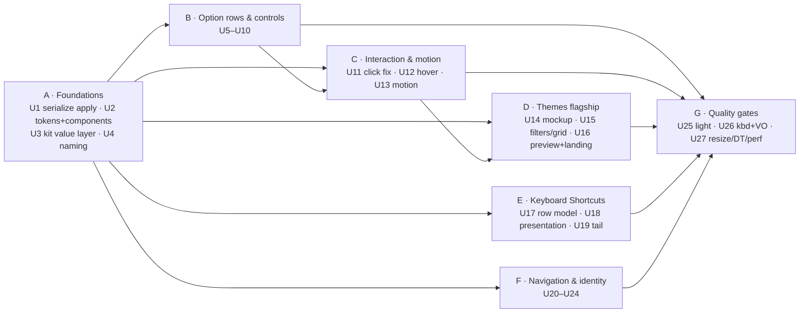
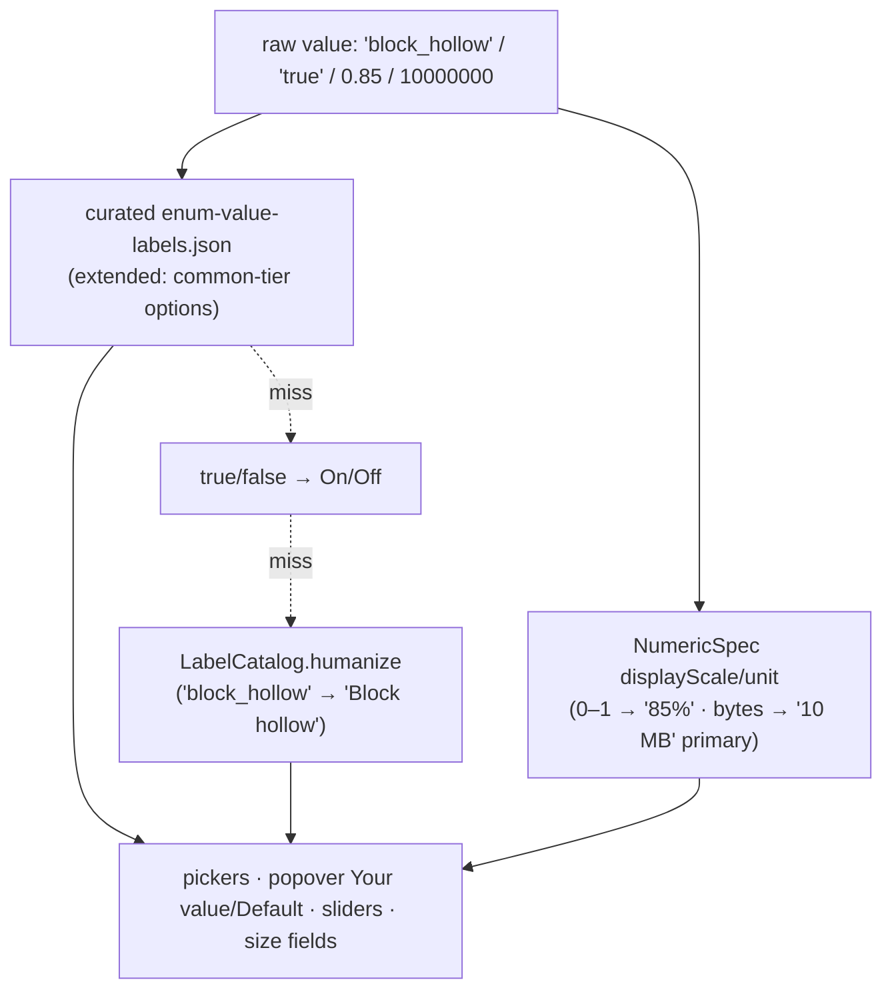

# feat: Pass-2 UI/UX elevation — native + character

## Summary

Pass 1 made the app correct: friendly labels, curated tiers, grouped layout, unified navigation, closed dead-ends. This plan takes it from correct to excellent along four axes: a **consolidated design system** (tokens, one pill, one feedback component, an accent that means one thing), **systematic value humanization** (no raw config token ever renders as a user-facing value), **restrained interaction character** (hover states, a small motion vocabulary, terminal-real theme previews — the app's one brand showcase), and **quality gates** the first pass never ran (light mode, keyboard-only, resize matrix, 463-theme performance). It also pays down the two debts that block polish work: the un-serialized `applyEdit` race and the swallowed-first-click paper cut. 27 dependency-ordered units in 7 phases; every audit finding traces to one owning unit — with a single documented split, the hover-parity gap shared between the hover system and the keyboard gate (see the [Traceability appendix](#traceability-appendix)).

---

## Problem Frame

Driving the shipped app end-to-end shows a settings app that is structurally right but texturally unfinished:

- **Raw tokens leak everywhere values render.** "bar", "always", "true", "native", "contain", a transparency slider reading "1", a scrollback field leading with "10000000". The pass-1 label layer humanized option *names*; option *values* have no humanizer at all (4 of ~300 options curated).
- **The visual system is convention, not construction.** Six hand-rolled capsule pills, two drifted feedback implementations, 9 ad-hoc opacity fills, 7 corner radii, accent color spent on seven unrelated roles, and a hand-drawn AppKit recorder that shares none of it.
- **Interaction feel is absent.** Zero hover states, three animated moments in 6,000 view lines, save feedback that shoves the layout and never collapses, a first click swallowed after every menu/popover dismissal.
- **The flagship surface undersells the product.** 463 themes render as palette-chip strips a newcomer can't read as "my terminal", in one flat list with no filters, where browsing means committing.
- **Real bugs remain.** The Settings sidebar row is clipped out of existence at the default window height; keybinding rows duplicate per-trigger and read as a bug; the app calls itself three different names.

The audit behind this plan drove every surface of the packaged app, then ran 8 audit lenses each adversarially verified against source (file:line), then a completeness critic. The result is 89 verified findings and 9 gaps, all P1/P2/P3-rated — full text in `docs/audits/2026-07-04-pass2-ux-audit-digest.md` (finding IDs like DS-1, MO-2, GAP-5 below refer to it).

---

## Goals & Requirements

**Value presentation**

- R1. No raw config token renders as a user-facing value: enum/boolean values humanized (curated wins, deterministic fallback), 0–1 sliders show %, byte sizes lead human-readable, placeholders never say "value". Raw keys/ids/values stay reachable (popover, help, search) — pass-1 R8 parity holds.
- R2. Documentation renders readably: reflowed paragraphs, real bullets, no mid-token breaks; popover always shows Default and a labeled Your value with Reset at hand.

**Design system**

- R3. One pill component, one feedback component, one search-field component, one token layer (spacing/radius/tint/motion) — framework-neutral so the AppKit recorder shares it. No duplicated capsule/feedback/search implementations remain.
- R4. Accent color means selection/current/primary-action only; customized-state gets a non-accent tint; destructive actions read destructive.

**Interaction character**

- R5. Every interactive control strengthens on hover with keyboard-focus parity; hover never reveals otherwise-invisible controls.
- R6. Motion draws from a named vocabulary at defined moments (disclosure, feedback, theme landing, Find overlay, recorder), reduce-motion gated; save feedback no longer shifts layout permanently; one click acts — no swallowed clicks after dismissals.

**Flagship surfaces**

- R7. Theme previews read as miniature terminals (background/foreground/prompt/cursor/selection from already-parsed data); themes filterable by All/Dark/Light/Favorites; no duplicate rows; browsing has a non-committing preview affordance.
- R8. Keyboard Shortcuts shows one row per action with chords as removable capsules; physical-key triggers read as keys, not prose; params appear only when they disambiguate.

**Trust & identity**

- R9. Navigation never hides a destination: Settings visible/reachable at every window size, "you are here" always coherent; one canonical product name everywhere; identity moments use the real app icon.
- R10. The safety model is strengthened, not bypassed: `applyEdit` serialized (single in-flight write), picker-seeding invariant preserved, commit-on-blur stays the single write path, undo feedback says "Reverted" (not "Saved").

**Quality gates**

- R11. Light mode, keyboard-only navigation, VoiceOver regression, window-resize matrix (660/520 → 900), Dynamic Type on new copy, and 463-theme scroll performance are explicit verification gates, not hopes.

**Success criteria:** a newcomer browsing themes sees terminals, not Pantone charts; no screen shows a raw config token as a value; every save feels acknowledged without the page jumping; the packaged app passes all six R11 gates.

---

## Key Technical Decisions

**KTD1 — Consolidate before restyling.** Land a small token layer (`DesignTokens`: spacing, radius tight/standard/card, semantic tint fills, `MotionSystem` durations/curves) plus single shared components (`Pill`, feedback content view, search field, destructive row button) *first*, expressed as framework-neutral primitives so `KeyRecorderView` imports the same constants (GAP-7): `CGFloat` for spacing/radius; **colors canonically dynamic `NSColor`** (semantic system colors, or `NSColor(name:dynamicProvider:)` for custom tints) with SwiftUI deriving via `Color(nsColor:)` — never a SwiftUI `Color` converted to `NSColor`, which freezes the resolved appearance and breaks light/dark adaptation. Every later restyle consumes tokens; no unit re-invents a capsule. Precedent: `RowMetrics`/`WindowMetrics` are the in-repo named-constant pattern this extends.

**KTD2 — Serialize `applyEdit` as a prerequisite gate.** A single in-flight write with coalescing lands in Phase A and gates every unit that raises apply frequency, adds timing around apply, or runs concurrent tasks near the apply path (feedback timer, theme landing motion, hover preview, batch theme classification) — GAP-8, project memory `deferred-apply-serialization`. Invariant stated once: one write in flight; a newer edit to the same option supersedes its queued predecessor in place; distinct options queue FIFO; the stale-on-disk guard still fires for external edits. The invariant covers every disk-write path — `commitWrite` (import, reset-all, reset-category) enqueues through the same queue as non-coalescable FIFO entries, so "single in-flight write" holds app-wide, not just for `applyEdit`. The `PaletteEditor`/`NumericOptionEditor` debounce is a *source-side* complement (fewer calls from one control); the one-in-flight + FIFO serial executor is new work, not an application of that pattern.

**KTD3 — Humanize values the way pass 1 humanized names.** `EnumValueLabels.label` gains a deterministic fallback chain: curated → `true/false → On/Off` → `LabelCatalog.humanize` (CV-1/CM-1). Applied only to `.enumeration`/boolean-ish display sites (pickers, popover Your value/Default) so hex/paths/numbers are never mangled. Numeric display gains `displayScale`/unit so 0–1 sliders render percent (DS-1). Coverage guard tests assert no catalog enum value renders as its own raw lowercase token. Display-only: the picker-seeding invariant (`enumChoices(current:)` from the *saved* value) is untouched.

**KTD4 — One accent axis.** Accent = current/selected/primary CTA. Customized-state moves to a non-accent tint (in-repo precedent: the orange "Replaces a default" badge); destructive = system red explicitly (Form rows drop `role:`-only styling). The mid-row pill+reset cluster is replaced by one trailing accessory model so rows stop running three metadata systems (DS-5, DS-11, CB-1).

**KTD5 — Hover strengthens, motion punctuates.** One `ButtonStyle`-based hover system (~4–6% fill lift, no movement) applied to visible-at-rest controls only — never hover-only reveals (the System Settings anti-pattern). Every hover affordance ships with a visible keyboard-focus equivalent in the same unit (GAP-2). Transitions come from `MotionSystem` (quickFade ~0.15s, settle ~0.25s) at defined moments only; all transitions reduce-motion gated; hover tint is not motion and stays ungated. Materials stay where they are (Welcome) — no new persistent translucency.

**KTD6 — Theme previews from cached data, lazily.** The mini-terminal mockup renders exclusively from already-parsed `ThemeColors` (background/foreground/palette/cursor/selection — the last four parsed today and never consumed). Lists/grids stay lazy; the Dark/Light filter's one-time batch classification runs off-main, cancellable via the existing provider-identity guard, with determinate progress (GAP-5). A scroll-performance check on the full 463-theme set is part of the unit's verification, with a degrade-while-scrolling fallback if frames drop.

**KTD7 — Verification is protocolized.** Repackage via `scripts/package-app.sh` before any visual check; click-driven manual verification per project convention; hover verified via pointer-move probes (click-only automation can't see hover — GAP-7); and six explicit end gates: light mode (GAP-1), keyboard-only (GAP-2), VoiceOver regression on restructured nodes (GAP-3), resize matrix at 660×520 and 900×max (GAP-4), Dynamic Type on all new strings (GAP-9), 463-theme scroll performance (GAP-5). New tint tokens must be defined luminance-relative (semantic colors or explicit light/dark pairs) — never a fixed dark-assumed alpha.

**KTD8 — Pass-1 invariants are load-bearing.** Preserved by name in every touching unit: picker seeding from saved value; resign-first-responder-on-Return so commit-on-blur is the single write path; provider-identity guards on async theme/font loads; reset-all scoping via `resettableCount`; search always matches raw keys/ids. One pass-1 decision is revisited with evidence: the mid-row Customized pill (B5) — observed squeezing labels into wrapping/truncation and repeating to noise (DS-9/DS-11); the replacement keeps the state visible, one step from reset.

---

## High-Level Technical Design

### Phase dependency graph

Phase A unblocks everything; B–F are largely parallel, with two cross-phase edges: C's hover/click work feeds D's preview interactions, and U13 (Phase C) waits on U5 (Phase B). G gates sign-off. Each unit's **Depends** field is authoritative for fine-grained ordering.

### The value-presentation pipeline (KTD3)

Applied at display sites only; stored values and picker seeding stay raw (KTD8).

---

## Implementation Phases

Each unit lists **Resolves** (audit finding IDs — full text in `docs/audits/2026-07-04-pass2-ux-audit-digest.md`), **Depends**, **Files**, **Approach**, **Test scenarios** (kit) or a stated manual-verification expectation, and **Verification** against the packaged app. Kit logic is unit-tested in `Tests/GhosttyConfigKitTests/`; the app target has no harness by design.

---

### Phase A — Foundations

#### U1. Serialize `applyEdit` — single in-flight write with coalescing

**Resolves:** GAP-8.
**Depends:** none. **Gates:** U6, U15 (batch classification runs concurrent tasks near the apply path), U16 (and any future unit adding timing around apply).
**Files:** `Sources/GhosttyConfigEditor/App/AppModel.swift` (`applyEdit`, `applyTheme`, `commitWrite` — import/reset-all/reset-category, undo path), `Sources/GhosttyConfigKit/Config/SerialWriteQueue.swift` (new — required, not optional: U1's kit tests are unwritable against the app-target model), `Tests/GhosttyConfigKitTests/ApplySerializationTests.swift` (new).
**Approach:** Introduce a serial apply pipeline: one write in flight; a newer edit to the *same* option supersedes its queued predecessor **in place** (never reordering it past an undo or a different-option write); distinct options queue FIFO; completion (including `refreshConfig`) must land before the next write starts, so the stale-on-disk guard keeps meaning "externally edited" rather than "we raced ourselves". Two further load-bearing rules: **each dequeued write resolves `browser.merged.model` fresh at execution time** (capturing it at enqueue would validate against pre-refresh bytes and clobber or spuriously stale-fail); and **undo is enqueued as a closure that reads `lastReceipt` at execution time**, as a non-coalescable FIFO entry (snapshotting the receipt at enqueue would restore pre-write text over a just-committed write). `commitWrite` (import, reset-all, reset-category) enqueues through the same queue as a non-coalescable FIFO entry that also resolves the model fresh at execution — a batch write and a queued `applyEdit` never run concurrently. The kit helper is scoped to a `SerialWriteQueue` (one-in-flight + in-place same-key coalescing + FIFO over an injected async work closure); `applyState`/`applyingOptionName`/`lastReceipt`/`refreshConfig`/`reload` stay on the `@MainActor` model. Keep the public `applyEdit(option:values:)` signature; the queue is internal.
**Test scenarios (kit):** scoped to queue semantics (receipt and stale-on-disk semantics remain `ConfigWriterTests`' responsibility) — two rapid same-key submissions yield one execution with the later value, in the original queue position; three distinct keys execute FIFO; a same-key coalesce never reorders past an interposed non-coalescable entry; an undo entry enqueued behind a pending write executes against post-write state (work-closure recording asserts call order); an end-to-end temp-file case: rapid same-option edits leave the later value on disk; an `applyEdit` and a batch reset submitted together execute serially, never concurrently. Covers R10.
**Verification:** packaged app — drag the transparency slider rapidly then release, spam-click two themes: final state matches last action, no stale-on-disk error, live terminal settles once.

#### U2. Design tokens + shared components (Pill, feedback content, search field, destructive button)

**Resolves:** DS-3, DS-4, DS-12, MO-9, CB-1, GAP-7.
**Depends:** none.
**Files:** `Sources/GhosttyConfigEditor/Views/SurfaceChrome.swift` (add `DesignTokens`, `MotionSystem`, `Pill`, shared `searchField`, `DestructiveRowButton`; extract feedback content mapping), `Sources/GhosttyConfigEditor/Views/OptionListView.swift`, `KeybindEditorView.swift`, `ThemeBrowserView.swift`, `GlobalFindView.swift`, `WelcomeView.swift` (migrate the six pill sites + two search-field sites + feedback mapping), `App/GhosttyConfigEditorApp.swift` (its one token target: the hardcoded 0.2s Welcome-fade literal moves to `MotionSystem`), `Views/KeyRecorderView.swift` (import bridged primitives).
**Approach:** `DesignTokens`: spacing scale, radius scale (tight/standard/card ≈ 4/6/10 — the recorder's existing radius 6 maps one-for-one to `standard`), semantic tint fills (`subtleFill`, `accentFill`, hover lift) defined as dynamic providers over dynamic bases, never fixed alpha over an assumed-dark base (GAP-1 rule). `MotionSystem`: `quickFade` (~0.15s easeOut), `settle` (~0.25s easeOut). A two-step semantic type scale joins the tokens — `surfaceTitle` (today's routine header step) and a reserved `heroTitle` above it — defined here, applied by U22 (DS-8). Color tokens are canonically dynamic `NSColor` with SwiftUI deriving via `Color(nsColor:)` (KTD1); `KeyRecorderView` keeps resolving tokens at draw time so they adapt to appearance automatically; one reduce-motion helper maps both the SwiftUI environment and the `NSWorkspace` flag (GAP-7). Promote the private `Badge` into one `Pill(text:systemImage:tint:style:)` and migrate all six capsule sites; fix the popover's lowercase "customized" by rendering `option.state.displayName` (DS-4). Extract the applyState→(icon, color, copy) mapping into one feedback content view parameterized only by placement (DS-10's component half; behavior changes in U6). Extract the search-field recipe used verbatim in two places (DS-12). Migration is look-preserving: this unit changes construction, not appearance.
**Test expectation:** none — view-layer consolidation; appearance-preserving.
**Verification:** packaged app — every surface renders as before (spot-check pills, search fields, feedback bar); popover badge now reads "Customized".

#### U3. Kit value-presentation layer — enum humanizer, numeric display transforms, summary/doc fixes

**Resolves:** CV-1, CM-1, CV-10, CM-5, CM-3.
**Depends:** none.
**Files:** `Sources/GhosttyConfigKit/Catalog/NumericSpec.swift` (`EnumValueLabels.label` fallback chain; `displayScale`/percent style; unit plumb-through for sliders), `Sources/GhosttyConfigKit/Resources/enum-value-labels.json` (extend to common/Recommended-tier enum options: cursor-style, window-save-state, background-image-fit, alpha-blending, …), `Sources/GhosttyConfigKit/Catalog/LabelCatalog.swift` (title-echo skip in `shortSummary(for:documentation:)` — the comparison needs the option name, which `shortSummary` has in scope and `firstSentence` does not), new `Sources/GhosttyConfigKit/Catalog/DocFormatter.swift` (reflow + bullets), `Tests/GhosttyConfigKitTests/` (EnumValueLabelTests, DocFormatterTests, LabelCatalogTests extension).
**Approach:** (a) `EnumValueLabels.label`: curated → `true`/`false` → "On"/"Off" → `LabelCatalog.humanize` (KTD3). (b) `NumericSpec`: a percent display mode for 0–1 sliders as an explicit per-option opt-in on the spec (never inferred from slider style — `minimum-contrast` is a 1–21 slider and must not render as "2100%"), plus unit exposure the slider editor can consume (display transform only — stored values unchanged). (c) `shortSummary`: if the extracted first sentence normalizes equal to `displayTitle`, advance to the next sentence or return empty (CV-10/CM-5). (d) `DocFormatter`: join hard-wrapped lines into paragraphs (blank line = break, bullet line = break), recognize `* ` items as bullets — deliberately still not full Markdown (CM-3). All pure kit, fixture-tested.
**Test scenarios (kit):** `label(cursor-style, "block_hollow")` == "Block hollow" via humanizer; curated override still wins for `osc8`; `"true"` → "On"; percent transform renders 0.85 → "85%"; `background-image-fit` summary is empty or a real second sentence, never a title echo (fixture regression); DocFormatter kills the `no-⏎cursor` mid-token break and renders the cursor-style doc's 4 `*` lines as bullets (fixture); **coverage guard:** no enum value of any common-tier option renders as its own raw lowercase token; orphan-key guard for new curated entries. Covers R1, R2.
**Verification:** kit suite green.

#### U4. One product name everywhere

**Resolves:** CM-2, CB-9.
**Depends:** none.
**Files:** `scripts/package-app.sh` (CFBundleName ← DISPLAY_NAME string only — do not touch `APP_NAME`, which names the executable/paths), `Sources/GhosttyConfigEditor/App/GhosttyConfigEditorApp.swift` (`Window` title, Help item), `Sources/GhosttyConfigEditor/Views/WelcomeView.swift` (header).
**Approach:** Canonical string "Ghostty Config Editor" in: CFBundleName (menu-bar title), window title, Help menu item, Welcome header. Single source-of-truth constant in the app target for the in-code strings.

> **Decision — LOCKED 2026-07-04.** Canonical product name is **"Ghostty Config Editor"** (chosen for discoverability: "config" is the term users search, and "editor" is more precise than "manager" for a config-file GUI). Pair it everywhere user-facing with the subtitle **"An unofficial config editor for Ghostty"** (README h1, window/App-Store subtitle) — respects the Ghostty trademark, sets first-party expectations, and adds matching keywords. The whole project was renamed alongside this decision: SwiftPM module/executable `GhosttyConfigManager` → `GhosttyConfigEditor`, bundle id `com.mshddev.GhosttyConfigEditor`, backup dir `~/Library/Application Support/GhosttyConfigEditor/Backups`, and repo → `ghostty-config-editor`. The three inconsistent UI strings (window title / Welcome header / Help item, formerly "Ghostty Config") and the backup path are **already updated** in this pass; the remaining U4 build work is the single source-of-truth constant + the subtitle string.

**Test expectation:** none — packaging/string change. **Verification:** repackage → menu bar, window title, Help item, Welcome all read "Ghostty Config Editor"; README/subtitle read "An unofficial config editor for Ghostty".

---

### Phase B — Option rows & controls

#### U5. Row metadata consolidation — one trailing accessory, protected label column

**Resolves:** DS-11, DS-9, DS-5, IA-8, CM-7.
**Depends:** U2.
**Files:** `Sources/GhosttyConfigEditor/Views/OptionListView.swift` (`OptionRow`, `customizedAffordance`, subtitle line limits), `Sources/GhosttyConfigEditor/Views/OptionListView.swift` (`OptionInfoPopover` reset action — exists; keep), `Views/SurfaceChrome.swift` (state-tint token from U2).
**Approach:** Replace the mid-row pill+reset cluster with one always-present, width-stable state cue that doesn't compete with the label column — a small filled state dot (non-accent tint per KTD4) leading or trailing the title, with the reset action folded into the ⓘ popover (already exists there when set) plus an inline reset glyph only on hover/focus (visible-at-rest cue stays the dot; hover strengthens, doesn't reveal *state*). Give the label VStack `.layoutPriority(1)` so titles never wrap because of accessories (DS-9 tactical guard stays even after the pill is gone). Suppress any per-row "Customized" text on the Customized surface (IA-8). Subtitle truncation gets one authority: drop `firstSentence`'s char cap for subtitle context; row owns truncation with `lineLimit(1...2)` (CM-7). **A11y (GAP-3):** the state dot carries `.accessibilityValue` from `OptionState.displayName`; the popover reset stays a named VoiceOver action; verify the focus path still reaches reset.
**Test expectation:** none — view recomposition over tested state APIs. **Verification:** packaged app — "Confirm before closing" and "Reopen windows on launch" render on one line with full subtitles at default width; Customized surface shows no redundant pills; VoiceOver announces state + can reset.
> **Decision — LOCKED 2026-07-04:** replace the mid-row "Customized" pill with a small non-accent **state dot**; reset folds into the ⓘ popover plus an inline glyph on hover/focus. This is the sanctioned revisit of Pass-1 B5 (KTD8).

#### U6. Feedback that acknowledges without shoving

**Resolves:** MO-2, CM-6, DS-10.
**Depends:** U1, U2.
**Files:** `Sources/GhosttyConfigEditor/Views/OptionListView.swift` (`OptionRow.feedback`), `Views/SurfaceChrome.swift` (`SurfaceFeedbackBar` + shared content view from U2), `Sources/GhosttyConfigEditor/App/AppModel.swift` (`ApplyState.succeeded` headline or `.reverted` case; undo sets "Reverted").
**Approach:** Both placements consume the U2 shared content view. Animate entry with `MotionSystem.quickFade` + `.transition(.opacity.combined(with: .move(edge: .top)))` (`.applying` stays instant); after ~2.5s untouched, collapse the inline row feedback to a small static checkmark via the self-resetting `Task.sleep` pattern already proven by the copy-snippet button — no permanent layout shift, ⌘Z remains the durable undo. Add a headline to the succeeded state; `undoLastApply` sets "Reverted" so the UI stops stacking "Saved" over "Reverted to the previous value." Keep the pre-undo receipt briefly to offer a Redo link next to the collapsed state (small, time-boxed; drop if it fights the receipt model — flag in PR if dropped).
**Test expectation:** none — `ApplyState` lives on the app-target model; the headline swap ("Saved" vs "Reverted") is verified in the packaged app. Covers R6, R10.
**Verification:** packaged app — toggle a setting: feedback fades in under the row, collapses to a checkmark after ~2.5s, rows below return; undo shows "Reverted", not "Saved".
> **Decision — LOCKED 2026-07-04:** **add** the small time-boxed single-step **Redo** link beside the collapsed feedback (drop only if it fights the receipt model — flag in the PR). A first-class undo/redo stack stays deferred.

#### U7. Numeric truth — percent sliders, bounded steppers, human-first sizes, real placeholders

**Resolves:** DS-1, CV-2, CV-6, CB-5, CV-11, CV-7, CM-8.
**Depends:** U2, U3.
**Files:** `Sources/GhosttyConfigEditor/Views/OptionListView.swift` (`NumericOptionEditor` slider/field/size editors, `fieldPlaceholder`, `ListValueEditor.placeholder`), `Sources/GhosttyConfigKit/Catalog/LabelCatalog.swift` (shared placeholder-fallback helper beside `exampleValue`, so it is kit-testable), `Sources/GhosttyConfigKit/Resources/option-labels.json` ("Window transparency" → "Window opacity" retitle).
**Approach:** One shared labeled-slider treatment consuming U3's percent/unit transforms: 0–1 sliders read "85%", with endpoint captions where direction is ambiguous ("Opaque"/"Transparent"). Resolve the transparency inversion by retitling to "Window opacity" (matches Ghostty's key semantics; no math) — the summary keeps "see-through" language so intent search still hits. Replace the callback `Stepper` with `Stepper(value:in:step:)` over `spec.min...spec.max` so +/- dim at bounds; route the binding through the existing debounced commit path (KTD8: commit-on-blur single write path). Size fields: formatted size ("10 MB") becomes the primary line, raw bytes demoted to the small mono caption (mono-as-accent, CB-5); remove `.accessibilityHidden(true)` and fold "10 MB" into the field's `accessibilityValue` (CM-8). Placeholders: title-derived tier before the literal fallback, extracted into one shared function used by both duplicated call sites (CV-7).
**Test scenarios (kit):** placeholder fallback yields "Enter a background image" when docs/default are empty; size formatting stays correct at boundary magnitudes (999 KB / 1 MB). Covers R1.
**Verification:** packaged app — transparency row reads "Window opacity — 100%"; font-size stepper dims at 72; scrollback leads "10 MB"; VoiceOver announces "10 MB".
> **Decision — LOCKED 2026-07-04:** **retitle** "Window transparency" → **"Window opacity"** (100% = solid; "Opaque"/"Transparent" endpoint captions; summary keeps "see-through" so intent search still hits).

#### U8. Boolean-ish and list controls — concrete states, honest Ligatures

**Resolves:** CV-5, CV-9.
**Depends:** U3.
**Files:** `Sources/GhosttyConfigEditor/Views/OptionListView.swift` (`BooleanishEditor`, `ListValueEditor` routing for `font-feature`), `Sources/GhosttyConfigKit/Config/ConfigReader.swift` (tri-state handling for `cursor-style-blink` if classified here), new small kit helper (e.g. `Sources/GhosttyConfigKit/Catalog/FontFeatures.swift`) owning the ligature tag-diff (compute/add/remove `-calt,-liga,-dlig` preserving user tags) so it is kit-testable.
**Approach:** When a boolean-ish option has exactly one extra state, render it as a labeled inline checkbox beside the switch ("Even when idle") instead of a single-item "More…" menu; reserve the menu for ≥2 extra states and label it with the active extra's friendly name (via U3 labels). `cursor-style-blink` (tri-state true/false/unset) joins the boolean-ish presentation so "true" never renders in a picker. Ligatures: toggle-first — On removes the disable set, Off writes curated `-calt, -liga, -dlig`; the generic list editor demotes to a "Customize individual features…" disclosure for stylistic sets, mirroring the toggle-plus-extras pattern. Value round-trip follows the pass-1 B4 caching rule (extra state survives an off/on cycle).
**Test scenarios (kit):** Ligatures Off produces exactly the disable set; On removes only those tags, preserving user-added `ss01`; tri-state classification for `cursor-style-blink`. Covers R1.
**Verification:** packaged app — "Confirm before closing" shows switch + "Even when idle" checkbox, no mystery menu; Ligatures is a switch; blink renders as a toggle.

#### U9. Info popover — readable docs, pinned facts, labeled values

**Resolves:** CM-4, CM-10, DS-13, CV-4, CB-4.
**Depends:** U2, U3.
**Files:** `Sources/GhosttyConfigEditor/Views/OptionListView.swift` (`OptionInfoPopover`).
**Approach:** Consume U3's `DocFormatter` for the body (reflowed paragraphs, rendered bullets, backtick mono, bold first sentence stays). Pin the metadata block (Your value / Default / Defined in / Reset) as a non-scrolling footer beneath a scroll-only doc body (Xcode Quick Help pattern) so decision facts never hide behind prose (CM-4). Your value / Default render through the enum label pass when the option is `.enumeration`/boolean-ish (KTD3). Type chip uses `valueType.displayName`, omitting the chip for `.unknown` (CM-10/CV-4).
**Test expectation:** none — view over U3-tested formatting. **Verification:** packaged app — cursor-style popover shows clean paragraphs and bullets, "Choice" chip, "Your value: Bar", "Default: Block", Reset visible without scrolling.

#### U10. Swatches that read, a font picker that shows fonts

**Resolves:** DS-2, CV-8, CB-11, CV-3, CB-3, CV-12.
**Depends:** U2.
**Files:** `Sources/GhosttyConfigEditor/Views/OptionListView.swift` (swatch ring at row/editor/preset sites; `FontFamilyEditor` title + `FontRow` sample).
**Approach:** Replace the `.separator` swatch ring with a two-layer light+dark hairline (the "one systematic overlay rule") at all three sites so a dark value and unset never look alike in either appearance. Font picker: title becomes `displayTitle` with the raw key as a mono caption (matching the popover pattern — CB-3); each `FontRow` renders a fixed terminal-representative sample ("AaBbGg 0123 -> => != ✓") in that row's `.custom` face so monospacing, ligatures, and Nerd-Font glyphs are visible (CV-12). **Constraint (KTD8):** selection continues to seed from the saved value.
**Test expectation:** none — view-only. **Verification:** packaged app — a near-black `split-divider-color` swatch is visibly "set" on the dark card; font rows show distinguishable samples; picker titled "Font".

---

### Phase C — Interaction & motion

#### U11. Kill the swallowed first click

**Resolves:** MO-1, TH-6.
**Depends:** none. **Sequenced before U12 on shared controls (GAP-7).**
**Files:** `Sources/GhosttyConfigEditor/Views/ThemeBrowserView.swift` (pairing menu), `Views/OptionListView.swift` (info popover, font picker popover), possibly a small shared NSEvent helper in `Views/`.
**Approach:** Reproduce in isolation to confirm the SwiftUI dismiss-vs-hit-testing race, then fix per control type — the two cases differ mechanically. **Theme ⋯ menu:** a local `NSEvent` monitor does not fire during `NSMenu` tracking (menus run a nested modal event loop that consumes the dismissing click), so the primary fix is swapping the borderless `Menu` for a `Button` + `confirmationDialog` or a custom popover. **Info/font popovers:** a popover-scoped local mouse-down monitor that closes the popover and **returns the event (pass-through, not `nil`)** so the click still hit-tests the control underneath — swallowing it would defeat "one click acts"; whether SwiftUI re-swallows under `.popover`'s own outside-dismiss is what the isolation repro settles. Monitor lifecycle mirrors `KeyRecorderNSView`'s discipline: installed only while the popover is open, torn down on dismissal, scoped to closing only its own popover (so it can't perturb U12 hover or other `isPresented` bindings). Not a blanket rewrite of all ~11 popover sites; fix the pattern where it hurts, document the recipe for the rest.
**Test expectation:** none — event-timing behavior. **Verification:** packaged app — open a theme's ⋯ menu, click a different theme row once: it applies on that click. Same for clicking the sidebar right after closing the font picker.

#### U12. Hover system with keyboard parity

**Resolves:** MO-5, IA-4, GAP-2 (parity rule; the full keyboard gate is U26).
**Depends:** U2; after U11 on shared controls.
**Files:** `Sources/GhosttyConfigEditor/Views/SurfaceChrome.swift` (new `HoverAffordanceButtonStyle` + focus-visible equivalent), applied in `OptionListView.swift` (info/reset buttons, Advanced header + `NSCursor.pointingHand`), `WelcomeView.swift` (jump-in cards), `GlobalFindView.swift` (result rows).
**Approach:** One ButtonStyle lifting background fill by the U2 hover token (~4–6%, no movement/scale) on `.onHover`, with the identical lift on keyboard focus (`focused`/`isFocused` ring or tint) so no affordance is pointer-only (KTD5). Strengthens visible controls only. The Advanced disclosure header gains hover tint + pointing-hand cursor (IA-4) supplementing its chevron. Hover tint ungated by reduce-motion (per HIG it is not decorative motion). Theme-row hover lands in U16 with its preview role; recorder hover in U18.
**Test expectation:** none — interaction styling. **Verification:** packaged app via pointer-move probes (KTD7) — icon buttons, Advanced header, welcome cards, Find rows all lift on hover; tabbing shows the same strengthened state.

#### U13. Motion vocabulary at the defined moments

**Resolves:** MO-4, CB-12, MO-6, MO-8, CB-13.
**Depends:** U2 (MotionSystem), U5 (the state dot it animates).
**Files:** `Sources/GhosttyConfigEditor/Views/OptionListView.swift` (Advanced rows transition, pill transitions via U2 `Pill`), `App/GhosttyConfigEditorApp.swift` (`mainColumn` Find fade).
**Approach:** Advanced disclosure: try `.transition(.opacity)` on the inserted rows, but given the documented grouped-Form Section fragility (the file's own comment records native collapsible Sections silently trapping rows), expect instant row appearance as the probable outcome — verify early in the packaged app. **Keep the chevron rotation in both cases**: a rotating chevron with instantly-appearing rows is the native disclosure norm and implies nothing false; the CB-12 fallback is "rows appear instantly", not "remove the chevron animation". When Advanced collapses while focus is on a row inside it, focus moves to the disclosure header — not window root — so keyboard/VoiceOver users don't lose their place (verified by U26). `Pill` gains one `.transition(.scale(0.9) + .opacity)` for state-triggered instances — theme Current is the true `Pill` case; U5's replacement state dot is not a `Pill` and receives the same transition explicitly so both state cues appear consistently (MO-6). Find overlay: fade keyed to `model.isFinding` only — sidebar navigation stays instant (MO-8/CB-13, mirrors the Welcome overlay's existing pattern). Everything gated on reduce-motion through the single U2 helper.
**Test expectation:** none — view transitions. **Verification:** packaged app — Advanced expands with a fade (or chevron no longer pretends); ⌘F fades in/out; category switches stay instant; all still under Reduce Motion → instant.

---

### Phase D — Themes flagship

#### U14. Terminal-mockup preview cell

**Resolves:** TH-2, CB-2.
**Depends:** U2. **Gated by KTD6 contract.**
**Files:** `Sources/GhosttyConfigEditor/Views/ThemeBrowserView.swift` (`preview(colors:failed:)` and row layout), `Sources/GhosttyConfigKit/Themes/ThemeParser.swift` (only if a preview-model helper is worth extracting for tests).
**Approach:** Replace the 16-chip grid with a miniature terminal: solid `background` fill; two to three lines of realistic content — a prompt line ("~ $ " + command) using a palette accent, an output line in a second ANSI color, remaining text in `foreground`; a cursor block in `cursorColor` (static; blink only outside reduce-motion, if at all); one word in `selectionBackground`/`selectionForeground`. A thin 16-dot ANSI strip stays as a secondary footer inside the cell. **Nil-fallback contract** (every one of these `ThemeColors` fields is optional and commonly absent upstream — Ghostty derives cursor/selection at runtime): `cursorColor` → `foreground`; `selectionBackground` → inverted foreground/background with `selectionForeground` → `background` (Ghostty's own default); a theme missing `background` or `foreground` entirely renders the failed-preview placeholder, never an empty cell. Uses only already-cached `ThemeColors` (KTD6) — the four parsed-but-never-consumed fields finally earn their keep. **A11y (GAP-3):** rebuild the cell's `accessibilityLabel` (theme name, appearance, "current" state) — the existing hand-built label dies with the old cell. **Perf:** flat ZStack/Canvas composition, no per-cell material/shadow; verified by U27's 463-row scroll gate.
**Test scenarios (kit):** if a preview-model helper is extracted: prompt/output/selection color assignment is deterministic from a given `ThemeColors` (no random per-render), and a palette-only fixture (no cursor/selection/background fields) resolves every mockup color through the fallback chain; else Test expectation: none — view composition, with the palette-only case verified manually against a known minimal theme. Covers R7.
**Verification:** packaged app — rows read as tiny terminals; a light theme (3024 Day) and dark theme are both legible; VoiceOver announces name + appearance.

#### U15. Filters, dedupe, and a browsing grid

**Resolves:** TH-3, TH-1, IA-7, TH-5, TH-10.
**Depends:** U14, U2, U1 (the classify batch runs concurrent tasks near the apply path — GAP-8).
**Files:** `Sources/GhosttyConfigEditor/Views/ThemeBrowserView.swift` (header segmented control, section building, grid mode, current-row fallback), `Sources/GhosttyConfigEditor/App/AppModel.swift` (filter state, batch classification with the existing `colorTasks`/provider-identity guard), `Sources/GhosttyConfigKit/Themes/ThemeParser.swift` (batch-classify helper if extracted), `Tests/GhosttyConfigKitTests/ThemeClassificationTests.swift` (new, if the helper is extracted; else extend `ThemeParserTests.swift`).
**Approach:** Header gains All / Dark / Light / Favorites segments. First selection of Dark/Light triggers a one-time off-main batch read of still-unclassified themes — cancellable via the provider-identity guard, determinate "Classifying N…" count, memoized so re-filtering is instant (KTD6/GAP-5). Dedupe: compute the pinned-name set (current ∪ favorites) once and exclude it from All themes; drop Current from Favorites (TH-1/IA-7). Grid: a header list/grid toggle (persisted like other view prefs) rendering ~300×160 cards in an **adaptive** `LazyVGrid` that degrades to one column below the width threshold (GAP-4); list stays default. Current-theme fallback row (unknown theme name) reuses the failed-preview placeholder and keeps star/menu so the row stays consistent (TH-10).
**Test scenarios (kit, conditional on the extracted helper — else manual):** batch classification of a fixture set lands each theme in the right bucket and never re-reads a memoized entry; pinned-dedupe set logic (current+favorite excluded from All, current excluded from Favorites). Covers R7.
**Verification:** packaged app — Dark filter shows only dark themes after a brief determinate classify; no duplicate current row; grid mode at 660pt width shows one column, at 900pt two.
> **Decision — LOCKED 2026-07-04:** the **list stays the default** browsing view; grid is an opt-in toggle (persisted). Filters/dedupe as specced.

#### U16. Browse without committing — hover preview, landing motion, menu copy

**Resolves:** TH-4, TH-7, TH-9, TH-8, CM-11, MO-3.
**Depends:** U14, U11, U12, U1.
**Files:** `Sources/GhosttyConfigEditor/Views/ThemeBrowserView.swift` (row hover, preview enlargement, current-transition animation, pairing-menu copy).
**Approach:** Row hover (U12 style): subtle row tint + star/⋯ strengthen (dimmer at rest, never hover-only — they stay visible). Hovering/focusing a row enlarges its terminal mockup in place (or a small fixed preview pane if in-place reflow janks — implementer's call after trying in the packaged app) with **no file write** — decoupling look from commit while keeping explicit click-to-apply + Undo (TH-4). Applying animates the current border/pill with `MotionSystem.settle` so the choice visibly lands (MO-3); favorites toggling animates section membership (TH-9). Menu copy: "Use for both" / "Use for Light mode" / "Use for Dark mode" (TH-8/CM-11). Rapid-apply safety rides U1's serialization.
**Test expectation:** none — interaction/view. **Verification:** packaged app — hovering shows a bigger preview with no config write (check file mtime); clicking applies with a visible settle; spam-clicking five themes ends on the last one, no error.
> **Decision — LOCKED 2026-07-04:** the hover-preview mechanic (**enlarge-in-place vs fixed pane**) stays the **implementer's call** after trying it live; the no-config-write-on-hover requirement holds either way.

---

### Phase E — Keyboard Shortcuts

#### U17. One row per action — chords as capsules

**Resolves:** KB-1, KB-7, CM-12, KB-2.
**Depends:** U2 (chord/add-chord capsules render via the shared `Pill` and tint tokens).
**Files:** `Sources/GhosttyConfigKit/Keybind/KeybindMerge.swift` (group after `merge()` → `chords: [ChordBinding]` each with trigger/origin/source/read-only; **rewrite `conflictingAction` to scan per-chord** — its per-trigger signature dies with the row model), `Sources/GhosttyConfigEditor/App/AppModel.swift` (remove the `userDisablesDefault` filter and rewrite the `mergedKeybinds` doc comment; **make `isReadOnly` per-chord**), `Sources/GhosttyConfigEditor/Views/KeybindEditorView.swift` (row per action, chord capsules, add-chord capsule; `filtered` searches across chords; `countSummary` "with a shortcut" counts actions with ≥1 active chord), `Tests/GhosttyConfigKitTests/KeybindMergeTests.swift` (extend).
**Approach:** Restructure the merge output from one-entry-per-trigger to one-entry-per-action carrying its chord list; render the action once with each chord as a removable capsule and a trailing "+" capsule replacing the "Add another shortcut…" menu item (System Settings' multi-shortcut idiom — native). Conflict-at-capture and read-only-by-source evaluate **per chord** (two chords for one action can differ in origin). Header count becomes truthful automatically ("N actions, M with a shortcut" — CM-12/KB-7). Resolve the disabled-default dead code: with grouping, a disabled default renders in place as a struck-through chord capsule with one-click re-enable — reviving the orphaned UI (KB-2). This is a deliberate behavior flip, not pure revival: an action whose only binding is a disabled default currently shows as an empty "No shortcut" row (the pre-`withUnboundActions` filter suppresses it); after this unit it shows the struck-through chord — verify in the packaged app. `restorableActions`/`restoreActionToDefault` operate on `userBindings` per-action already and are unaffected. **Invariants (KTD8):** conflict-at-capture, focus/record decoupling, resign-first-responder undo path all preserved; search still matches raw action ids.
**Test scenarios (kit):** grouping the default fixture yields one entry per action with 17 two-chord actions (copy/paste/undo/goto_tab:N…); per-chord origin/read-only preserved through grouping; disable-default keeps the action row with a disabled chord rather than dropping the row; conflict lookup still resolves per chord. Covers R8.
**Verification:** packaged app — "Copy" appears once with two capsules (⌘C and the physical key); count reads actions truthfully; disabling a default strikes the capsule in place with an undo arrow.
> **Decision — LOCKED 2026-07-04:** the deliberate behavior flip is **approved** — a disabled default renders **struck-through in place** with one-click re-enable, instead of the current empty "No shortcut" row.

#### U18. Trigger, param, and badge presentation

**Resolves:** KB-3, CB-6, KB-4, KB-5, CB-7, KB-8, KB-6, DS-14, MO-7.
**Depends:** U2, U17.
**Files:** `Sources/GhosttyConfigEditor/Views/KeybindEditorView.swift` (trigger pill, badges, raw-id handling, warning placement), `Views/KeyRecorderView.swift` (physical-key treatment, persistent affordance, tracking-area hover, recording fade, U2 token bridge), `Sources/GhosttyConfigKit/Keybind/ActionLabelCatalog.swift` (param-fold decision helper — distinct-param-set computation lives in the kit so it is testable).
**Approach:** Physical named-key triggers (zero-modifier chords) get a distinct mono small-caps chip + `.help("Physical Copy key")` in both renderers (KB-3/CB-6 — mono-as-accent exactly where differentiation is absent). Params fold into titles only when the base action has >1 distinct param in the merged set; otherwise caption-only (KB-4). Suppress the "Default" badge (badges = deviations only); demote the permanent raw-id mono caption to `.help()`/⋯-menu, matching `OptionRow` one file over — search unaffected (KB-5/CB-7). Move the recorder warning into the trigger column where the user is typing (KB-8). Recorder: persistent bound-state affordance (dimmed record-dot/pencil in the capsule), `NSTrackingArea` hover tint, ~120ms recording-state fade via the bridged reduce-motion helper, and U2's bridged radius/tint constants replacing its hand-picked values (KB-6/DS-14/MO-7).
**Test scenarios (kit):** param-fold decision (copy_to_clipboard:mixed → no parenthetical; goto_tab:1..8 → parenthetical) computed from the fixture. Covers R8.
**Verification:** packaged app — "copy" chip reads as a key, not prose; no wall of "Default" pills or mono ids; rebind warning appears beside the recorder; recorder shows it's clickable when bound.

#### U19. Keybind tail — functional grouping + label coverage

**Resolves:** KB-9, KB-10.
**Depends:** U17, U18.
**Files:** `Sources/GhosttyConfigKit/Resources/action-categories.json` (new), `action-labels.json` (extend toward default-bound actions), `Sources/GhosttyConfigEditor/Views/KeybindEditorView.swift` (sections), `Tests/GhosttyConfigKitTests/` (orphan guards).
**Approach:** Curated functional sections (Window & Tabs, Splits, Editing & Clipboard, Search, Scrollback, System) via an `action-categories.json` mirroring `option-tiers.json`, with the orphan-key guard discipline; extend curated summaries prioritizing actions that ship a default keybind. Fast-follow priority (see Scope Boundaries).
**Test scenarios (kit):** every categorized action resolves against the actions fixture (orphan guard); uncategorized actions land in a deterministic fallback section. Covers R8.
**Verification:** packaged app — the list reads in sections; most default-bound actions show a one-line description.

---

### Phase F — Navigation, chrome & identity

#### U20. Sidebar integrity — Settings visible at every size

**Resolves:** IA-1, IA-2, IA-9, IA-3.
**Depends:** none.
**Files:** `Sources/GhosttyConfigEditor/Views/SidebarView.swift`, `App/GhosttyConfigEditorApp.swift` (`WindowMetrics.defaultHeight` comment/value, find button chrome).
**Approach:** Promote Settings to a fixed non-scrolling sidebar footer (Finder/Xcode idiom) so its visibility never depends on row-count math at any height — the recommended resolution of IA-1; additionally wrap the List in a `ScrollViewReader` and `scrollTo(model.selection)` on selection change so *any* off-screen row (Problems at 520pt) scrolls into view. Rename the section header "Settings" → "Options" so the word names exactly one destination (IA-2). Customized row gains a count badge bound to `customizedOptions.count`, applied **before** `.tag` per the documented ordering constraint (IA-9). Find button routes through the active-capable chip pattern so Find-mode reads in the chrome; sidebar selection returns nil while finding (IA-3). Land the find-chip change after or alongside U21's chip visual-contract change so the two don't hand-roll divergent active-chip treatments.
**Test expectation:** none — nav view. **Verification:** packaged app — at default height Settings is visible as a footer and selecting it highlights it; at min height (drag) every destination is reachable; Customized shows its count; ⌘F visibly engages the toolbar chip.

#### U21. Toolbar chips — status, not hyperlinks

**Resolves:** DS-6, CB-10.
**Depends:** U2.
**Files:** `Sources/GhosttyConfigEditor/App/GhosttyConfigEditorApp.swift` (`ToolbarChip`, `autoReloadChip`).
**Approach:** Honor the chip's own contract: accent tints the glyph only; label stays `.primary` (DS-6). Give the actionable chip a structural cue that survives focus loss — filled tint background when on (not hairline-only) so "clickable" doesn't ride on accent alone (CB-10). A11y stays a toggle-trait switch per pass-1 G1.
**Test expectation:** none — view-only. **Verification:** packaged app — chip no longer reads as a link; unfocused window still distinguishes the toggle from the version label.

#### U22. Identity moments — welcome hero, next steps

**Resolves:** CB-8, DS-8, IA-5.
**Depends:** U2.
**Files:** `Sources/GhosttyConfigEditor/Views/WelcomeView.swift` (hero icon + hero type step), `Views/RecommendedView.swift` (footer next-steps), `Views/OptionListView.swift` (`customizedSpringboard` — the third call site migrates too), shared springboard component (extract from `WelcomeView.jumpInCard` / `customizedSpringboard` — third copy becomes the component).
**Approach:** Welcome hero renders the real app icon (`NSApplication.shared.applicationIconImage` — zero new assets) instead of the generic gear, atop U2's reserved hero type step (`heroTitle`) so the one identity moment outranks routine chrome (CB-8/DS-8). Recommended gains a closing next-step block — "Pick a theme" (→ Themes) and "Describe a change" (→ Find) — using the extracted springboard component; no no-op "browse" filler (IA-5).
**Test expectation:** none — view-only. **Verification:** packaged app — Welcome leads with the app's own mark at hero size; Recommended ends with two concrete next steps that navigate.

#### U23. Status & failure surfaces — parity and plain language

**Resolves:** GAP-6, CM-9.
**Depends:** U2, U22 (hero/identity patterns).
**Files:** `Sources/GhosttyConfigEditor/App/GhosttyConfigEditorApp.swift` (loading/notFound/unsupported/failed states), `Views/ProblemsView.swift` (copy).
**Approach:** Bring the four non-ready screens up to pass-2 parity — consistent hero/type scale, the app-icon identity moment, token-based tints — and verify each by forcing the state (bogus `binaryOverride`, corrupt catalog) and exercising "Choose Ghostty…"/"Try again". Replace all three "footgun(s)" strings with plain language ("configuration problems"), keeping the term in CONCEPTS.md/code comments (CM-9). Walk the true first-run narrative end-to-end (fresh defaults: Welcome → empty Customized → all-default Recommended → empty Problems) as this unit's verification scenario.
**Test expectation:** none — view/copy. **Verification:** packaged app — each forced failure state looks like the same product as the happy path and recovers; Problems copy is jargon-free; first-run narrative holds together.

#### U24. Destructive actions read destructive

**Resolves:** DS-7, IA-6.
**Depends:** U2.
**Files:** `Sources/GhosttyConfigEditor/Views/OptionListView.swift` (Customized reset section), `Views/SettingsView.swift` (Backup & reset grouping).
**Approach:** Both "Reset All to Defaults…" Form-row buttons render via U2's `DestructiveRowButton` (explicit red — macOS grouped Forms drop `role:`-only styling). Settings moves Reset into its own trailing section, matching the Customized surface's separation (IA-6). Confirmation dialogs unchanged.
**Test expectation:** none — view-only. **Verification:** packaged app — both Reset buttons are visibly red and separated from benign actions.

---

### Phase G — Quality gates

#### U25. Light-mode pass

**Resolves:** GAP-1.
**Depends:** all visual units (B, C, D, E, F — hover tints and chord chips are luminance-sensitive too).
**Files:** verification pass + targeted fixes wherever it fails (likely `WelcomeView.swift` 0.04/0.08/0.10 fills, swatch rings, terminal-preview chrome).
**Approach:** Toggle system appearance to Light; drive Welcome, Themes (mockups + filters), an option category with swatches, Keyboard Shortcuts, Problems, Settings. Fix what fails, honoring the U2 rule that every tint token is luminance-relative and the preview/swatch overlays follow light-overlay-on-dark / dark-overlay-on-light. This unit is the enforcement pass; the rule itself ships in U2.
**Test expectation:** none — verification unit with fix budget. **Verification:** all listed surfaces legible and intentional-looking in light mode; both appearances re-checked after fixes.

#### U26. Keyboard-only + VoiceOver regression gate

**Resolves:** GAP-2, GAP-3.
**Depends:** U5, U8, U9, U12, U14, U15, U17, U18, U20, U21, U23 (every unit that restructures interactive nodes or adds focusable controls — including the control-type swaps in U8, the sidebar/toolbar restructures in U20/U21, and the failure-surface reworks in U23).
**Files:** `Sources/GhosttyConfigEditor/Views/SurfaceChrome.swift` (`@FocusState` on the per-surface search field + focus-on-entry or scoped ⌘F), plus fixes wherever the audit fails.
**Approach:** (a) Per-surface search becomes keyboard-reachable: `@FocusState` with focus-on-surface-entry or a local-filter key route (System Settings' own famous gap — we beat it). (b) Tab-order audit of every restructured surface: row trailing accessory, Advanced header, theme row controls, chord capsules; focus lands sensibly after Advanced expand AND collapse (collapse moves focus to the disclosure header per U13) and after theme-apply. (c) VoiceOver regression on the relocated nodes: terminal-preview cell announces name/appearance/current; state dot announces and reset remains actionable; demoted raw ids still reachable where VoiceOver users relied on them.
**Test expectation:** none — a11y verification with fix budget. **Verification:** full keyboard-only traversal of each surface; VoiceOver walkthrough of options/themes/keybinds matches or beats pass-1 behavior.

#### U27. Resize, Dynamic Type, and performance gates

**Resolves:** GAP-4, GAP-5, GAP-9.
**Depends:** U6, U7, U10, U14, U15, U17, U20 (owners of the new strings, fixed-size elements, and heavy cells it stress-tests).
**Files:** verification pass + targeted fixes (grid column adaptivity, caption yielding, string catalog moves).
**Approach:** (a) Resize matrix: every surface at 660×520 and 900×max — sidebar reachability, feedback behavior at min height, grid column degradation, no clipped-class regressions. (b) Dynamic Type at the largest accessibility size for all new strings (endpoint captions, "Classifying N…", chord chips, preview sample) — fixed-size elements yield rather than truncate titles; any hand-typed user-facing string added by this pass moves into the shared vocabulary/catalog path (GAP-9). (c) Performance: full-463 flick-scroll in list and grid modes with mockup cells, measured with Instruments' Core Animation FPS gauge or an os_signpost frame-time counter — pass = sustained 60 fps (≤16.6 ms frame time), and the degrade-while-scrolling fallback triggers when frame time exceeds budget for ~10 consecutive frames; classification batch stays off-main and cancellable (KTD6).
**Test expectation:** none — verification unit with fix budget. **Verification:** documented pass of the matrix; the measured frame rate meets the 60 fps budget on the full theme set (number recorded in the verification note, not "felt smooth"); XXL type shows no collisions.

---

## Scope Boundaries

**In scope:** the 27 units above — value presentation, design-token consolidation, hover/motion, themes and keybind experience restructures, navigation/identity fixes, apply serialization, and the six quality gates — all within the existing macOS SwiftUI app + `GhosttyConfigKit`.

**Sequencing note:** U19 (keybind grouping + label coverage) is one of the 27 in-scope units, sequenced last within Phase E as a fast-follow after U17/U18 prove out.

### Deferred to follow-up work

- **Full Markdown doc rendering** — U3's DocFormatter does reflow + bullets only, per pass-1's standing deferral.
- **Redo as a first-class stack** — U6 adds at most a single-step Redo link; a real undo/redo stack stays deferred.
- **Localization** — GAP-9's string-catalog discipline lands; actual localization remains out.
- **256-color palette editor, config-file chooser, FSEvents watcher** — pass-1 deferrals, unchanged.

### Out of scope

- The safe-write/validation/reload engine semantics (`ConfigWriter`, `GhosttyReloader`) — U1 wraps scheduling around `applyEdit` and `commitWrite`, it does not alter validate-before-write/backup/reload.
- Cross-platform (Linux/GTK) options; the catalog stays macOS-scoped.
- Distribution (notarization/Developer-ID); app-icon *artwork* redesign (U22 reuses the existing icon).
- Bespoke-UI departures from the native foundation (per direction: native + character, not a rebrand).

---

## Risks & Mitigations

- **The row-model restructure (U17) is the largest behavioral change.** *Mitigation:* the grouping lands in the kit with fixture tests before the view changes; per-chord origin/read-only/conflict logic is unit-tested; pass-1 invariants named in the unit.
- **Grouped-Form animation limits may defeat U13's disclosure transition.** *Mitigation:* explicit fallback decided in-unit (drop the implying animation rather than fake it); verified in the packaged app either way.
- **Mockup previews × 463 themes could jank.** *Mitigation:* KTD6 contract (cached-data-only, lazy containers, flat composition) + U27's scroll gate with a named degrade fallback.
- **The swallowed-click fix touches event plumbing.** *Mitigation:* scoped to the top offenders with an isolation repro first; the hover system sequences after it on shared controls (GAP-7).
- **Token migration could silently restyle surfaces.** *Mitigation:* U2 is defined as look-preserving; spot-check verification is its acceptance bar; restyling happens only in later units that cite it.
- **No app-target harness.** As in pass 1: logic pushed into the kit and tested there; view units carry explicit packaged-app verification steps; the G-phase gates are units, not afterthoughts.

---

## Traceability appendix

All 89 verified findings + 9 critic gaps map to one owning unit, with one documented exception (GAP-2, split by design — see the footnote below the table). Full finding text: `docs/audits/2026-07-04-pass2-ux-audit-digest.md`.

| Unit | Resolves |
|---|---|
| U1 | GAP-8 |
| U2 | DS-3, DS-4, DS-12, MO-9, CB-1, GAP-7 |
| U3 | CV-1, CM-1, CV-10, CM-5, CM-3 |
| U4 | CM-2, CB-9 |
| U5 | DS-11, DS-9, DS-5, IA-8, CM-7 |
| U6 | MO-2, CM-6, DS-10 |
| U7 | DS-1, CV-2, CV-6, CB-5, CV-11, CV-7, CM-8 |
| U8 | CV-5, CV-9 |
| U9 | CM-4, CM-10, DS-13, CV-4, CB-4 |
| U10 | DS-2, CV-8, CB-11, CV-3, CB-3, CV-12 |
| U11 | MO-1, TH-6 |
| U12 | MO-5, IA-4, GAP-2 (parity rule) |
| U13 | MO-4, CB-12, MO-6, MO-8, CB-13 |
| U14 | TH-2, CB-2 |
| U15 | TH-3, TH-1, IA-7, TH-5, TH-10 |
| U16 | TH-4, TH-7, TH-9, TH-8, CM-11, MO-3 |
| U17 | KB-1, KB-7, CM-12, KB-2 |
| U18 | KB-3, CB-6, KB-4, KB-5, CB-7, KB-8, KB-6, DS-14, MO-7 |
| U19 | KB-9, KB-10 |
| U20 | IA-1, IA-2, IA-9, IA-3 |
| U21 | DS-6, CB-10 |
| U22 | CB-8, DS-8, IA-5 |
| U23 | GAP-6, CM-9 |
| U24 | DS-7, IA-6 |
| U25 | GAP-1 |
| U26 | GAP-2, GAP-3 |
| U27 | GAP-4, GAP-5, GAP-9 |

*(GAP-2 appears at U12 for the hover-parity rule and at U26 for the audit gate; primary owner is U26.)*

---

## Sources & Research

- **Firsthand walkthrough** (2026-07-04, packaged app, dark mode, every surface driven): 50 numbered ground-truth observations; the audit digest cites them as "Obs N".
- **8-lens ultracode audit, adversarially verified:** each lens's findings re-verified against source by an independent agent (file:line corrected, speculative/duplicate/already-planned items killed), then a completeness critic over the verified set — `docs/audits/2026-07-04-pass2-ux-audit-digest.md`.
- **View-layer scan:** component inventory, token-layer absence, motion/hover census (`Sources/GhosttyConfigEditor/`).
- **Institutional learnings:** `docs/solutions/design-patterns/validated-single-select-from-self-describing-catalog.md` (picker-seeding invariant), `docs/solutions/tooling-decisions/packaging-swiftpm-executable-as-macos-app.md` (verification workflow), commit `dfa5070` (Phase G+H adversarial fixes to not regress), project memory on the `applyEdit` race.
- **External grounding:** System Settings critiques (hover-only affordances, vague labels, keyboard-nav gaps — lapcatsoftware.com teardown; MacRumors Liquid Glass coverage), Liquid Glass restraint consensus (anderegg.ca), Warp's one-accent-axis + chrome-overlay rules (warp.dev design blog), monospace-as-accent trend (2025-26 dev-tool design), NN/g progressive disclosure, Ghostty's native-first + rendering-fidelity ethos (ghostty.org, mitchellh.com).
- **Pass-1 plan:** `docs/plans/2026-07-02-001-feat-newcomer-first-ux-overhaul-plan.md` — decisions honored (single window, two-tier search, Themes-as-launch, in-window Settings) and the one evidence-based revisit (mid-row pill, KTD8).
