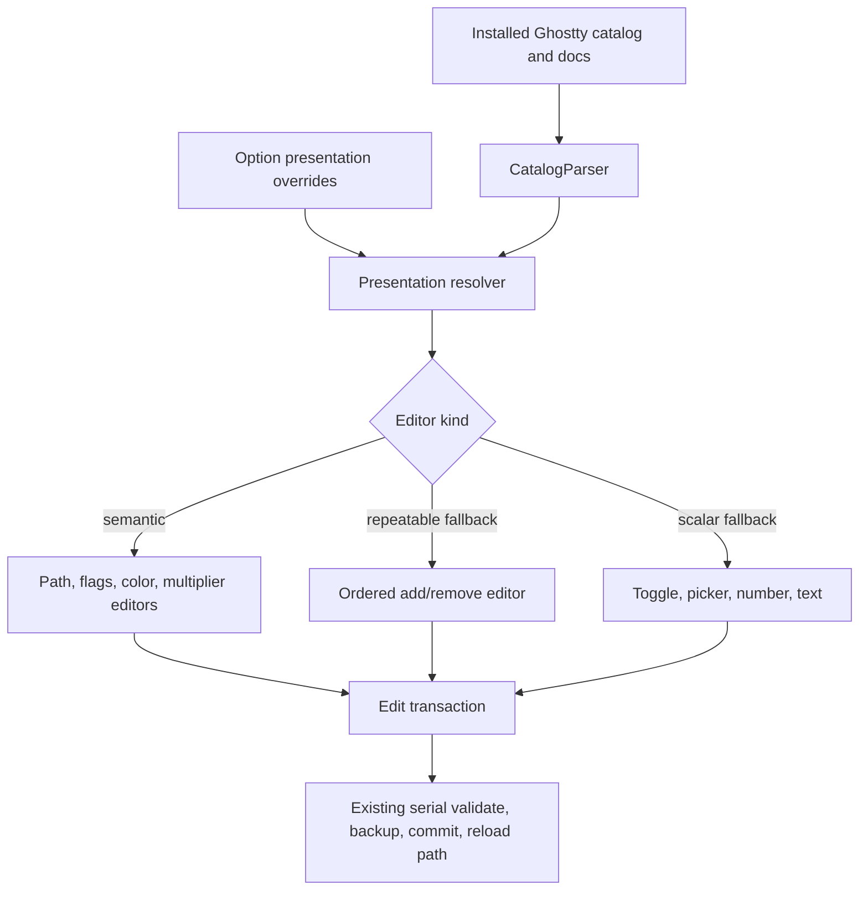
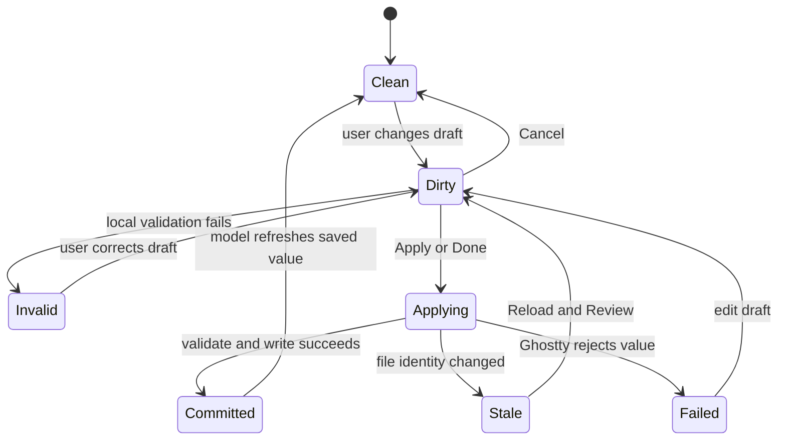

# Settings Trust and Flow - Plan

## Goal Capsule

- **Objective:** Complete the third UI/UX pass by making controls truthful, edits transactional, structured settings approachable, and navigation reliable without replacing the pass-1/pass-2 information architecture.
- **Authority:** This plan's Product Contract overrides implementation convenience; Ghostty's installed catalog and validation output remain the authority for accepted values; the two earlier UX plans remain historical rationale rather than active scope.
- **Execution profile:** Deep, cross-cutting SwiftUI work over catalog presentation, inline editors, navigation, and app-shell layout.
- **Stop conditions:** Stop rather than guess if a proposed editor cannot round-trip every value Ghostty accepts, if a write path bypasses validate-before-write and backup, or if a change would remove raw-key search or direct config-file recovery.
- **Tail ownership:** Implementation includes unit coverage, a disposable-config native-app walkthrough, accessibility inspection, and removal of experimental/dead-end code before completion.

---

## Product Contract

### Summary

The first two UX passes established a strong native settings shell: newcomer-oriented labels, Common/Advanced disclosure, Themes, Recommended, global Find, safe writes with Undo, and a Status hub. The third pass fixes the trust gaps that remain when those surfaces are exercised end to end: controls that display the wrong effective state, popovers that commit invalid drafts on dismissal, raw internal errors, repeatable settings with no editor, and navigation or layout states that lose context.

The target is not another redesign. It is a semantic-hardening pass that makes the existing interface behave like a dependable macOS settings app while retaining Ghostty's power-user reach.

### Problem Frame

The running app often looks finished while behaving ambiguously at the exact moment a user needs certainty. An unset `cursor-style-blink` renders as Off even though Ghostty blinks by default. An invalid color draft commits when its popover closes and reports `unknown error error.InvalidCharacter` beneath the row. A stale-on-disk rejection discards the user's draft before asking them to reload. Several composite, path, and repeatable values still expose raw mini-languages or no control at all, and a CLI-only setting that has no effect in a config file remains editable.

The shell has smaller continuity gaps. Local and global search look similar despite different scopes. Status drill-downs keep Status selected, but selecting Status again does not return to the hub. Maximizing the window leaves the content as a tiny island because every surface shares one fixed width cap, even though Themes and Keyboard Shortcuts benefit from more space.

### Actors

- A1. A newcomer changes common visual or behavioral settings without knowing Ghostty keys or value syntax.
- A2. A power user searches by raw key, edits advanced or repeatable values, and may also edit the config in another app.
- A3. A keyboard or assistive-technology user needs every state, action, validation result, and recovery path conveyed without hover or color alone.

### Requirements

**Control truth and safety**

- R1. Every control must distinguish an explicit value from an unset/default value and must display the effective default when it is known.
- R2. An option that cannot affect the app-managed config file must not appear as an editable setting.
- R3. A failed edit must remain associated with its originating row, use plain-language feedback, and never make an unsaved value look committed.
- R4. Popover and long-form editors must have an explicit, testable commit contract: valid Apply/Done saves, Cancel discards, and incidental dismissal never commits an invalid draft.
- R5. External-file conflicts must preserve the user's attempted value and offer a reload-and-review path without requiring re-entry or silently overwriting the external value.

**Approachable editing**

- R6. Every in-scope repeatable setting must have either a dedicated editor or a lossless generic add/remove fallback; no editable row may end with only an info button.
- R7. High-frequency structured values must use controls matching their semantics: folders use a chooser plus inherited/default states, flag sets use labeled choices, device-specific scroll multipliers use separate fields, and all color-valued options use the shared color editor.
- R8. Raw Ghostty syntax remains visible and searchable as secondary information, and unknown or future values always round-trip without coercion.

**Wayfinding and continuity**

- R9. Local filtering must name its current scope, while global Find remains available from every surface and clearly searches the whole catalog.
- R10. Status, Customized, and Problems must form a coherent drill-down flow: reselecting Status returns to the hub, breadcrumbs work, and actionable problems offer a direct next action.
- R11. Content width must adapt by surface so forms stay readable while Themes and Keyboard Shortcuts use available width; maximized windows must not strand a tiny panel in empty space.
- R12. Theme and keyboard-shortcut rows must expose one unambiguous instance of each action, remain keyboard/VoiceOver reachable, and avoid duplicate or mystery controls.

**Preservation**

- R13. Preserve validate-before-write, one-backup/one-Undo semantics, serial writes, auto-reload, raw-key search, curated Common/Advanced ordering, and the current visual identity.

### Key Flows

- F1. Browse and edit
  - **Trigger:** A1 opens Recommended or a category and changes a value.
  - **Steps:** The control shows the effective value, the edit enters a draft state, validation succeeds or fails in place, and successful feedback offers Undo.
  - **Outcome:** The saved config and visible control agree at every point.
  - **Covered by:** R1, R3, R4, R13
- F2. Recover from an external edit
  - **Trigger:** A2 changes the config outside the app after beginning an in-app edit.
  - **Steps:** The write is rejected as stale, Reload & Review refreshes disk state while retaining the draft, and the user compares both values before applying again.
  - **Outcome:** Neither the external change nor the in-app draft is silently lost.
  - **Covered by:** R3, R5, R13
- F3. Find and navigate
  - **Trigger:** A user filters the current category or invokes global Find.
  - **Steps:** The interface names the search scope, results identify their category, selecting a result opens and focuses the setting, and returning preserves coherent sidebar selection.
  - **Outcome:** Search never leaves the user unsure where they are or what was searched.
  - **Covered by:** R9, R10
- F4. Diagnose and repair
  - **Trigger:** Status reports a validation error or static warning.
  - **Steps:** The user drills into Problems, opens the implicated setting or source file, repairs or reloads it, and returns to Status.
  - **Outcome:** Status changes from warning to healthy with an understandable recovery path.
  - **Covered by:** R2, R3, R10

### Acceptance Examples

- AE1. Given `cursor-style-blink` is unset, when Cursor opens, then the control communicates the effective blinking default rather than displaying Off; setting Off writes `false`, and Reset returns to the default state.
- AE2. Given a color editor contains `#zzzzzz`, when the user chooses Apply, then no write occurs and a validation explanation stays inside the editor; when the user instead clicks outside, presses Escape, or chooses Cancel, the draft is discarded and the saved swatch remains unchanged.
- AE3. Given the config changes externally after a user types font size 17, when the user applies it, then the app retains 17, Reload & Review shows the refreshed disk value beside the draft, and only a second explicit Apply replaces it.
- AE4. Given `config-default-files` is documented as CLI-only, when the catalog is built for this editor, then it is absent from browse, Recommended, and Find rather than appearing as a functional toggle.
- AE5. Given an unset repeatable `config-file` or `command-palette-entry`, when its row renders, then it exposes an add action and can round-trip multiple values; known path-shaped values also offer a chooser.
- AE6. Given a maximized window, when a form, Themes, or Keyboard Shortcuts is open, then forms retain a readable measure while browsing/editing surfaces expand usefully instead of leaving most of the window blank.
- AE7. Given Customized or Problems is visible and Status remains selected, when the user selects Status again, then the Status hub opens.
- AE8. Given a theme row or card, when inspected visually and through accessibility, then Apply, Favorite, and Theme Options each appear exactly once with distinct labels.

### Success Criteria

- An unset/default control never contradicts Ghostty's effective behavior in the reference catalog.
- Invalid color and long-value drafts cannot escape their editor as raw internal errors.
- Every repeatable reference-catalog option is classified as dedicated, generic fallback, read-only, or excluded, with a test preventing unclassified rows.
- A stale-write walkthrough retains and successfully retries the attempted edit.
- Local search, global Find, Status drill-downs, Problems, Themes, and Keyboard Shortcuts pass the disposable-config walkthrough at default and maximized window sizes.
- Existing kit tests and the new app-logic tests pass with the installed Ghostty integration tests remaining opt-in.

### Scope Boundaries

**In scope**

- Correctness and clarity of the existing macOS app's option controls, editor transactions, search, Status drill-downs, Problems actions, and responsive layout.
- Dedicated editors for the high-value structured settings found during the walkthrough, plus a lossless fallback for other repeatables.
- A lightweight test target for app presentation/navigation logic without a third-party view-inspection framework.

**Deferred to follow-up work**

- Editing the full include graph as a multi-file workspace rather than adding/removing `config-file` values in the primary file.
- Continuous filesystem watching; activation sync, manual Reload, and conflict recovery remain the supported model.
- A full visual-regression screenshot system or automated XCUITest application target.

**Out of scope**

- Replacing the self-describing Ghostty catalog with a hand-maintained schema.
- Adding a raw config editor, plugin system, cloud sync, or a second settings window.
- Reworking the established brand, sidebar taxonomy, Recommended set, or safe-write engine absent a demonstrated defect.

### Sources

- Prior UX baselines: `docs/plans/2026-07-02-001-feat-newcomer-first-ux-overhaul-plan.md` and `docs/plans/2026-07-04-001-feat-native-character-ux-elevation-plan.md`.
- Runtime evidence: native build launched against a disposable `XDG_CONFIG_HOME`, exercising onboarding, every sidebar destination, local/global search, theme list/grid/favorites/pairing/apply/Undo, keyboard capture/conflict, Status/Customized/Problems, external reload, import/export dialogs, menus, and window zoom.
- Apple Human Interface Guidelines: [Search fields](https://developer.apple.com/design/human-interface-guidelines/search-fields), [Popovers](https://developer.apple.com/design/human-interface-guidelines/popovers), [Alerts](https://developer.apple.com/design/human-interface-guidelines/alerts), and [Settings](https://developer.apple.com/design/human-interface-guidelines/settings).
- Mature settings precedent: [Visual Studio Code settings editor](https://code.visualstudio.com/docs/editing/getting-started#_configure-vs-code-settings) for search, automatic application, per-setting reset, and modified-settings discovery.
- Product contract: [Ghostty configuration documentation](https://ghostty.org/docs/config) for zero-configuration posture, optional config, include semantics, file locations, and reload limits.
- Test-boundary reference: [Swift Package Manager target documentation](https://docs.swift.org/swiftpm/documentation/packagedescription/target/) confirms that a test target can depend on another target in the same package, allowing pure app policy to be tested without adding a UI-inspection dependency.

---

## Planning Contract

### Key Technical Decisions

- KTD1. Add a small presentation contract over the self-describing catalog. A bundled, orphan-guarded `OptionPresentationCatalog` supplies only facts Ghostty's output cannot express structurally: editability in a config-file GUI, effective default display, editor kind, and semantic grouping. New options still fall back deterministically; the override layer never becomes a second option schema.
- KTD2. Model editor state as a tested transaction instead of scattered `@State` callbacks. The shared state distinguishes saved value, refreshed disk value, draft, dirty, locally invalid, applying, stale, failed, and committed. Reloading a stale edit returns to reviewable Dirty state; it never retries automatically because the external edit may target the same option.
- KTD3. Prefer semantic editors, then a lossless fallback. Folder/path, flag-set, split scroll multiplier, color, and known structured repeatables receive focused controls. Remaining repeatables use one generic ordered add/remove editor that preserves unknown values verbatim.
- KTD4. Normalize errors at the application boundary. Known Ghostty diagnostics and `ConfigWriteError` cases become concise user-facing messages while raw output remains available in the info/detail context for troubleshooting; no UI prints implementation-type names.
- KTD5. Give each surface a width policy. Forms use a readable maximum, dense editors receive a wider maximum, and Themes grid columns expand within a bounded wide canvas. The app keeps its useful minimum size but does not apply one 640-point cap to every destination.
- KTD6. Separate Status selection from Status drill-down state. Sidebar selection remains `.status`, while an explicit destination identifies hub, Customized, or Problems; selecting Status always resets the destination to hub and breadcrumbs mutate the same state.
- KTD7. Add app-logic tests without view-introspection dependencies. SwiftPM permits a test target to depend on another package target, so `GhosttyConfigEditorTests` can cover package-visible presentation, navigation, width-policy, and error-mapping types while `GhosttyConfigKitTests` continues to own catalog parsing, round-tripping, and write behavior. If importing the executable target exposes launch-only coupling, move only those pure policies into a small library target rather than adding a UI-test dependency.

### High-Level Technical Design

#### Presentation and editing pipeline

The resolver determines what the interface may claim; the installed catalog still determines what Ghostty accepts. All editor branches converge on the current `AppModel.applyEdit` or batch writer.

#### Edit transaction lifecycle

Escape or incidental popover dismissal follows Cancel unless the editor is explicitly documented as immediate-selection. Discrete controls such as a closed enum picker remain immediate; text-bearing editors use the transaction lifecycle.

### System-Wide Impact

- **Catalog:** New presentation metadata becomes another curated, version-audited overlay alongside labels, tiers, enum labels, and numeric specs.
- **Writes:** The writer and backup contract stay unchanged, but AppModel must retain attempted drafts through stale and validation failures.
- **Navigation:** Status drill-down state and search scope become explicit rather than inferred from a shared selection/query.
- **Accessibility:** Effective/default state, editor dirty/invalid state, and every recovery action must be present in accessibility labels and values.
- **Compatibility:** Unknown Ghostty values and newly added options continue through generic controls without data loss; no closed editor may silently narrow an open value set.

### Sequencing

U1 establishes the presentation and test seams. U2 and U3 can then proceed in parallel. U4 depends on both because structured editors need the presentation contract and transaction lifecycle. U5 and U6 can proceed after U1 and should land before the final runtime verification.

### Risks and Mitigations

- **Curated metadata drift:** Keep overrides sparse and add reference-catalog orphan, classification, and no-effect-option guards.
- **Over-specializing Ghostty syntax:** Preserve a raw-value fallback and round-trip unknown tokens in every structured parser.
- **Dismissal semantics surprise:** Use immediate commits only for discrete selections; text-bearing popovers display Apply/Cancel and never save on incidental dismissal.
- **App test target friction:** Test pure app types only; do not introduce ViewInspector or force SwiftUI rendering into unit tests.
- **Layout regression at narrow sizes:** Verify default, minimum, and maximized widths per surface, including Dynamic Type and sidebar visibility.

---

## Implementation Units

### U1. Presentation contract and app-logic test seam

- **Goal:** Create the sparse metadata and test infrastructure that let the UI make truthful, testable presentation decisions.
- **Requirements:** R1, R2, R7, R8, R13
- **Dependencies:** None
- **Files:** `Package.swift`; `Sources/GhosttyConfigKit/Catalog/OptionPresentationCatalog.swift`; `Sources/GhosttyConfigKit/Resources/option-presentations.json`; `Sources/GhosttyConfigKit/ResourceLoad.swift`; `Sources/GhosttyConfigKit/Catalog/CatalogParser.swift`; `Sources/GhosttyConfigKit/Catalog/OptionCatalog.swift`; `Tests/GhosttyConfigKitTests/OptionPresentationCatalogTests.swift`; `Tests/GhosttyConfigKitTests/CatalogParserTests.swift`; `Tests/GhosttyConfigEditorTests/PresentationPolicyTests.swift`
- **Approach:** Define editability, effective-default display, editor kind, and structured-value hints as sparse overrides resolved onto `CatalogOption`. Exclude config-file-inert options such as `config-default-files` at the catalog choke point. Add a test target that depends on the executable target and exercises package-visible pure policies; fall back to a small app-support library only if launch coupling prevents that boundary from compiling cleanly.
- **Patterns to follow:** Curated resource loading and orphan guards in `LabelCatalog.swift`, `NumericSpec.swift`, and their tests; platform filtering in `CatalogParser.swift`.
- **Test scenarios:**
  1. Covers AE4. Parse the reference catalog and assert CLI-only/no-effect options do not reach browse or search.
  2. Decode every presentation override and assert each key exists in the reference catalog or is explicitly version-gated.
  3. Assert every reference-catalog repeatable resolves to dedicated, generic fallback, read-only, or excluded.
  4. Assert an unknown future scalar and repeatable option receive lossless fallback policies without curated metadata.
  5. Compile and run the app-logic test target without launching `NSApplication` or linking test libraries into the executable product.
- **Verification:** The resolved presentation policy is deterministic, sparse, and usable from both kit and app tests without changing accepted Ghostty values.

### U2. Truthful effective and default states

- **Goal:** Ensure switches, pickers, state cues, and accessibility always communicate explicit versus default behavior accurately.
- **Requirements:** R1, R3, R8, R13; F1; AE1
- **Dependencies:** U1
- **Files:** `Sources/GhosttyConfigKit/Catalog/OptionCatalog.swift`; `Sources/GhosttyConfigKit/Catalog/OptionPresentationCatalog.swift`; `Sources/GhosttyConfigEditor/Views/OptionListView.swift`; `Sources/GhosttyConfigEditor/Views/RecommendedView.swift`; `Sources/GhosttyConfigEditor/Views/SettingsView.swift`; `Tests/GhosttyConfigKitTests/ValueTypePresentationTests.swift`; `Tests/GhosttyConfigKitTests/EnumChoicesTests.swift`; `Tests/GhosttyConfigEditorTests/PresentationPolicyTests.swift`
- **Approach:** Resolve explicit, effective-default, and unresolved-default states before choosing a control. Use a toggle only when its effective Boolean value is known; otherwise expose a Default/On/Off choice or a labeled default state. Make the orange customized cue explainable through accessible text and a persistent reset action in info/details.
- **Patterns to follow:** `OptionState`, `enumChoices(current:)`, curated enum labels, and the existing lossless out-of-enum row.
- **Test scenarios:**
  1. Covers AE1. Unset cursor blinking presents Default: blinking; Off writes `false`; reset returns to default.
  2. Unset true-default and false-default Boolean options render the correct switch value without becoming customized.
  3. An empty default with no semantic override renders an unresolved Default choice rather than falsely choosing Off.
  4. An explicit value equal to the default remains distinguishable from unset while preserving reset behavior.
  5. VoiceOver strings include title, effective/default state, explicit/customized state, and current value without relying on the dot color.
- **Verification:** The reference catalog contains no control whose visual on/off state contradicts its documented effective default.

### U3. Transactional editors and plain-language recovery

- **Goal:** Make text-bearing edits explicit, reversible, and resilient to invalid input or external changes.
- **Requirements:** R3, R4, R5, R13; F1, F2; AE2, AE3
- **Dependencies:** U1
- **Files:** `Sources/GhosttyConfigKit/Config/EditTransaction.swift`; `Sources/GhosttyConfigKit/Config/ConfigWriter.swift`; `Sources/GhosttyConfigEditor/App/AppModel.swift`; `Sources/GhosttyConfigEditor/Views/OptionListView.swift`; `Sources/GhosttyConfigEditor/Views/SurfaceChrome.swift`; `Tests/GhosttyConfigKitTests/EditTransactionTests.swift`; `Tests/GhosttyConfigKitTests/ConfigWriterTests.swift`; `Tests/GhosttyConfigEditorTests/ErrorPresentationTests.swift`
- **Approach:** Introduce a pure edit-transaction reducer used by color, long-value, and structured popovers. Add local validation where syntax is knowable, explicit Apply/Cancel controls, and a normalized error presenter. Retain the attempted draft on write failure. Reload & Review refreshes the saved value and returns the transaction to Dirty so the user can compare and explicitly Apply; it never queues an automatic overwrite.
- **Execution note:** Characterize existing immediate controls and write serialization first; the new transaction must wrap, not bypass, the current safe-write path.
- **Patterns to follow:** `SerialWriteQueue`, `ConfigWriter.staleOnDisk`, `ApplyState`, and `SurfaceFeedbackBar`.
- **Test scenarios:**
  1. Covers AE2. Invalid color text followed by Escape or outside click performs no write and retains the saved value.
  2. A valid color selected then applied performs one validation, backup, write, and reload despite multiple draft callbacks.
  3. Cancel discards a dirty valid draft; Apply commits it; a discrete enum remains immediate.
  4. Ghostty's `error.InvalidCharacter` diagnostic maps to a plain invalid-color message while retaining raw detail for troubleshooting.
  5. Covers AE3. A stale write retains draft 17, reloads an externally changed value, displays both, and requires a second Apply before committing.
  6. If the target option disappears after reload, review stops with an actionable message and disables Apply rather than guessing.
  7. An external change to a different option remains intact after the reviewed draft is applied.
- **Verification:** No text-bearing popover can write on incidental dismissal, raw implementation errors never appear in row feedback, and stale recovery does not require retyping.

### U4. Structured and repeatable setting editors

- **Goal:** Replace the remaining dead rows and high-friction mini-languages with semantic controls while preserving unknown values.
- **Requirements:** R2, R6, R7, R8, R13; AE5
- **Dependencies:** U1, U3
- **Files:** `Sources/GhosttyConfigKit/Catalog/StructuredOptionValue.swift`; `Sources/GhosttyConfigEditor/Views/OptionListView.swift`; `Sources/GhosttyConfigEditor/Views/StructuredOptionEditors.swift`; `Sources/GhosttyConfigKit/Resources/option-presentations.json`; `Sources/GhosttyConfigKit/Resources/enum-value-labels.json`; `Tests/GhosttyConfigKitTests/StructuredOptionValueTests.swift`; `Tests/GhosttyConfigKitTests/ValueTypePresentationTests.swift`; `Tests/GhosttyConfigEditorTests/PresentationPolicyTests.swift`
- **Approach:** Extract large editor components from `OptionListView.swift`. Add a generic ordered repeatable editor for unhandled repeatables, folder/file choosers with raw entry, a two-part precision/discrete scroll editor, a labeled multi-choice bell-feature editor, and consistent color detection for all color-valued settings. Preserve unknown flag/value fragments in an Advanced/raw row inside each structured editor.
- **Patterns to follow:** `FontFamilyEditor`, `PaletteEditor`, `ListValueEditor`, `FontFeatures`, `GhosttyPalette`, and lossless enum-choice resolution.
- **Test scenarios:**
  1. Covers AE5. Empty and populated `config-file` and `command-palette-entry` values add, remove, reorder, and round-trip through the generic fallback.
  2. `working-directory = window-inherit-working-directory` presents an inherited/default choice, while a selected directory serializes exactly and can be reset.
  3. `precision:0.5,discrete:3` parses into two labeled fields and reserializes in stable order; unknown fragments survive an edit.
  4. Bell-feature choices preserve omitted/default and unknown tokens while toggling one labeled feature.
  5. `unfocused-split-fill` and selection color options resolve to the shared color editor rather than plain text.
  6. Every editable repeatable in the reference catalog renders an action; `keybind`, palette, fonts, and environment still route to their dedicated surfaces.
- **Verification:** The reference catalog has no silent editable row, high-value structured values no longer require raw syntax for common cases, and all round-trip tests preserve unknown input.

### U5. Search, Status, and Problems continuity

- **Goal:** Make search scope and maintenance drill-downs self-evident, reversible, and actionable.
- **Requirements:** R9, R10, R13; F3, F4; AE7
- **Dependencies:** U1
- **Files:** `Sources/GhosttyConfigEditor/App/AppModel.swift`; `Sources/GhosttyConfigEditor/App/GhosttyConfigEditorApp.swift`; `Sources/GhosttyConfigEditor/Views/SidebarView.swift`; `Sources/GhosttyConfigEditor/Views/SurfaceChrome.swift`; `Sources/GhosttyConfigEditor/Views/GlobalFindView.swift`; `Sources/GhosttyConfigEditor/Views/OptionListView.swift`; `Sources/GhosttyConfigEditor/Views/SettingsView.swift`; `Sources/GhosttyConfigEditor/Views/ProblemsView.swift`; `Tests/GhosttyConfigEditorTests/NavigationPolicyTests.swift`; `Tests/GhosttyConfigKitTests/IntentSearchTests.swift`
- **Approach:** Name local scope in the prompt or header, retain the distinct global Find overlay, and introduce explicit Status destinations. Selecting the already-highlighted Status footer resets to hub. Problems rows expose Show Setting for mapped keys and Open Config at Line or Reveal in Finder for file-only findings, while Back to Status uses the same destination model.
- **Patterns to follow:** `focus(optionNamed:)`, `pendingFocusScroll`, global `findQuery`, and `StatusBackLink`.
- **Test scenarios:**
  1. A local Appearance query identifies its scope and returns only Appearance; global Find returns matching settings across categories with category context.
  2. Selecting a global result clears global/local queries, selects the category, expands Advanced when needed, and focuses the row.
  3. Covers AE7. Status → Customized → reselect Status returns to hub; the same holds for Problems and for the breadcrumb.
  4. A validation message with a known key offers Show Setting; a static file-line warning offers an explicit file action with an accessible label.
  5. Clearing local search restores the prior category title and disclosure state without losing sidebar selection.
- **Verification:** Every search and maintenance path has an unambiguous scope, selected destination, and return path.

### U6. Responsive surfaces and flagship-row cleanup

- **Goal:** Let each major surface use space appropriately and remove duplicate or ambiguous theme/shortcut actions.
- **Requirements:** R11, R12, R13; AE6, AE8
- **Dependencies:** U1
- **Files:** `Sources/GhosttyConfigEditor/App/GhosttyConfigEditorApp.swift`; `Sources/GhosttyConfigEditor/Views/SurfaceChrome.swift`; `Sources/GhosttyConfigEditor/Views/RecommendedView.swift`; `Sources/GhosttyConfigEditor/Views/ThemeBrowserView.swift`; `Sources/GhosttyConfigEditor/Views/KeybindEditorView.swift`; `Sources/GhosttyConfigEditor/Views/KeyRecorderView.swift`; `Tests/GhosttyConfigEditorTests/ContentWidthPolicyTests.swift`; `Tests/GhosttyConfigEditorTests/ThemeActionPolicyTests.swift`
- **Approach:** Replace the global capped-column modifier with a per-surface policy and testable width calculation. Keep grouped forms readable, allow theme grids and shortcut rows to grow, and define narrow/wide row layouts. Remove the duplicate theme-options control, expose Apply/Favorite/Options as separate accessibility elements in both list and grid, and give keybinding actions labeled overflow behavior when chords no longer fit.
- **Test scenarios:**
  1. Covers AE6. Width policy returns readable form width at default, minimum, and maximized window sizes; Themes gains columns and Keyboard Shortcuts gains chord space at wide sizes.
  2. Narrow layouts wrap or move secondary actions without truncating the setting/action title.
  3. Covers AE8. Theme row and card action descriptors contain exactly one Apply, Favorite, and Theme Options action.
  4. Theme favorite/filter/current-section transitions preserve deduplication after the action cleanup.
  5. A shortcut action with one, two, and many chords retains reachable Rebind, Disable/Remove, Add, and More actions at narrow and wide widths.
  6. Dynamic Type and Reduce Motion do not cause controls to overlap or make the selected/current state color-only.
- **Verification:** Default and maximized walkthrough screenshots show purposeful density, and the accessibility tree exposes each flagship action once with a task-specific label.

---

## Verification Contract

| Gate | Applies to | Command or method | Pass condition |
|---|---|---|---|
| Kit unit suite | U1-U5 | `swift test --filter GhosttyConfigKitTests` | Catalog, transaction, structured-value, search, and writer tests pass. |
| App-logic suite | U1-U6 | `swift test --filter GhosttyConfigEditorTests` | Presentation, navigation, error, width, and action policies pass without rendering SwiftUI. |
| Full package suite | All units | `swift test` | All existing and new tests pass with no regression. |
| Build | All units | `swift build` | Debug app and both test targets compile under Swift 6. |
| Native disposable-config smoke | U2-U6 | Launch with a temporary `XDG_CONFIG_HOME` and the installed Ghostty binary. | F1-F4 and AE1-AE8 pass without touching the user's real config. |
| Layout matrix | U6 | Inspect Recommended, a form category, Themes list/grid, Keyboard Shortcuts, Status, and Problems at minimum, default, and maximized sizes. | No overlap, misleading void, clipped essential action, or unreadable measure. |
| Accessibility matrix | U2-U6 | Inspect keyboard focus and accessibility tree with Reduce Motion and larger text variants. | Effective/default/customized state, validation, and each action are conveyed without hover or color alone. |
| Live integration | Release candidate | `GHOSTTY_LIVE_TESTS=1 swift test` | Installed-Ghostty catalog and CLI integration tests pass when explicitly enabled. |

---

## Definition of Done

- R1-R13 and AE1-AE8 are implemented and traceable to passing tests or the named native walkthrough gate.
- Every reference-catalog option has a truthful presentation classification, and every editable repeatable has an editor.
- Invalid, stale, cancelled, applied, undone, and retried edits leave the UI and disk in matching states.
- Search scope, Status drill-down, Problems actions, Themes, and Keyboard Shortcuts remain coherent through keyboard and accessibility navigation.
- Forms, dense editors, and theme grids use appropriate widths at minimum, default, and maximized window sizes.
- Validate-before-write, backup, serial write, Undo, raw-key search, auto-reload, and unknown-value round-tripping remain intact.
- The full package test suite and relevant live integration suite pass.
- Abandoned prototypes, duplicate actions, temporary audit hooks, and dead code are removed from the final diff.
